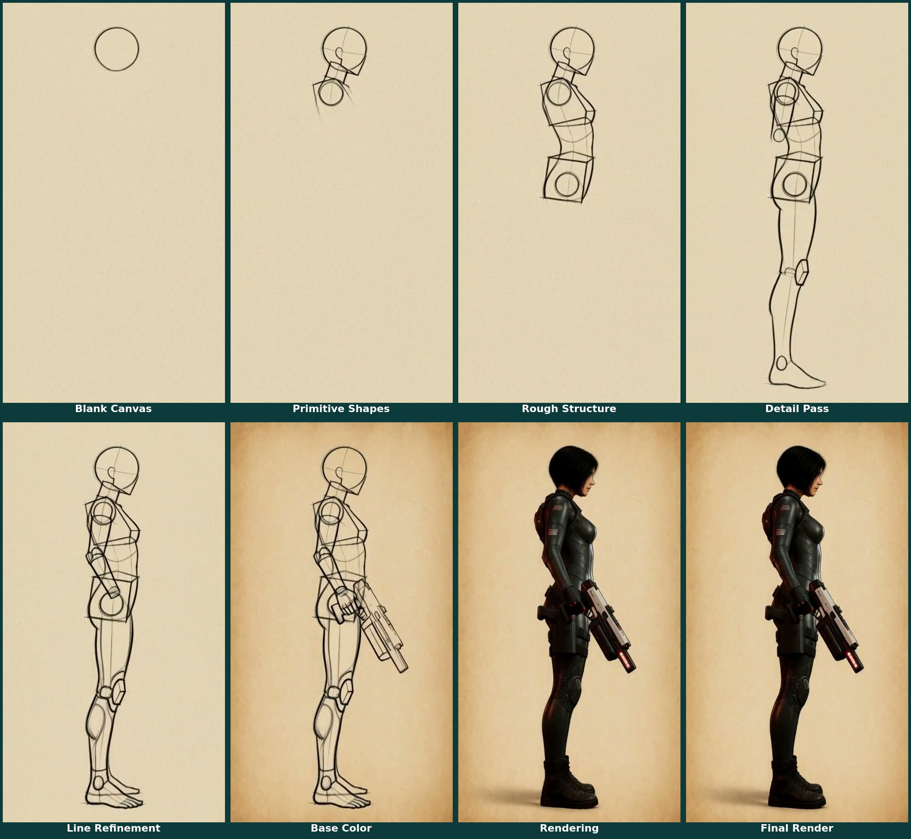

# A drawing-tutorial sheet made entirely by MiniMax H3

Someone on r/StableDiffusion fed MiniMax H3 a single finished painting and
the prompt "create a video tutorial of how this particular painting was
created — blank canvas, basic forms, detail layer, color/rendering layer,
final image," and got back a plausible reverse-engineered construction
video. Inspiration and full credit:
[the original post](https://reddit.com/r/StableDiffusion/s/np0U2umKtw).

I run [charref-gen](https://github.com/gavmor/charref-gen), an existing pipeline of mine
(ported from an earlier `blades68-lora` character-reference-sheet job) that
generates video+audio character reference sheets for a game roster using
MiniMax H3. That pipeline's own 4-shot technique (head closeup / front /
back / side, neutral A-pose) traces back to a separate real source:
[u/bstr3k's "Using H3 as a Character Reference Sheet Generator"](https://www.reddit.com/r/StableDiffusion/comments/1vr5nvc/using_h3_as_a_character_reference_sheet_generator/)
(r/StableDiffusion) — multi-image reference generating a static 360°
character sheet, with the same "neutral A pose" fixed prompt and a 4-panel/
6-panel workflow choice. It seemed like a natural fit for the drawing-
tutorial trick too: instead of a video, render a static multi-panel
*construction sheet* — the kind you'd find in a figure-drawing instruction
book — for one of the roster characters.

## What actually worked

The validated recipe is a single MiniMax H3 `ImageToVideo` render, pinned
between a blank parchment-toned canvas (`first_frame`) and the character's
finished render re-backgrounded onto the same paper (`last_frame`), with a
prompt that explicitly names each classical Loomis/Reilly construction
primitive — sphere skull, box ribcage, box pelvis, cylinder limbs — so the
model blocks in visibly three-dimensional shapes before refining into line
art, color, and final rendering. Same seed, same 8-step turbo LoRA config,
124 frames, as every other charref-gen render. Eight evenly-spaced frames are then
extracted and labeled: Blank Canvas, Primitive Shapes, Rough Structure,
Detail Pass, Line Refinement, Base Color, Rendering, Final Render.

Here's the full 8-panel sheet, unedited:

<figure>
  
  <figcaption>Blank Canvas → Primitive Shapes → Rough Structure → Detail Pass → Line Refinement → Base Color → Rendering → Final Render</figcaption>
</figure>

Every panel is clean, start to finish — no hand, no pencil, nothing but
the construction stages and the character herself. This is the recipe's
best run.

## The reliability question this doesn't settle

That clean result isn't the whole story, though. An earlier version of
this same idea (a flatter gesture-outline sketch, before the Loomis-
primitive prompt above) had an unprompted drawing hand appear mid-stroke —
logged at the time as a nice bonus, since it read like a genuine "how this
was drawn" tutorial. Later, testing the same Loomis-primitive recipe
specifically for whether a hand would show up on request, two follow-up
renders (same asset/seed/images/frame count as the sheet above, different
render files, not shown here) both had a hand and pencil appear in most
panels despite explicit suppression instructions:

- Negative phrasing ("no hand, pencil, or drawing implement is ever
  visible"): hand still visible in 6 of 8 panels. Naming the concept at
  all, even to negate it, seems to prime the model to render it anyway —
  a known failure mode for negative instructions in this kind of
  generation.
- Affirmative rephrasing (no mention of hand/pencil/implement at all,
  just "lines and shading appear on the page on their own, as though
  drawn by an unseen artist"): still visible in 5 of 8 panels.

So the honest read: this specific sheet came out completely hand-free, but
that's not a guarantee across renders — the underlying tendency toward an
implied hand is still there and unresolved. Current theory is that the
phrase "a video tutorial of how this was drawn" is itself a strong enough
training-data prior toward a filmed human hand that rephrasing the
hand-specific clause, in either direction, isn't enough to override it.
The untested next move would be dropping the "tutorial video" framing
entirely for something like "an animated technical diagram" — no implied
camera, no implied operator. That's a future post if it works.
