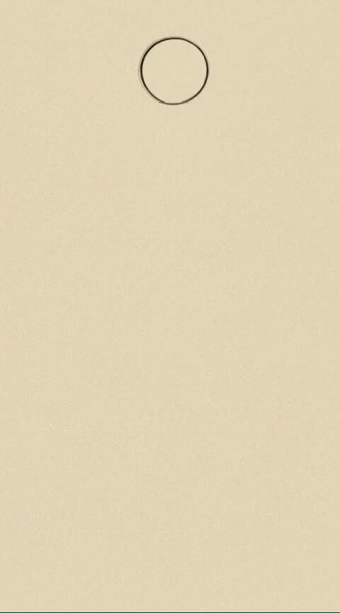
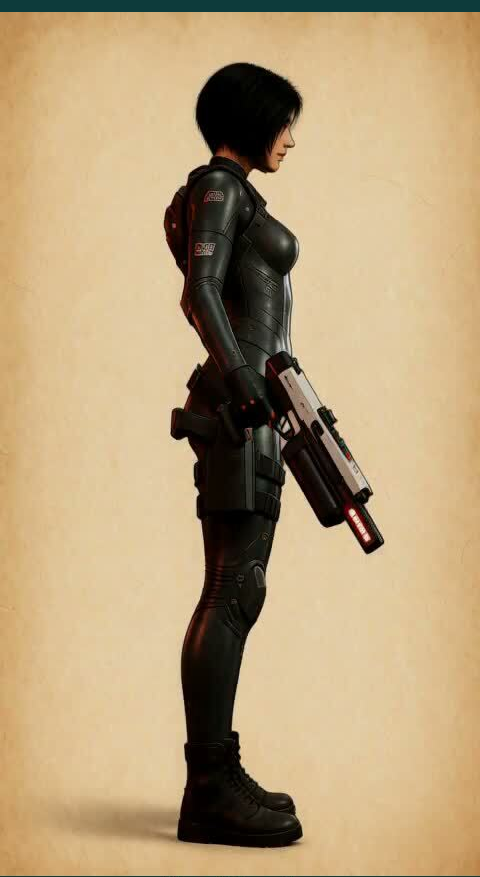

# A drawing-tutorial sheet made entirely by MiniMax H3

Someone on r/StableDiffusion fed MiniMax H3 a single finished painting and
the prompt "create a video tutorial of how this particular painting was
created — blank canvas, basic forms, detail layer, color/rendering layer,
final image," and got back a plausible reverse-engineered construction
video. Inspiration and full credit:
[the original post](https://reddit.com/r/StableDiffusion/s/np0U2umKtw).

I run [T2VA](https://github.com/gavmor/T2VA), an existing pipeline of mine
(ported from an earlier `blades68-lora` character-reference-sheet job) that
generates video+audio character reference sheets for a game roster using
MiniMax H3. It seemed like a natural fit for the same trick: instead of a
video, render a static multi-panel *construction sheet* — the kind you'd
find in a figure-drawing instruction book — for one of the roster
characters.

## What actually worked

The validated recipe is a single MiniMax H3 `ImageToVideo` render, pinned
between a blank parchment-toned canvas (`first_frame`) and the character's
finished render re-backgrounded onto the same paper (`last_frame`), with a
prompt that explicitly names each classical Loomis/Reilly construction
primitive — sphere skull, box ribcage, box pelvis, cylinder limbs — so the
model blocks in visibly three-dimensional shapes before refining into line
art, color, and final rendering. Same seed, same 8-step turbo LoRA config,
124 frames, as every other T2VA render. Eight evenly-spaced frames are then
extracted and labeled: Blank Canvas, Primitive Shapes, Rough Structure,
Detail Pass, Line Refinement, Base Color, Rendering, Final Render.

Two of those eight panels came out completely clean:

<figure>
  
  <figcaption>Blank Canvas</figcaption>
</figure>

<figure>
  
  <figcaption>Final Render</figcaption>
</figure>

## What didn't

The six panels in between are, honestly, still unsolved. Every intermediate
frame — sketch, refinement, and coloring stages alike — has a
drawing hand and pencil visibly rendered in, which wasn't asked for and
doesn't fit the "constructed by magic" framing I actually want. Two
separate single-variable attempts to suppress it failed:

- Adding "no hand, pencil, or drawing implement is ever visible" to the
  prompt: still visible in 6 of 8 panels. Naming the concept at all, even
  to negate it, seems to prime the model to render it anyway — a known
  failure mode for negative instructions in this kind of generation.
- Rewriting the same instruction affirmatively (no mention of
  hand/pencil/implement at all, just "lines and shading appear on the page
  on their own, as though drawn by an unseen artist"): still visible in 5
  of 8 panels.

Current read: the phrase "a video tutorial of how this was drawn" is
itself a strong enough training-data prior toward a filmed human hand that
rephrasing the hand-specific clause, in either direction, isn't enough to
override it. The untested next move would be dropping the "tutorial video"
framing entirely for something like "an animated technical diagram" — no
implied camera, no implied operator. That's a future post if it works.

For now: the two clean endpoints above are genuinely representative of
what the pipeline produces, and the middle-panel hand problem is a known,
open issue rather than something quietly cropped out of view.
