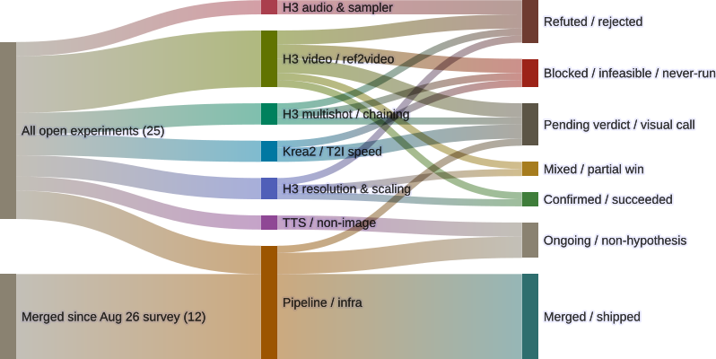

# 25 GPU experiments, one diagram

The genops workspace is where ComfyUI / H3 / Concourse experiment work lives.
It keeps an experiment register — a running list of every open branch that
carries either a real hypothesis or a real artifact. At 25 active items
spread across seven work domains, the register had stopped being something I
could hold in my head and started being something I needed to look at.

This post is that look. The diagram below is the register, drawn as a Sankey
from two pools on the left — the 25 still-open items, and the 12 branches
that merged to `main` since the August 26 survey — through work domain in
the middle to current verdict on the right. An earlier draft of this post
left the 12 merged branches out on the theory that "the diagram is the open
register, and merged work has resolved." On reflection that drew an
artificial line: shipped infrastructure is part of the same body of work,
and leaving it out understated how much of it landed. It's in now. The
underlying source files — the Mermaid source, the per-experiment
source-of-truth table, and the survey notes — are linked at the bottom.

<figure>
  
  <figcaption>25 open plus 12 merged genops items as of 2026-09-02, grouped by work domain and routed to current verdict.</figcaption>
</figure>

## How to read it

Three columns. Left: two pools — the 25 still-open items, and the 12
branches merged since August 26 (verified against `origin/main`'s actual
PR-merge commits, not just an absent branch ref). Middle: seven work
domains — what part of the generative stack each item lives in; all 12
merges land under `Pipeline / infra`. Right: seven terminal states — what
each experiment has resolved to (or is still waiting on), now including
`Merged / shipped` for completed non-hypothesis work.

The shape tells you two things at once: how the work is distributed across
domains (the column widths on the left-to-middle flows), and where each
domain currently stands (the column widths on the middle-to-right flows).
A domain with a wide "Refuted" band is a domain where the negative results
are outnumbering the wins; a domain with a wide "Confirmed" band is one
where the bets are landing. A wide "Pending verdict" band is work that's
actually finished running but is waiting on a human visual call rather than
on more GPU time.

## What it shows

The widest single band in the diagram overall is now **Pipeline / infra →
Merged / shipped** (12) — the 12 branches that landed since August 26:
Immich per-workflow album routing and its supporting fixes (a BusyBox
`find` incompatibility, prompt-description handling for TextGenerate's
LLM-expander, a `.gitignore` fix for the secrets symlink, pinning the
Immich resource to a stable release), a hairstyle/gender-pool split, a
lab-notebook doc, and the deliberate revert-and-rebuild of the
charref-fullredo bolt-on. None of it is hypothesis-bearing, which is why
it's a volume band, not a win — but it's the largest single flow in the
diagram, and skipping it (as an earlier draft did) understated the week.

Among the domains that do carry a hypothesis, the widest single band is
**H3 audio & sampler → Refuted**:
both items in that domain — the audio-latent-mask experiment and the
`er_sde` + `bong_tangent` sampler experiment — came back negative. That
domain is closed as a current line of inquiry, not because of one bad
result but because the two open items in it both hit the same null. Worth
noting as a domain-level read, not an item-level one.

The cleanest wins are **H3 video → Confirmed** (the LongMedia native
30s single-shot run landed, fixed the segmented-attention `extra_conds`
collision upstream) and **H3 resolution → Confirmed** (the full 8-point
0.3–0.98 MP sweep survived without OOM). Both are single-item wins, so the
"1 of N" framing on each band matters more than the headline color.

The biggest unresolved pool is **H3 video → Pending verdict** at 2 items —
the `krea2-4step-chk14000-distill-test` visual compare is in flight (three
arms, no verdict yet), and `h3-crewgroup-quality-pass` build #3 is awaiting
a formal quality-bar sign-off. **Krea2 → Pending verdict** is also 2
items, partially overlapping with the in-flight distill test.

The 4 still-open items in **Pipeline / infra** route to **Ongoing** by
design — they're not hypothesis-driven, so a "verdict" doesn't apply. The
12 merged ones route to **Merged / shipped** instead: also not
hypothesis-driven, but no longer in flight either, so `Ongoing` would
misdescribe them. Both bands together show `Pipeline / infra` as a working
register with a real completion rate, not a verdict register.

## Caveats worth naming

The diagram does two normalizations worth being explicit about:

1. **Deduplication across domains.** The `krea2-4step-chk14000-distill-test`
   branch is the same physical experiment whether you count it under
   "H3 video" (it's a video-quality compare) or "Krea2 / T2I speed" (it
   tests a 4-step distill LoRA on a Krea2 Turbo scaffold). The diagram
   counts it once per *work-domain lens* the experiment is relevant to,
   which is why the per-domain middle-column totals don't add up to 25.
   The 25 figure is the count of distinct physical experiments; the
   middle-column counts are a sum of "in which lens does this experiment
   matter."
2. **Confound audit is upstream of the diagram.** Every flow ending in
   "Confirmed" or "Refuted" was already checked for the three things that
   actually matter on this lab — seed pinned across arms, prompt held
   constant, step count held constant, one dependent variable changed per
   arm. The diagram doesn't show that audit; the per-experiment database
   does (linked below). This is on purpose: the diagram is the shape of
   the register, not the audit trail behind it.

A separate honest caveat: **Refuted** here means "the hypothesis as
stated didn't hold." It doesn't mean "this area is uninteresting" — the
`er_sde` + `bong_tangent` sampler refutation, for example, is useful
information even though the result was negative, because it ruled out a
specific alternative to the production sampler. The register's job is
to record the refutation, not to render judgment on whether the
investigation was worth doing.

## What's not in this diagram

The 12 merged branches are in the diagram now (see above) — an earlier
draft of this post left them out and that was a mistake in framing, not a
data problem. What's still out: roughly ten more branches from the
August 26 survey that were abandoned or superseded rather than merged or
kept open. Those are the remaining difference between the 47 active items
that survey saw and the 37 (25 open + 12 merged) this diagram now covers.
They're absent because there's no real verdict or shipped artifact to
route them to — not because they're being hidden for looking bad.

There's also no GPU-time accounting in the diagram. A separate cost-per-
verdict view would be useful — the `krea2-4step-chk14000-distill-test`
visual compare is the most expensive "Pending verdict" item currently in
the register, and a diagram that overlaid time-on-GPU alongside verdict
would show that pretty directly. That's a future post.

## Source

- Mermaid source: `~/.openclaw/workspace/genops/experiments-sankey-2026-09-02.md`
- Per-experiment source-of-truth table: `~/.openclaw/workspace/genops/experiments-database-2026-09-02.md`
- Survey this re-counts against: `~/.openclaw/workspace/genops/experiment-survey-2026-08-26.md`
- Rendered with Mermaid 11.16.0 (`mmdc -i experiments-sankey.mmd -o experiments-sankey.svg`)
- The 12 merged branches, verified against `origin/main` (`git merge-base
  --is-ancestor` on each PR's merge commit, `gavmor/blades68-lora`): PR #9
  `fix/gitignore-secrets-symlink-match`, #11
  `feature/branch-pipeline-immich-egress`, #12
  `feature/immich-egress-prompt-description`, #13
  `feature/immich-description-txt-sidecar`, #14
  `feature/pin-immich-resource-1.0.0`, #15
  `fix/resolve-prompt-description-textgenerate`, #16
  `feature/per-workflow-immich-albums`, #17
  `fix/album-routing-busybox-find`, #18 `docs/lab-notebook`, #19
  `fix/branch-pipelines-vars-propagation`, #21 `fix/hairstyle-gender-split`,
  #24 `fix/revert-charref-fullredo-bolt-on`.

Survey snapshot: 2026-09-02. Diagram rendered same day.