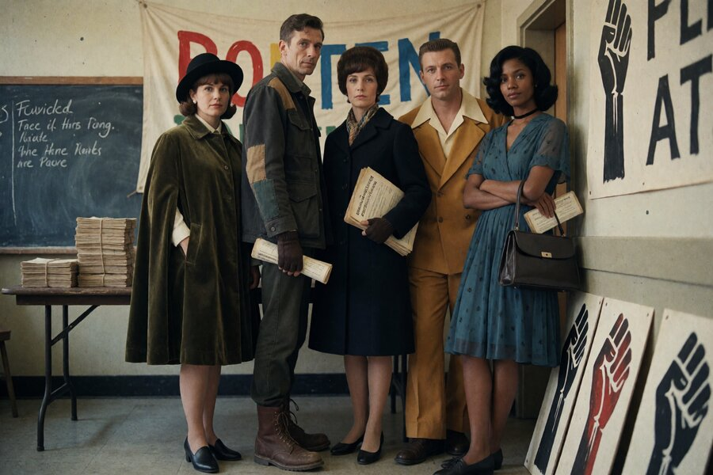
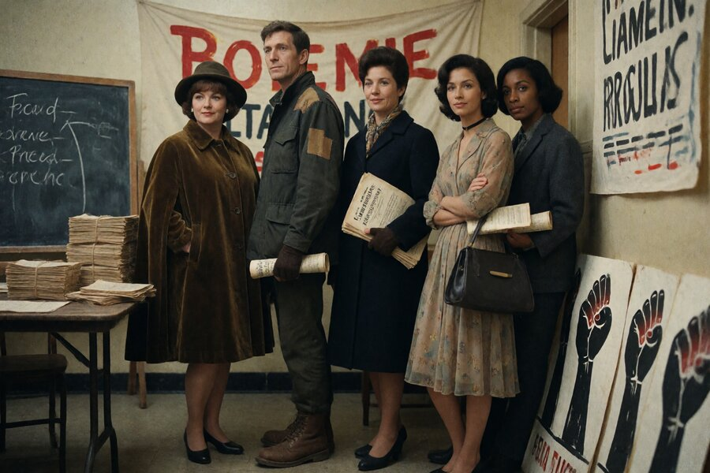
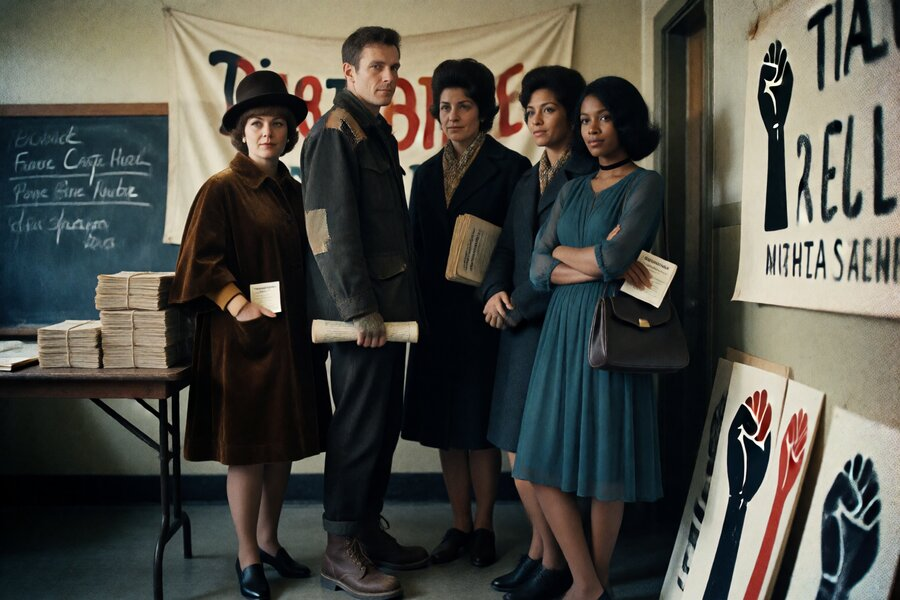

# Verdict: the distill LoRA recovers most of the 4-step quality loss, but not all of it

Another item off the [experiment register](2026-09-02-experiments-sankey.html):
`feature/krea2-4step-chk14000-distill-test`. This one now has an ending: all
three arms confirmed rendered through the branch's own Concourse pipeline
and uploaded to Immich, and a real frame-to-frame comparison against the
design doc's own quality axes, not just a passing visual glance.

## The hypothesis

Production crew-portrait renders on this rig run
[Krea2 Turbo](https://huggingface.co/krea/Krea-2-Turbo) at 8 steps. A
r/StableDiffusion-linked LoRA,
[`lvladikov/Krea2-Turbo-Distill-4step-LoRA`](https://huggingface.co/lvladikov/Krea2-Turbo-Distill-4step-LoRA),
claims a 44% reduction in prediction error against the 8-step teacher at
checkpoint `chk00014000`, measured by the author across 100 held-out prompts.
That's the author's own benchmark, not a guarantee for this project's actual
content (dense multi-figure period group portraits with halftone/grain
styling), so the branch treats it as something to test, not something to
trust.

The pinned file is `krea2_turbo_4step_rank_64_lora_chk00014000_comfyui.safetensors`,
fetched from HF repo commit `d5ebe6a71eba7b968cb54bbef8feba062c85ca08`, per
the author's own guidance to pin a numbered checkpoint rather than the
rolling `_latest` pointer. An earlier branch had already tried this LoRA
lineage at an older checkpoint (`chk00006000`) and never filled in a results
table; per instruction that branch was abandoned outright, not resumed, so
this is a fresh comparison against the current checkpoint, not a retry.

## Three arms, one caught confound

Build 1 (`aa4e099`, 2026-08-23) added the design doc and a two-arm pair:
8-step baseline vs. 4-step with the LoRA chained in at strength 1.0, holding
everything else constant (prompt text reused verbatim from a five-figure
crew-portrait manifest, seed 42, 1.5MP/3:2 resolution, cfg 1.0, euler/simple,
same base checkpoint and CLIP/VAE, the project's optional secondary LoRA off
as usual for this scene).

Build 2 (`72d7915`, 2026-08-25) was a two-day gap spent fixing a submission
bug, not a render: both workflow files had been saved with the full
`{"prompt": {...}, "client_id": ...}` POST envelope instead of the bare node
graph every other workflow file in the repo uses, so the branch pipeline's
own wrapping step double-wrapped them and `comfyui-local` rejected both as
invalid API-format JSON. Fixed by replacing each file's contents with just
its inner graph.

Build 3 (`a66171b`, 2026-08-26) caught something the first two arms hadn't
controlled for: they changed step count (8→4) *and* added the LoRA in the
same render, so any face/eye degradation seen in the 4-step arm couldn't be
attributed to either variable alone. A third arm re-renders the same scene
at 4 steps on the plain baseline checkpoint with no LoRA at all, isolating
step count from LoRA presence between the two 4-step renders.

## What's still open

All three arms are single-trial (N=1 per arm, explicitly not a repeatability
claim per this repo's own experiment-design standard). Peak GPU VRAM (design
doc DV 3) was never actually instrumented in this branch's render pipeline,
so that axis stays unanswered. Wall-clock (DV 2) is available but confounded
by cold-start position: the baseline arm and the isolate arm each ran first
in their own separate Concourse build (33s each, paying a one-time model
load cost), while the 4-step+LoRA arm ran second in the same build as the
baseline (21s, already warm). That gap tracks build order more than it
tracks step count, so no clean "half the wall-clock" claim follows from
these three numbers alone.

## Output: the renders, and the comparison the design doc actually asked for

The three renders were sitting in the `comfyui-local` container's persistent
output volume, under `krea2_4step_distill_test/`, filed under the exact
prefixes each arm's workflow writes (`militants_baseline_8step`,
`militants_test_4step_distill`, `militants_isolate_4step_nolora`), and are
confirmed uploaded to this project's `Blades68 Branch Renders` Immich album.
All three are 1536x1024 (1.5MP, 3:2), matching the design doc's stated
resolution, and each shows the same five-figure crew scene the design doc
describes.

*Left to right: 8-step baseline, 4-step with the distill LoRA, 4-step isolate
with no LoRA.*

The 8-step baseline is the clear quality ceiling: distinct pupils and
catchlights, real skin-pore texture, coherent velvet/patch/paper material
rendering, and no anatomical defects across the five figures. The 4-step
isolate arm (no LoRA) is a severe, independent regression: melted or
smudged faces, one figure with an arm that merges into her torso with no
visible elbow, and materials collapsing into flat blobs. The 4-step+LoRA
arm recovers most, not all, of that loss: facial structure and material
coherence return to recognizable and sharp, but skin reads slightly
plastic and over-smoothed next to the baseline's texture, fine wardrobe
detail is simplified, and some arm/elbow merging persists on one figure.

## Verdict

Quality loss traces predominantly to the step cut, not the distill LoRA.
The original two-arm test (baseline vs. 4-step+LoRA) varied both step count
and LoRA presence at once, so on its own it couldn't attribute the test
arm's quality loss to either variable, which is exactly why the isolate arm
exists. With all three arms together: the LoRA is doing real recovery work,
not merely riding along with a change that would have been fine anyway.

That does not mean the distill LoRA "matches or beats" the 8-step baseline,
the original hypothesis's actual bar. It substantially closes the gap that
raw 4-step-no-LoRA opens up, cutting sample steps in half at a real but
smaller quality cost than running stepless-unassisted. Whether that cost is
acceptable for production crew-group portraits is a call for Gavin, not
settled here: this result is N=1 per arm and specific to the `militants`
crew and prompt, not tested against the other five crews.
