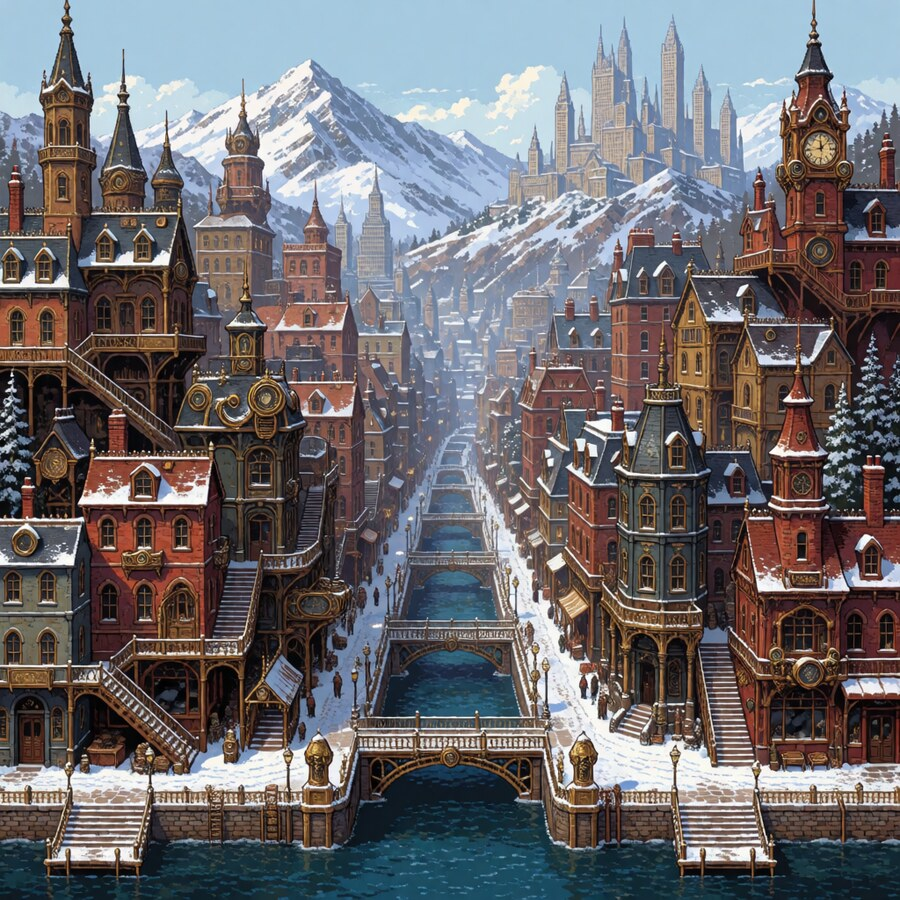

# Krea2 Turbo builds the JRPG city, but not in 16-bit pixel art

This one belongs to a different category than most of the
[experiment register](2026-09-02-experiments-sankey.html): not a formal
hypothesis test with dependent variables, but a straight "does this claimed
trick actually work on this rig" reproduction attempt, the kind this site
will keep coming back to. Item #18: `feature/krea2-pixelart-gamelevel-test`.
Nobody looked at the time this branch was worked. This retrofit pass found
the render sitting unarchived in the render container's output volume, so
there is now an answer, just not the one the source post promised.

## What was being reproduced

A r/StableDiffusion post (thread ID `1vtdr3l`, unlinked here because it couldn't be verified as still live)
claimed [Krea 2 Turbo](https://huggingface.co/krea/Krea-2-Turbo) produces
high-quality 16-bit pixel-art JRPG game-level scenes out of the box, no LoRA
needed, purely from prompt structure: dense stairs/bridges/stacked-building
architecture, a named art style, and explicit camera framing. The claim
under test is narrow and specific: that a hand- or LLM-crafted, already-
detailed prompt works close to verbatim, not whether this pipeline's own
prompt-refinement stage could also arrive at the same result on its own.

## What was actually built

The single commit on this branch (`6a48b21`, 2026-08-20) adds one workflow
file, `workflows/krea2_pixelart_gamelevel_test.api.json`: the original
poster's first verbatim prompt (a victorian steampunk winter riverside
city) swapped into the user-prompt node, no LoRA attached (already this
pipeline's default), and internal prompt-refinement explicitly turned off
so the posted prompt reaches CLIP unmodified rather than getting rewritten
by this project's own refiner first.

That's the entire branch. No second commit, nothing in the repo's own lab
notebook past the initial commit, no note about a build being queued or
blocked in this lab's own tracked archive. What this retrofit pass found is
that the workflow was, in fact, run at some point (the file is dated the
same day as the commit): the output just never made it into this lab's
archive or notebook, and sat unindexed in the render container's output
volume instead.

## What the render actually shows

*The output file (`Krea2_pixelart_gamelevel_test_00001_.png`, 1024x1024,
found in the render container's output volume, filename prefix matches this
branch's workflow exactly). It reproduces nearly everything in the prompt
text: the dense stacked architecture, the stairs and arched bridges over a
canal, the brass and Victorian detailing, the snow on rooftops and ledges,
and the snow-capped mountains in the background. What it does not reproduce
is the one thing the prompt explicitly asked for and the source post's
whole claim rested on: "16-bit pixel art." The image is a smooth digital
illustration, fine gradients and detailed linework, not a pixelated,
limited-palette JRPG sprite style.

## Where it actually landed

Partial, now that there's something to look at. The scene-construction half
of the claim holds up well on this rig: dense multi-level architecture,
named art elements, and camera framing all come through from the prompt
close to verbatim, no LoRA needed. The style half of the claim does not:
whatever made the original poster's screenshots read as "16-bit pixel art"
did not carry over to this render. Comparing this output directly against
the original post's screenshots (not done here) would say more precisely how
close the miss is; what's checkable now is that this particular reproduction
attempt, on this rig, did not produce pixel art from the prompt alone.
