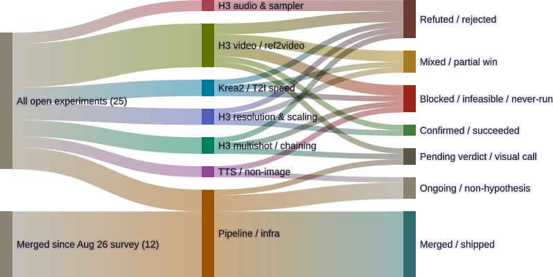

# Two verdicts landed, one resolved to "never happened"

*A short register update against the [2026-09-02 Sankey](2026-09-02-experiments-sankey.html) — what moved since that count, not a full re-survey.*

The 21 [per-experiment deep-dives](index.html) published since the last count
carry the narrative detail. This post is just the register-level view: three
items changed state since 2026-09-02, and the shape of the diagram moved with
them.

<figure>
  
  <figcaption>Same 25 open + 12 merged register as 2026-09-02, three items re-routed to their landed verdicts.</figcaption>
</figure>

## What moved

**`krea2-4step-chk14000-distill-test` → Mixed / partial win.** The three-arm
comparison (8-step baseline, 4-step + distill LoRA, 4-step isolated with no
LoRA) finally got its frame-to-frame read: [step count, not the LoRA, is what
drives the quality loss](2026-09-04-krea2-4step-distill-pending.html) —
the isolating third arm shows severe degradation at 4 steps with no LoRA
present at all. The LoRA recovers most, not all, of that loss: facial
structure and materials come back coherent, but skin reads slightly
over-smoothed and some wardrobe detail simplifies next to the 8-step
baseline. Doesn't match the baseline outright, does substantially close the
gap. N=1 per arm, specific to the `militants` crew prompt — not a
production-adoption decision, that's still Gavin's call.

**`krea2-pixelart-gamelevel-test` → Refuted.** The Reddit claim that Krea2
Turbo produces authentic 16-bit pixel art from prompt structure alone
[doesn't hold](2026-09-04-krea2-pixelart-gamelevel.html): no pixel grid, no
dithered palette, no tiling, wrong proportions for the claimed format. What
it actually produces is closer to pre-rendered 32-bit-era background art or
modern "HD-2D" concept art — a real capability, just not the one under test.
Clean single-claim binary check, N=1, no further arms planned.

**`sopro-tts-experiment` → Blocked (resolved to "never started").** Last
cycle's register carried this one as state-unclear. It's now confirmed: the
branch tip is byte-identical to an unrelated merge commit already on `main`
— zero unique commits, and nothing in the repo, workflow files, or commit
history mentions "sopro" by name anywhere. Not a stalled experiment with
lost work behind it; a branch that was created and never used.

## What didn't move

`tts-voice-clone-benchmark` picked up a fifth validated model
(MOSS-TTS-Local-Transformer-v1.5, 12.2GB peak VRAM, RTF 1.1-1.35x, native
48kHz stereo output) since the last count, but it's an ongoing harness build,
not a hypothesis test, so it stays routed to `Ongoing / non-hypothesis`
either way — ten candidates left. Full progress table in [the harness
write-up](2026-09-06-tts-voice-clone-benchmark-progress.html).

Everything else — the H3 video/resolution/audio/multishot domains, the
Pipeline/infra items, the 12 merged branches — is unchanged from 2026-09-02.

## Caveats (same as last time)

Same two normalizations as the original post: `krea2-4step-chk14000-distill-test`
counts once per work-domain lens (H3 video *and* Krea2/T2I speed), so the
middle-column totals don't sum to 25; and every Confirmed/Refuted/Mixed flow
already passed a confound check upstream of this diagram (seed pinned, prompt
held constant, one dependent variable per arm) — the diagram shows the shape
of the register, not the audit trail.

## Source

- Mermaid source: `~/.openclaw/workspace/genops/experiments-sankey-2026-09-04.mmd`
  (diffed against `experiments-sankey-2026-09-02.mmd`, only the three flows
  named above changed)
- Rendered with Mermaid 11.16.0, transparent background, 800px, matching the
  2026-09-02 render exactly
- Verdicts landed in `gavmor/blades68-lora`: `dad1c5e` (distill LoRA),
  `7f7ea09` (pixelart), both 2026-09-04

Survey baseline: 2026-09-02. This update: 2026-09-04.
