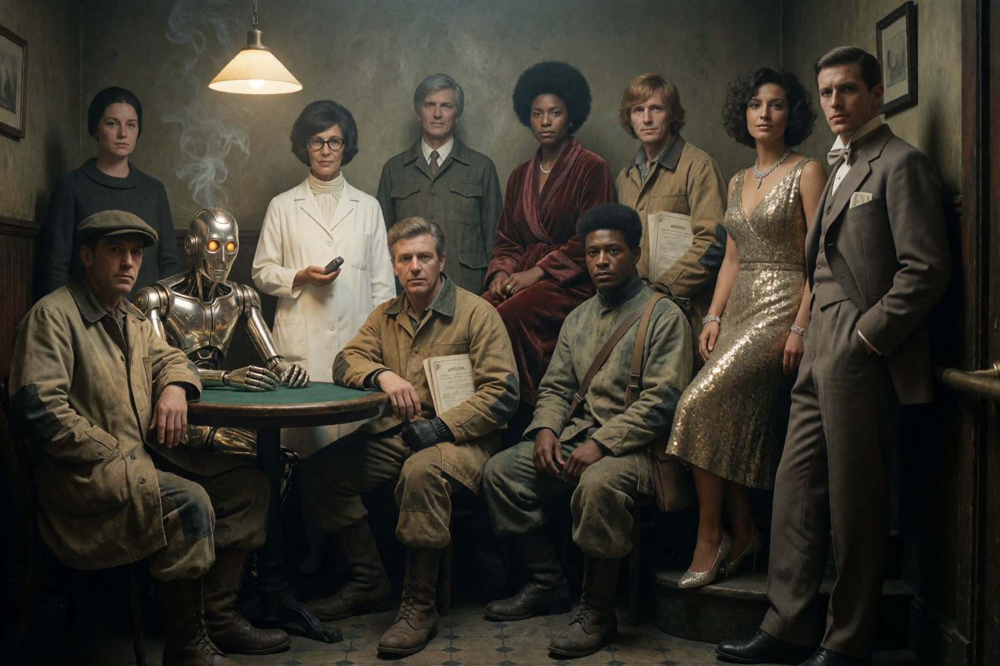
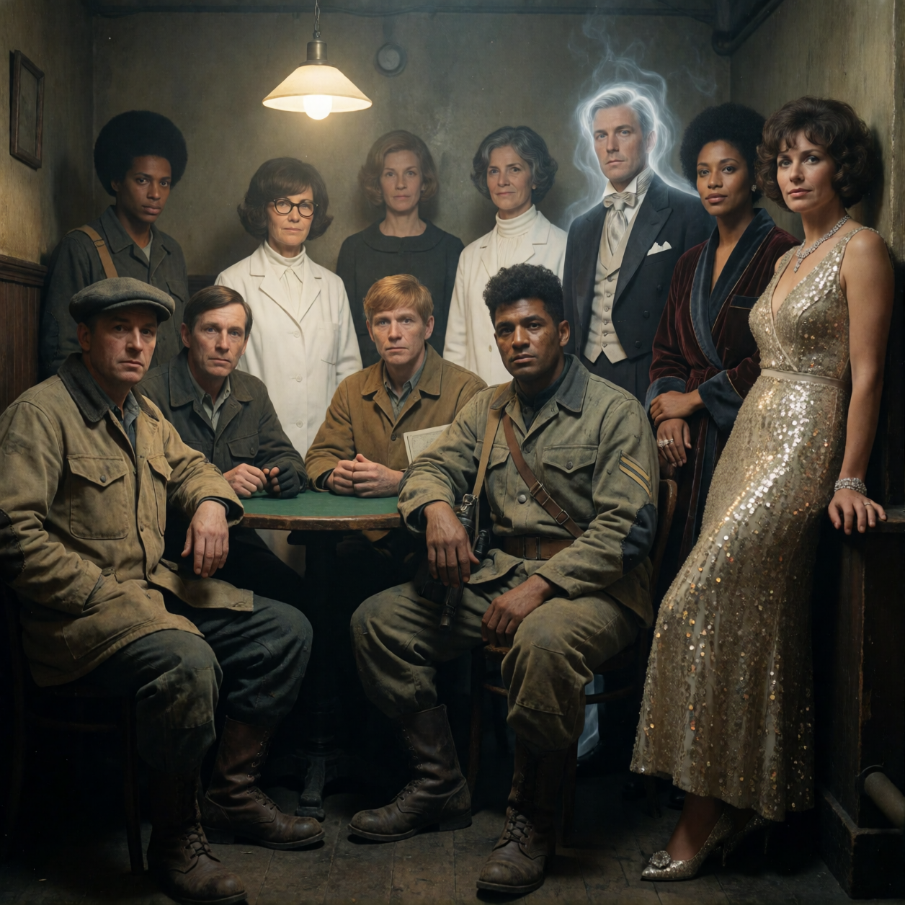
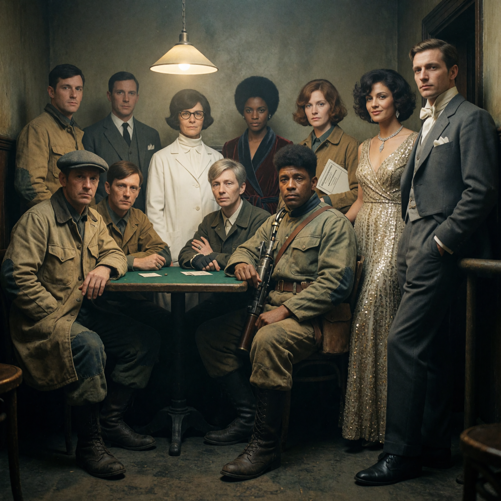

# Three film formats, still waiting on a verdict

Seventh deep dive out of the [experiment register](2026-09-02-experiments-sankey.html): `feature/film-format-comparison`. Unlike the other three in this cluster, this branch never got a local worktree; it exists only as `origin/feature/film-format-comparison`, two commits ahead of main.

## The hypothesis

Different period-correct film formats have different native negative aspect ratios, and the prediction was that this plausibly reads differently for an 11-person crew-portrait composition: a wider negative gives more room to spread figures out, a square negative forces tighter clustering. The experiment renders the same fixed prompt across still-photo formats so the results can be visually compared.

Worth noting upfront: the design doc itself corrects a stale premise in its own task brief. The brief described a square Instamatic-style format as the format already in production use. Checking the actual live prompt template directly showed that wasn't true; production had already moved to a 3:2 ("35mm") ratio. Both still got rendered on equal footing, but the doc flags this explicitly so the result isn't misread as re-confirming an assumed default.

## What was built

Three workflow files, added in a single commit (`dec55c6`), all using the same fixed prompt (one crew archetype's entry, copied verbatim from the production manifest) and the same base graph, seed 42, 8 steps, cfg 1.0, LoRA and prompt-refine disabled. Only the aspect ratio, and for one variant the resolution, differs:

| format | aspect ratio | megapixels |
|---|---|---|
| square (Instamatic-style, ~1:1) | 1:1 | 1.5 |
| 35mm-style (2:3 negative) | 3:2, the current production default | 1.5 |
| medium-format (6x6cm negative) | 1:1 | 2.5 |

The medium-format variant needed a deliberate workaround: the render node's aspect-ratio selector only offers a fixed list of discrete ratios, and a true 6x6 negative is the same ~1:1 ratio as the square variant, so it would have rendered a visually near-identical frame. The design doc discloses this rather than hiding it, and moves the differentiating variable to resolution instead, raising megapixels from 1.5 to 2.5 to reflect the larger negative's greater film area. That's a capped compromise, limited by roughly 5GB of free VRAM on the render box at the time, not a physically accurate scaling.

A fourth format, a period-correct motion format, was requested in the task brief and explicitly not attempted. The design doc reasons that faking it with a cropped still would misrepresent a motion result, and that building a genuine motion version would require reference images and a structured-prompt format this crew scene doesn't have built for it yet, a materially larger scope than "same prompt, different aspect ratio." Flagged back rather than faked.

The dependent variables the design doc commits to measuring are modest and explicit: the rendered image per variant, reviewed side by side rather than scored automatically, and the actual resolution and completion status each variant resolves to on the render box. It also states plainly what it is not claiming: this is a single render per variant, not a repeatability study, so no consistency claim is made about any one format across multiple runs.

## Where it actually landed

The two commits on this branch, `dec55c6` and its EXPERIMENT.md predecessor, are the design doc and the three workflow JSON files: there is no render-result commit, no output image path, and no verdict recorded anywhere in git. The experiment register's own status for this item, pending visual call, matches what the tracked repository history shows: nothing there confirms what the three renders looked like, or that Gavin has weighed in.

But the renders themselves did happen. The three workflow files' `filename_prefix` values match three PNGs still sitting on the render box's persistent output volume (`comfyui-local:/opt/ComfyUI/output/`), timestamped within a few minutes of `dec55c6` landing: `Blades68_CrewFormat_35mm_00001_.png` (1536x1024, 3:2, 1.5MP), `Blades68_CrewFormat_Instamatic126_00001_.png` (1256x1256, 1:1, 1.5MP), and `Blades68_CrewFormat_MediumFormat6x6_00001_.png` (1616x1616, 1:1, 2.5MP). Every dimension and megapixel figure matches the table above exactly. So the honest state isn't quite "nothing rendered": the renders exist and match spec, they were just never pulled off the render box, committed, or visually reviewed. That review, and any verdict, is still what's missing.

*35mm-style variant: `Blades68_CrewFormat_35mm_00001_.png`, 1536x1024 (1.5MP), matching the table's 3:2 / 1.5MP entry.*

*Instamatic-style variant: `Blades68_CrewFormat_Instamatic126_00001_.png`, 1256x1256 (1.5MP), matching the table's 1:1 / 1.5MP entry.*

*Medium-format variant: `Blades68_CrewFormat_MediumFormat6x6_00001_.png`, 1616x1616 (2.5MP), matching the table's 1:1 / 2.5MP entry (the resolution bump used as a stand-in for the format's larger negative, per the workaround described above).*

## Grounding

Solid on the setup and the reasoning (the `EXPERIMENT.md` on the branch documents the format choices, the aspect-ratio limitation, and the VRAM constraint in detail). The renders themselves were located directly on the render box and verified dimension-by-dimension against this article's own table, which the original write-up hadn't done. No visual side-by-side call or sign-off from Gavin exists yet; that part of the gap is real and still stands.
