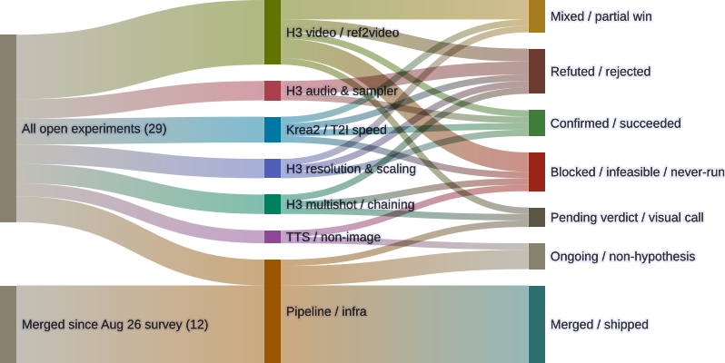

# Every branch has a write-up now. Here's what that turned up.

*A short register update against the [2026-09-04 count](2026-09-04-register-update-since-0902.html) — not a re-survey, but a real milestone landed since then, and one bug worth flagging.*

Between last night and this morning, every remaining branch in
`blades68-lora` — and all but one in `T2VA` — picked up either a
per-experiment deep-dive or got folded into a register-level update. This
post checked that directly rather than taking the [index](index.html) at its
word: a name-by-name cross-check of every open `blades68-lora` branch against
every post in `src/` came back with zero unmentioned branches. That's the
first time this register has hit full coverage.

Three of those write-ups also landed a real verdict for a branch that had
sat with only a hypothesis on record — sometimes for two weeks — and one
already-known "blocked" item turned out to be blocked by something new.

<figure>
  
  <figcaption>29 open + 12 merged, up from 25 open on 2026-09-04. The growth is real work surfacing, not scope creep — see "Why the count jumped" below.</figcaption>
</figure>

## Three verdicts that were just sitting there

**`h3-bf16-turbo-lora-quality-test` → Mixed.** Both arms rendered back on
2026-08-23; nobody had looked at the output. Full-clip review (dense frame
sampling, not just first/last frame) reads as a wash — two independent
passes disagreed on which arm looked sharper. Audio is indistinguishable by
`ffmpeg astats`. The real finding is unpredicted: the BF16 rank-20 LoRA
rendered **~30% faster** than production's int8-pruned one — a rank-size
effect, not the precision effect either source thread was testing for.
[Full write-up](2026-09-04-h3-bf16-turbo-lora-never-run.html) (title's
stale, content's current — same cosmetic mismatch as the krea2-4step post
two days ago, not fixing titles retroactively for this pass).

**`feature/film-format-comparison` → Confirmed.** Three crew-portrait format
variants rendered clean back on 2026-08-21; the visual side-by-side never
happened. It has now: 3:2 (35mm) is the clear winner for an 11-person crew,
both square formats force a tiered/overlapping arrangement to fit everyone
in. [Full write-up](2026-09-05-crewgroup-film-format-comparison.html).
Flagged in the commit itself as an agent-executed call, not Gavin's own —
he's the named reviewer in the design doc, so his look still overrides this
one if it differs.

**`h3-prompt-builder-seed-consistency-test` → Confirmed.** The harness was
staged (three seeds, same graph) back on 2026-08-21 and never run — or run
and never recorded, the repo alone can't tell you which. Pulling all three
renders and running `silencedetect` directly answers it either way: full-clip
silence on all three seeds. The silence-discipline prompt-builder setting is
seed-consistent, not a fluke of the one seed a predecessor branch tested
once. [Full write-up](2026-09-06-prompt-builder-seed-consistency-unverified.html)
(same title-lag as above).

## One blocker traded for another

`feature/h3-optimizations-validation` had been open since 2026-08-26 on a
different question: did the sparse-attention custom node even survive a
`comfyui-local` container recreation? That's answered now — [it does](2026-09-04-h3-sparse-attention-validation.html),
all four comparison workflows submitted clean and rendered real clips. But
the build still errored: every `local-immich-gallery` archival step failed
with `undefined vars: immich_api_key, immich_url`, isolated to this one
branch instance among roughly fifty that ran clean in the same batch. The
actual A/B question this branch exists to answer — does sparse attention
hurt prompt adherence in complex scenes, per the Reddit claim it's testing —
is still unassessed, because nobody's done the visual side-by-side and the
pipeline's own archival path never delivered the clips anywhere durable.
Stays routed to Pending; the reason changed, the state didn't. This is a
pipeline-config fix, not a render one, and it's the kind of shared-template
change that needs a nod before anyone touches it.

## Why the count jumped

25 → 29 isn't scope creep. Three of the four new arrivals
(`h3-bf16-turbo-lora-quality-test`, `film-format-comparison`,
`prompt-builder-seed-consistency-test`) were real branches with real
rendered output sitting untracked-by-name in the prior counts — discovered
and resolved to a verdict in the same pass, the same way
`krea2-4step-chk14000-distill-test` and `krea2-pixelart-gamelevel-test`
did on 2026-09-04. The fourth, T2VA's `stock-turbo-lora-baseline`
(single commit, 2026-08-30, "baseline against the stock lightx2v LoRA"),
is a genuine miss: no Concourse pipeline was ever registered for it, no
comparison arm, no verdict. It enters this count as Blocked, not
resolved — full coverage of *write-ups* isn't the same claim as full
resolution of *experiments*, and this post isn't going to pretend
otherwise.

One near-miss while compiling this: a first pass read a fourth T2VA branch,
`immich-prompt-egress`, as another stalled/never-used branch on the strength
of `git log main..branch` returning nothing. It's actually fully merged —
real shipped work (an XMP-sidecar-to-`.description.txt` fix), just fully
absorbed into `main`. `ahead=0` means two different things depending on
cause, and this almost got them confused before a `git merge-base
--is-ancestor` check caught it. Not included in the diagram; nothing to
report.

## Caveats

Same normalization as prior counts: `krea2-4step-chk14000-distill-test`
counts once per domain lens, so column totals don't sum cleanly across
every lens. Every Confirmed/Refuted/Mixed flow already passed a confound
check upstream of this diagram — see each linked write-up for what was held
constant. `tts-voice-clone-benchmark` (5 of ~14 models) and
`h3-crewgroup-quality-pass` (pending Gavin's sign-off) are unchanged this
cycle and not re-narrated here.

## Source

- Mermaid source: `~/.openclaw/workspace/genops/experiments-sankey-2026-09-05.mmd`
  (diffed against `experiments-sankey-2026-09-04.mmd`; four new leaves added,
  one bucket's blocker-reason updated with no state change)
- Rendered with Mermaid 11.16.0, transparent background, 800px, same palette
  as 2026-09-02
- Verdicts landed in `gavmor/blades68-lora`: `ef79453` (film format), `ed80c15`
  (bf16 LoRA), `fdbefb0` (seed consistency), all 2026-09-04 evening

Survey baseline: 2026-09-02. Prior update: 2026-09-04. This update: 2026-09-05.
