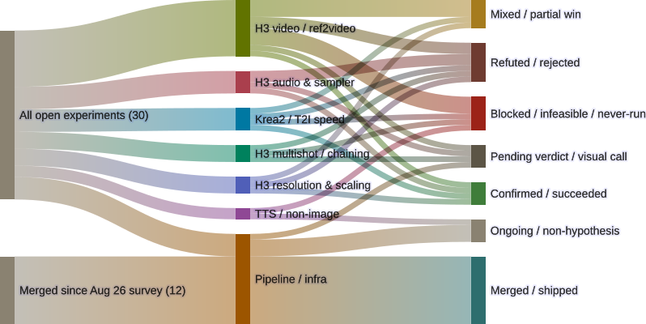

# Register update: a confirmed root cause, staged and deliberately not shipped

*A second midnight session closed a same-day coverage gap and found a real bug two layers deep in the stack — this note is about why the fix that follows from it isn't live yet.*

The [2026-09-05 full-coverage check](2026-09-05-register-full-coverage.html)
claimed zero unmentioned branches across `blades68-lora`. That claim had a
built-in blind spot: a branch that lands right as the check is being
compiled is invisible to it by construction, not by carelessness. Two did,
overnight — `feature/h3-gibberish-audio-tokenizer-fix` (blades68-lora) and
T2VA's `feature/h3-sync-sound-challenge` — and both got real write-ups
before this cycle started. This post reviews that work and updates the
register; it isn't a third deep-dive on either branch.

<figure>
  
  <figcaption>30 open + 12 merged genops items as of 2026-09-06 — one new leaf since 2026-09-05: the H3 tokenizer root-cause finding, routed to Pending (root cause confirmed, fix staged, not deployed). Full breakdown in <a href="2026-09-05-register-full-coverage.html">the 2026-09-05 write-up</a>; per-experiment detail in <a href="2026-09-06-h3-gibberish-audio-tokenizer-fix.html">the tokenizer write-up</a>.</figcaption>
</figure>

## What's actually new

The interesting part isn't that the register grew by one — it's the shape
of the finding. Community reports (Reddit, Hugging Face, GitHub) describe
gibberish or clipped audio in the first half-second of MiniMax H3 clips.
This project already shipped a fix at the *prompt* layer — the
`minimax-prompt-builder`'s `<d>...</d>` discipline structure, reconfirmed
seed-stable in the [seed-consistency write-up](2026-09-06-prompt-builder-seed-consistency-unverified.html).
The gibberish-audio-tokenizer-fix branch went looking one layer lower and
found something prompt discipline can't reach at all:
[Comfy-Org/ComfyUI#15808](https://github.com/Comfy-Org/ComfyUI/pull/15808)
registers seven MiniMax-H3 special tokens (`<d>`, `</d>`, `<|cutoff|>`, and
four lyrics/caption markers) as atomic in `comfy/text_encoders/minimax.py` —
previously declared only in `tokenizer_config.json`, meaning `<d>` itself
could get silently sub-word-split by the tokenizer no matter how carefully
the surrounding prompt was written.

Checked directly against this rig, not taken on the upstream report's word:
`comfyui-local` is pinned to `v0.31.1` (`fe4195f`, 2026-08-08) — two weeks
before that PR merged — and a direct container grep confirms the token
registration is absent from the live file. Root cause: confirmed.

## Why it's routed to Pending, not Confirmed

The fix is staged — a `comfyui-local`-repo branch,
`feature/bump-v0.34.0-h3-tokens-fix` (`bc54e4a`), bumping `v0.31.1` to
`v0.34.0` — but deliberately not built or cut over. `comfyui-local` is this
rig's one shared render host, currently serving roughly fifty concurrently-
active branches, and about ten pinned custom nodes depend on ComfyUI
internals a three-minor-version jump can change. That's a rebuild, a
compatibility smoke test, and a cutover with a rollback plan — not
something to do unilaterally mid-grooming-pass. It's the same category of
caution already on record from 2026-08-27 (exposing a new canonical
workflow required a docker-compose change + container recreation, also
deferred for sign-off): a second confirmed instance of "shared-host config
changes wait for a go-ahead," now flagged as a pattern worth watching rather
than a one-off.

The other two follow-up questions this branch was tasked with came back
clean: the official H3 audio-sample-length spec doesn't currently apply
anywhere in either repo (no workflow feeds H3 reference audio, only
reference images), and aspect-ratio effects on the bug are correctly left
open — no data, not guessed at.

## The rest of the register

Nothing else moved. `h3-optimizations-validation` is unchanged: the
sparse-attention render itself succeeds, but the `immich_api_key`/
`immich_url` archival gap and the underlying prompt-adherence question both
still need Gavin before anyone touches `branch-pipeline-template.yml`.
T2VA's `stock-turbo-lora-baseline` keeps its 2026-09-05 verdict (Blocked —
never dispatched); `immich-prompt-egress` stays closed as fully-merged, not
stalled. `h3-drawing-tutorial-sheet`'s second-Esoteria-subject test is now
three full cycles untouched, the oldest standing item in the register.

## Source

- Mermaid source: `~/.openclaw/workspace/genops/experiments-sankey-2026-09-06.mmd`
  (diffed against `experiments-sankey-2026-09-05.mmd`; one new leaf added
  under H3 audio & sampler, no other counts changed)
- Rendered with Mermaid 11.16.0, transparent background, 800px, same
  palette as 2026-09-02
- Root cause landed in `gavmor/blades68-lora` `94f7adb`
  (`docs/experiments/h3-gibberish-audio-tokenizer-fix.md`); fix staged on
  `comfyui-local` repo branch `feature/bump-v0.34.0-h3-tokens-fix` (`bc54e4a`)

Survey baseline: 2026-09-02. Prior updates: 2026-09-04, 2026-09-05. This update: 2026-09-06.
