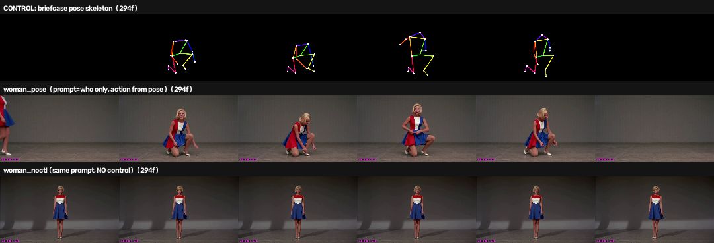
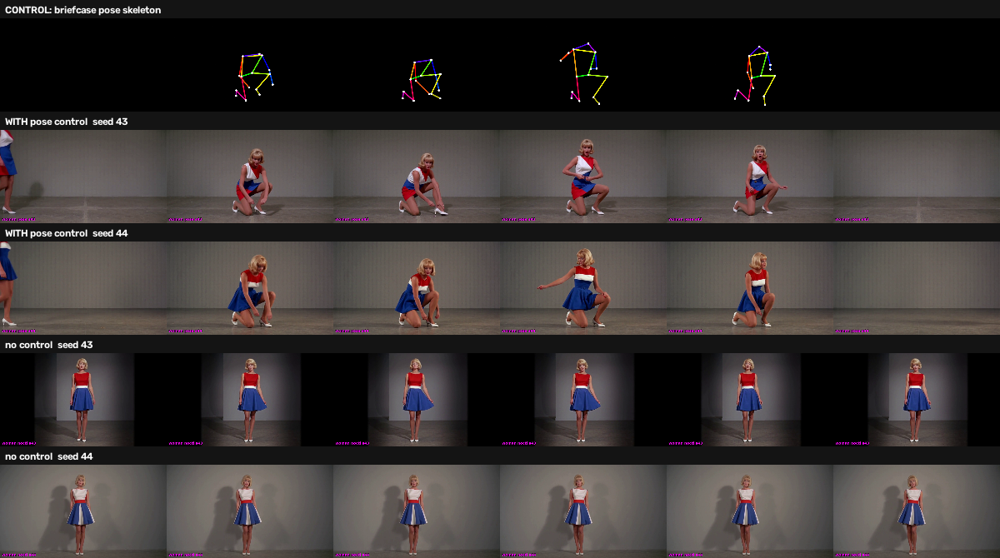

# Pose transfer works: the woman in the dress follows the briefcase poses

*Status: reproduced, N=3 per arm (seeds 42/43/44). Zero stranded GPU locks
across every build. Nothing here is a novel result — pose-conditioned video
generation is a known technique and the node is someone else's work. What this
write-up establishes is narrower and, for us, more useful: **it runs on this
rig, on one 24 GB card, through our pipeline, and the effect survives
replication.** Three days from "here's a ControlNet link" to a replicated,
published result — 23 days if you count from the first feasibility check that
said this rig couldn't do it. 18 minutes of GPU per 12-second clip, 20 of
24 GiB VRAM at peak. The [August feasibility check](2026-09-05-h3-fun-controlnet-union-test.html)
on this exact technique stopped before its first render — "can this rig run it
at all," answered no, blocked on a 124 GB checkpoint. That blocker cleared on
2026-09-15 when a loader shipped for Kijai's pruned variant. This is the same
experiment, unblocked and carried through.*

<figure>
  
  <figcaption>Top: the pose skeleton fed in. Middle: the render with pose control — she kneels, crouches, rises, exits. Bottom: identical prompt, no control — she stands still. The prompt describes only who and where; it never mentions kneeling, a briefcase, or a tripod.</figcaption>
</figure>

## Abstract

MiniMax-H3 accepts a pose-skeleton control video through a third-party
ControlNet node ([wyzborrero/ComfyUI-H3-FunControl](https://github.com/wyzborrero/ComfyUI-H3-FunControl),
published the morning of 2026-09-15) that loads Kijai's curve-form pruned
checkpoint instead of Alibaba's full-width release. The question was never
whether pose conditioning works in general — it does, and has for a while on
other model families. The question was whether it works *here*: one RTX 3090,
this ComfyUI install, our Concourse pipeline, on a subject the control has
never seen.

It does. With a prompt describing only *who and where*, and a control video
supplying *what happens*, H3 rendered a woman in a 1960s mini dress kneeling
and reaching toward the floor — an action the prompt never mentions. The
matched no-control arm, same prompt and seed, produced a woman standing still.
Repeated at three seeds, the split is clean: every pose arm crouches, no
control arm does.

Two earlier experimental designs could not have established this, for opposite
reasons. The design error is the more transferable part of the write-up, so
both are recorded below.

## Hypothesis

A pose skeleton extracted from arbitrary footage, fed to `H3FunControlApply`,
will impose that skeleton's action on a generation whose text prompt does not
describe the action.

**Dependent variable:** presence and timing of the action beats — kneel, ground
manipulation, rise, exit — in the rendered subject, judged against the control
skeleton.

**Falsifier:** the pose arm stands still like the no-control arm, or performs
action uncorrelated with the skeleton's timing.

Written before the arms rendered, per the repo's
[experiment design standard](https://github.com/gavmor/comfyui-workflows/blob/main/docs/adr/0004-experiment-design-standard-for-feature-branches.md).

## Methods

### Verifying the checkpoint before trusting the README

The loader accepts only the curve-form variant. Rather than trust the
documentation, the safetensors headers were read directly on the box:

| checkpoint | `adaln_proj.linear` | metadata | loader |
| :-- | :-- | :-- | :-- |
| `..._pruned_bf16` | `[96768, 8]` | `adaln_basis` | accepted |
| `..._union` (full width) | `[96768, 2688]` | — | explicitly refused |

Both had been downloaded back in August, so nothing needed fetching. The node
itself is 560 lines with zero third-party imports — only `torch` and `comfy.*`,
reusing `comfy.ldm.minimax.model.DiTBlock`. That is *why* it is small: with
curve-form weights, a control block simply is Comfy's own DiT block. It was
pinned by commit into `comfyui-local` with a `PINNED_COMMIT` file so the
container's state stays auditable.

### Building a control video from footage we own

No pose preprocessor is installed in this ComfyUI (only Canny), so the skeleton
is produced offline with MediaPipe `PoseLandmarker`, drawing an OpenPose-style
**coloured** skeleton at exactly the generation's dimensions and frame count —
the node hard-fails when control token count diverges from the video segment.

Rather than download a human-activity dataset (Kinetics, AVA, NTU RGB+D were
all considered), the source clip was *rendered by H3 itself*: a man in a
late-1960s suit walking in with a briefcase, kneeling, assembling a tripod, and
leaving. Perfect provenance, exact scale control, no licensing question, and it
sidesteps the defect that killed an earlier experiment in this line — reference
artifacts whose source material was unknowable.

### The measurement that redirected the whole experiment

Two properties of the control signal turned out to matter more than any node
parameter: how often the detector finds the figure, and how much of the frame
that figure occupies. The node's README names subject size — not strength — as
the binding constraint on control authority.

| control video | skeleton bbox | lit px | detection |
| :-- | --: | --: | --: |
| 0.40 MP, uncropped | 7.2 % | 6,050 | 100 % |
| 0.98 MP, uncropped | **7.1 %** | 12,360 | 100 % |
| 0.98 MP, autocropped | **10.6 %** | 18,833 | 100 % |

**Raising resolution alone does nothing for subject size.** Doubling the pixel
budget left the bounding box unchanged at ~7 %. That is the finding that
matters operationally: "render at a higher resolution" is not a fix for a weak
control, because the figure scales with the frame.

Cropping the source to the figure before extraction is the fix. The first
implementation stretched a tall crop into 16:9 and detection **collapsed to
52 %** — distorted limb proportions defeat the detector. Letterboxing restored
100 %. Aspect fidelity beats filling the frame.

### Three designs, only one of which can answer the question

| design | prompt | control | can it answer the hypothesis? |
| :-- | :-- | :-- | :-- |
| agreement | briefcase action | skeleton of *H3's own render of that prompt* | **No** — confounded |
| contradiction | briefcase action | turn-in-place skeleton | **No** — measures dominance |
| decomposed | *who and where only* | briefcase skeleton | **Yes** |

**Why agreement fails.** The skeleton came from H3's own render of the same
prompt and seed, so agreement between output and control was guaranteed whether
or not the ControlNet contributed anything. That build looked like a success and
proved nothing.

**Why contradiction fails.** Two mutually exclusive instructions admit no
coherent video. The design answers "which signal dominates?" — genuinely useful,
and the answer was *the prompt wins* — but the footage is uninterpretable as a
quality result. Ranking tools against each other on it is a category error. It
was ranked on it mid-session, wrongly; see Corrections.

**Why decomposed works.** The prompt was audited to contain no action or prop
vocabulary — including removing "locked off on a tripod" from the camera
boilerplate, since *tripod* is precisely the prop the pose introduces. Any
action in the output is therefore attributable to the control.

## Results

Both arms: 1312×736 (0.966 MP), 294 frames (12.25 s at 24 fps), same seed,
strength 0.8, control window 0.0–0.6. Prompt in both: a young woman with a
blonde bob in a red/white/blue colour-blocked A-line mini dress, studio,
locked-off camera. **No action described.**

| arm | control | outcome |
| :-- | :-- | :-- |
| `woman_pose` | briefcase skeleton | kneels, crouches, shifts weight, rises, exits — tracking the skeleton timepoint by timepoint |
| `woman_noctl` | none | stands, essentially one pose across all six sampled timepoints |

Identity and wardrobe held in both arms, so the pose drove the body without
disturbing appearance.

### Replication at seeds 43 and 44

One render proves nothing here. This experiment line has repeatedly produced
single-render results that replication overturned — reference arms that
vanished into seed noise, a retention dial that turned out to be measuring
something else, and two claims in this very session that had to be retracted.
So the arms were re-run at two more seeds, changing nothing but
`RandomNoise.noise_seed`.

<figure>
  
  <figcaption>Top: the control skeleton. Middle two rows: pose control on, seeds 43 and 44 — she crouches, one knee down, reaching toward the floor, then rises. Bottom two rows: same seeds, no control — she stands, essentially one pose throughout.</figcaption>
</figure>

| seed | with pose control | no control |
| :-- | :-- | :-- |
| 42 | crouches, rises, exits | stands |
| 43 | crouches, rises | stands |
| 44 | crouches, rises | stands |

Three for three, with no exceptions in either direction. The crouch lands in
the middle timepoints in both pose arms, matching where the skeleton kneels.

The render times corroborate it independently: pose arms took 1081 s and
1079 s against 865 s and 867 s for the no-control arms — roughly 215 s of extra
work per arm, at both new seeds. The ControlNet is not quietly no-op'ing.

### What pose control does not do

No briefcase and no tripod appear in any pose arm. The control carries **body
position only** — it has no channel for objects, so the woman performs the
kneeling-and-reaching motion of handling something with nothing there. For
production use that is the practical boundary: pose supplies the action, the
prompt still has to supply the props.

### The failure mode worth knowing about

In the contradiction design at 0.98 MP, something stranger than "control
ignored" happened: the prompt still governed the human, **but the skeleton
rendered as a physical armature standing in the frame** — a dark angular
structure with the skeleton's proportions, present from the first frame. The
conditioning had gained enough authority to enter the image without gaining
enough to steer the subject, so it was absorbed as a foreign object. That is
the signature of an under-weighted control, distinct from one doing nothing.

### What it actually cost

The thing I always want to know when someone reports a result, and rarely
find: how long did this take in real hours, on real hardware?

**Render time**, measured from ComfyUI's own execution timestamps rather than
wall-clock guesses, at 1312×736 × 294 frames (12.25 s of video at 24 fps):

| arm | renders | each | per second of output |
| :-- | --: | --: | --: |
| no control | 5 | 855–874 s (~14.4 min) | ~70 s |
| with pose control | 3 | 1077–1101 s (~18.1 min) | ~88 s |

So **roughly 70× real-time without the control, 88× with it** — about 26 %
slower, or 222 s of extra compute per clip, consistent across every seed. Put
plainly: a twelve-second shot is a fifteen-to-eighteen-minute wait, and a
four-arm comparison ties up the card for an hour.

**Memory.** The generation itself is 943 tokens per latent frame, 74 latent
frames, **69,782 sequence tokens**. The ControlNet materialises a control
tensor the size of the video sequence alongside the image tensor — the OOM
traceback named them explicitly, `control (83190, 5376)` and `img (83190,
5376)`, about 0.83 GiB each in bf16.

| configuration | peak VRAM | of 24 GiB |
| :-- | --: | --: |
| no control | ~16.2 GiB | 68 % |
| pose control | ~20.0 GiB | 83 % |
| native `ref_videos` v2v | ~20.9 GiB | 87 % |

It fits on a 3090 with roughly 3.6 GiB spare — but only on a *clean* card.
Running a second arm in the same process without freeing VRAM first put the
ControlNet arm at `Free (according to CUDA): 155.69 MiB` and killed it
mid-sampler. On 24 GiB this is a real constraint, not a footnote.

**Development time.** This is the number I set out to publish and then got
wrong on the first pass, so here it is at three honest scales.

| span | elapsed |
| :-- | --: |
| Active build: first commit → working result | ~4 hours |
| Asked → published, replicated result | **~3 days** |
| First feasibility check → published result | **23 days** |

The four-hour figure is real but measures the wrong thing: it is time on task
for one branch on one afternoon. Quoting it alone implies you could sit down
after lunch and be done, and that is not what happened.

The **three days** is the number that matters. A ControlNet link arrived on
2026-09-12; the result published on 2026-09-16. In between: a second link with
a working node, a day of building, an overnight driver upgrade that took the
GPU out, a Concourse database that turned out to have no persistent volume, a
stale job timeout that killed the replication run, and roughly five hours of
infrastructure repair that produced no renders at all. None of that is
interesting as technique and all of it was required to get a result out.

The **23 days** is the full story. The [August feasibility check](2026-09-05-h3-fun-controlnet-union-test.html)
looked at this exact technique on 2026-08-24 and concluded *blocked, N=0* —
the checkpoint wanted ~124 GB. Nothing changed on this end. Someone else
shipped a loader for a pruned variant, and that is what moved it. Most of the
elapsed time was waiting for the ecosystem, not working.

Within the active four hours, the split was: verify the checkpoint variant,
build a pose extractor because none was installed, discover that resolution
alone does not fix subject size, and discard two experimental designs that
could not answer the question. Wiring the node in — the part a tutorial would
cover — was maybe twenty minutes.

Your mileage will differ wildly, because everyone's rig differs. But if you
are weighing whether to try this on a single consumer card: the model work is
an afternoon, and the calendar is a week. The gap between those two numbers is
the part nobody publishes, and it is almost entirely harness — drivers,
schedulers, storage, and discovering which of your measurements were
measuring nothing.

## Conclusion

Pose transfer works on this stack. The node loads, applies, costs real compute,
and imposes a specific unprompted action on a novel subject while preserving
prompt-specified identity — reproducibly, across three seeds.

None of that is a discovery. It is a reproduction: someone else's node, a
known technique, a checkpoint someone else pruned. The value is knowing it
runs *here*, what it costs on a 24 GB card, where its authority runs out, and
that the August "this rig cannot do it" verdict is now retired.

The operative division of labour: **the prompt says who and where; the pose
says what happens.** Fighting them is a diagnostic, not a workflow — a lesson
that cost four builds to learn properly.

This also makes ControlNet and H3's native `ref_videos` complementary rather
than competing. `ref_videos` transfers appearance and idiom; pose control
transfers motion, and neither carries props. They answer different questions,
and the mid-session claim that one is "clearly better" does not survive the
decomposed design.

### Limitations

- **The source is H3's own output.** This shows H3 reproducing motion it can
  already generate. Driving from genuinely external footage is the harder
  test, and is not done.
- **One prompt, one skeleton.** Three seeds establish the effect is not noise;
  they say nothing about how it generalises across subjects or actions.
- **No quantitative pose-adherence metric.** The verdict is visual. Two pixel
  metrics were attempted and both failed — one used each clip's own opening
  frames as a baseline (so a structure present from frame zero registered as
  no change), the other used a brightness threshold defeated by a darker
  render. Consistent with earlier findings in this line that pixel distance
  measures magnitude, not kind.

### Next

1. Pose extracted from genuinely external footage — the real generalisation
   test.
2. A control-window sweep at fixed resolution.
3. Pose control combined with a worn-cohort reference artifact — motion and
   wardrobe arriving through independent channels.

## Corrections

Claims made earlier in this same session and overturned by later evidence,
recorded rather than quietly edited away:

- **"The ControlNet tracks the skeleton beat for beat."** Confounded; the
  skeleton came from H3's own render of that prompt and seed. Retracted.
- **"Video-to-video is clearly better than ControlNet."** Asserted on
  contradiction footage where neither approach could produce sensible output.
  Unsupported.
- **An out-of-memory failure blamed on resolution.** It was not a resolution
  ceiling — the same arm had rendered alone at the same size. The preceding arm
  left 12 GiB of models resident and the VRAM flush only ran at job end. Fixed
  by flushing between arms; confirmed by the next build.
- **A process violation.** A VRAM probe was submitted directly to ComfyUI from
  a shell, without the GPU lock, rationalised as "just a probe, not an
  experiment." Interrupted and disclosed. The standing rule is that all
  generative work runs through Concourse; the fix was then verified by a
  pipeline build rather than by hand.
- **A build failure read as an experiment failure.** The first replicate run
  died at 45m26s. That was a stale job timeout, sized when arms rendered in
  94–132 s at the 0.4 MP quick preset; a four-arm build at 0.98 MP needs about
  67 minutes. Two arms had already finished. Raised to 3 h in both the
  standalone pipeline and the branch template.

## Artifacts

Eleven `render-and-review` builds. Every render held the cross-pipeline GPU
lock and egressed through a pipeline `put:` — **zero stranded locks**, on
infrastructure that was stranding them seven times in fourteen hours two days
earlier. Two builds failed without producing a result: one to an
out-of-memory, one to a stale 45-minute job timeout that predated the move to
the 0.98 MP preset. Both are recorded in Corrections; neither cost a
conclusion.

Seven Immich albums, from the source clip through to the seed replicates.
Machine-readable design and provenance live alongside the fixtures in
[`EXPERIMENT.yml`](https://github.com/gavmor/comfyui-workflows/blob/feature/h3-funcontrol-pose-20260915/EXPERIMENT.yml)
on `feature/h3-funcontrol-pose-20260915`.
