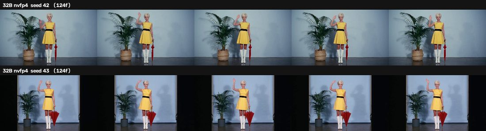

# Only one text encoder works with MiniMax H3, and it isn't a quality question

*Status: falsified hypothesis, and a cleaner answer than the one I went
looking for. Four encoders tested, two seeds, N=2 per compatible arm. The
experiment was designed to rank text encoders by prompt adherence; it
discovered that three of the four cannot run at all, for a reason you can
check in thirty seconds without downloading anything.*

## The question

From r/StableDiffusion, [post
1whr5j7](https://www.reddit.com/r/StableDiffusion/comments/1whr5j7/what_is_the_best_clip_model_for_h3/),
u/apostrophefee:

> what is the best clip model for h3 atm i'm using
> qwen3vl_32b_minimax_h3_nvfp4_awq.safetensors is this the only clip for h3 or
> is there any better one for my 8gb vram

Two questions in one, and they have different answers. *Is this the only one?*
— effectively yes. *Is there a better one for 8GB?* — the premise is wrong in
a way that is good news.

## What I expected to find

ComfyUI's `CLIPLoader` offered four Qwen3-VL variants on our box, all sharing
the Qwen3-VL vocabulary of 151,936 tokens, which made all four look like
plausible drop-ins:

| encoder | file size | layers |
| :-- | --: | --: |
| 32B nvfp4_awq | 14.61 GB | 50 |
| 8B fp8_scaled | 9.86 GB | 36 |
| 4B fp8_scaled | 4.88 GB | 36 |
| 4B abliterated | 8.27 GB | 36 |

So I designed a comparison: 4 encoders × 2 seeds, everything else held
identical, scored on prompt adherence. The hypothesis, committed before the
first render, was that smaller encoders would *degrade* adherence — dropping
specific colours, confusing left from right — in an order tracking model size.

The prompt was the instrument. A vague prompt cannot discriminate between text
encoders, so I wrote a scoring rubric as a sentence: 755 characters carrying 14
independently checkable attributes, weighted toward what a weaker encoder
plausibly drops. Named colours. A left/right hand binding. An arm pose. A
background object that must be present but is not the subject.

## What actually happened

The two 32B arms rendered in 76 seconds each. Then the first 4B arm died at the
sampler:

```
mat1 and mat2 shapes cannot be multiplied (180x2560 and 5120x5376)
```

H3's conditioning projection is a fixed `5120 → 5376` matrix. It accepts a
5120-dimensional hidden state and nothing else. Reading the hidden dimension
straight out of the safetensors headers:

| encoder | hidden dim | result |
| :-- | --: | :-- |
| 32B nvfp4_awq | **5120** | renders |
| 8B fp8_scaled | 4096 | fails |
| 4B fp8_scaled | 2560 | fails |
| 4B abliterated | 2560 | fails |

The arithmetic predicted that every non-32B encoder fails identically, and that
the 8B would fail with `4096` where the 4B showed `2560`. I ran it rather than
asserting it. It failed with `(180x4096 and 5120x5376)` — the predicted number,
in the predicted position. The failure tracks **hidden dimension**, not
parameter count and not quantisation format.

So the hypothesis is falsified, but not because the smaller encoders scored
badly. They do not produce a score. There is no quality continuum here, only a
shape check that a model either passes or does not.

**Matching vocabulary is not compatibility.** All four tokenise identically.
That tells you nothing about whether the model's output width fits what the
transformer expects, and it is why these four all appear side by side in
ComfyUI's dropdown looking interchangeable.

## Check before you download

You do not need a GPU or a render to test a candidate encoder. Read the
hidden dimension out of the header and compare it to 5120:

```python
import json, struct

with open("your_encoder.safetensors", "rb") as fh:
    n = struct.unpack("<Q", fh.read(8))[0]
    header = json.loads(fh.read(n))

dims = {h["shape"][0] for k, h in header.items()
        if k.endswith("input_layernorm.weight")}
print(dims)   # want {5120}; {4096} or {2560} will not load
```

Each transformer block's `input_layernorm` sits on the residual stream, so its
weight is a 1-D tensor exactly as wide as the hidden state. Every block agrees,
so this prints a single value. For an H3-compatible encoder it must be 5120.

Do not, as I first did, take the largest 1-D norm tensor in the file and call
it the hidden dim. That gives 5120 for the 32B and appears to work, but returns
4096 for the 4B — whose hidden dim is 2560 — because attention `q_norm`/`k_norm`
tensors are sized to the projected attention width, not the residual stream.
The snippet above was checked against all four encoders and returns the value
that actually appears in the error message.

## The 8GB question, which has a better answer

The asker is running a 14.61 GB encoder on an 8 GB card and it works. That is
worth explaining, because it is the actually useful finding for anyone in that
position.

ComfyUI logs this on every load:

```
CLIP/text encoder model load device: cuda:0, offload device: cpu, current: cpu
```

The text encoder is brought to the GPU, used to encode the prompt, and then
**offloaded back to CPU before sampling begins**. It does not stay resident
alongside the transformer. A 14.61 GB encoder therefore never has to fit
beside the 24 GB of activations that sampling wants — it is a transient cost at
the start of the job, not a standing one.

Which means the premise "is there a better one *for my 8GB*" dissolves. Encoder
size is close to free in VRAM terms. The cost of the big encoder is disk, RAM,
and the seconds spent loading and encoding — not the VRAM ceiling that would
otherwise force a downgrade. Even if a smaller H3-compatible encoder existed,
it would not buy an 8GB user much.

## What the one compatible encoder actually produces

Since the 32B is the only option, its adherence score is the baseline everyone
gets rather than a comparison point. Scored against the 14-attribute checklist
at two seeds:



It lands the difficult parts. Yellow A-line mini dress with a single wide
black stripe at the waist, white knee-high boots, closed red umbrella, raised
right arm, tall green potted plant behind and to the left, pale blue wall,
dark floor, full body in frame, static camera. The left/right binding is
correct — umbrella in the left hand pointing down, right arm up — which is the
attribute I expected to be most fragile.

Two misses, consistent across both seeds: the hair reads as very short and
light but not clearly platinum, and the plant is beside her rather than behind.
Seed 43 also crops the frame narrower with dark side bars. Call it 12 of 14,
with the same two failures at both seeds — which suggests they are prompt
ambiguities rather than seed noise.

## Limitations

Four encoders is what our box had, not the population of Qwen3-VL builds. A
5120-dim variant smaller on disk than 14.61 GB may well exist — a more
aggressive quantisation of the same architecture would load fine, because
quantisation changes bytes per weight, not hidden dimension. That is the search
worth doing, and this write-up does not do it.

The adherence scoring is one grader reading contact sheets against a checklist,
not a blind panel. It is reported for the single compatible encoder, so it
ranks nothing.

I did not test whether the projection can be adapted. Nothing here says a
4096-dim encoder is impossible with H3, only that it does not work by
substitution in the stock graph.

## Cost

Fifty-two minutes of GPU for the doomed 8-arm batch, which discovered the
incompatibility the slow way after rendering the two arms that worked. Two
confirmation builds at about ninety seconds each — incompatible encoders fail
fast, at the sampler, as soon as the conditioning is projected. Then a third
build to re-render the two compatible arms so they would egress with a build
number attached rather than existing only in a container's output directory.

The whole thing would have been three minutes if I had read the headers first.
Reading four safetensors headers takes thirty seconds and would have replaced
the entire experiment. I designed a quality comparison without checking whether
the arms could be built — which is item zero on this lab's own checklist for
comparison experiments, and the reason that item exists.

## Answer, short version

The 32B nvfp4_awq is effectively the only text encoder for H3 in a stock
ComfyUI graph, because H3's projection takes a 5120-dim hidden state and the
smaller Qwen3-VL builds emit 4096 or 2560. Vocabulary match does not imply
compatibility. And the 8GB worry is misplaced: ComfyUI offloads the encoder to
CPU after encoding, so its size costs you load time and disk, not sampling
headroom.
