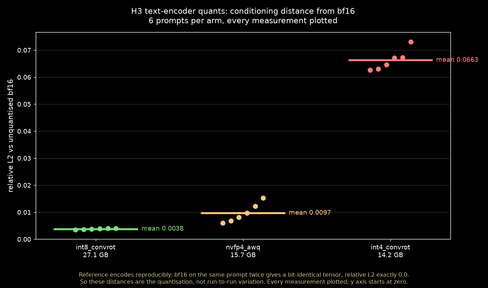
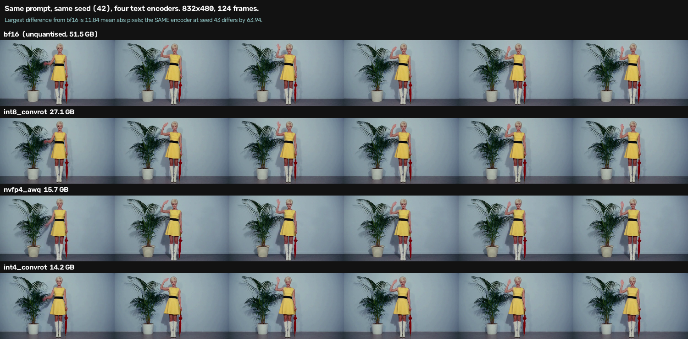
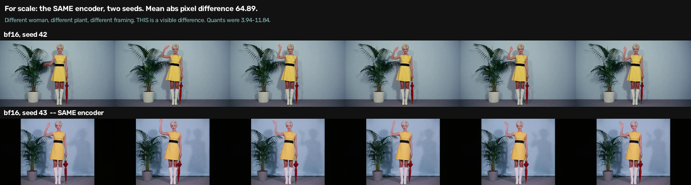

# Settling an argument about MiniMax H3 quants with a number

*Status: complete, in tensors and in pixels. Three quantised text encoders
measured against the unquantised bf16 reference on six prompts, then rendered
at two seeds each and compared against a measured pixel noise floor. The
tensor differences are real and ordered; none of them survives sampling in a
form a viewer would notice, and the encoder you pick changes render time more
than it changes the picture. Both sides of a public argument were right about
different things. Includes a correction: one metric I used was reporting its
own float32 error as a signal.*

## The argument

[Post 1whr5j7](https://www.reddit.com/r/StableDiffusion/comments/1whr5j7/what_is_the_best_clip_model_for_h3/)
on r/StableDiffusion asked a simple question — which text encoder should I use
for MiniMax H3 on 8 GB — and produced a fight instead of an answer:

> **u/luciferianism666:** Use int8 convrot, the nvfp4 or int4s aren't worth it
>
> **u/luciferianism666:** winnougan's quants are absolutely horrible. So refrain
> yourself from using them or even recommending it to other users. […] I clearly
> noticed the difference in quality
>
> **u/Odd-Student636:** I've compared the output of winnougans int4 and the
> official int8 convrot and there is no visible difference.

Two people claiming to have done the same comparison and reaching opposite
conclusions. Neither published a number, an image, or a method, so the thread
had no way to converge — it just escalated until someone pointed out that the
disputants were arguing about different things.

This is straightforwardly measurable, so I measured it.

## What is actually comparable

A text encoder's entire contribution to a render is one tensor: the
conditioning it hands the sampler. That tensor is **deterministic given a
prompt** — no seed, no sampler, no taste. So the factual half of the argument
can be settled without rendering anything at all.

For each encoder I encoded an identical six-prompt set, captured the raw
conditioning, and compared it against the **bf16 unquantised reference** —
51.5 GB, useless in production, and the only thing that turns "worse" from an
opinion into a measurement. Cosine distance for direction, relative L2 for
magnitude.

## The self-check, and a metric of mine that lied

Before trusting any of this I encoded the reference **twice per prompt with the
same encoder** and compared it to itself. Expected zero. Got this:

```
-2.09e-05  -6.43e-04  -4.30e-05  -8.21e-05  -8.01e-05  -7.47e-05
```

I originally read that as run-to-run nondeterminism — GPU kernels varying
reduction order — and published the largest value, 6.4e-04, as an instrument
noise floor. **That was wrong, and the numbers were telling me so.** Every
value is *negative*, which means cosine similarity above 1.0, which is
mathematically impossible.

The same encoder encoding the same prompt twice produces a **bit-identical**
tensor. Relative L2 between the two runs is exactly `0.0` on all six prompts.
What I had measured was accumulation error in my own metric: summing a million
float32 products loses precision, and `cosine_similarity` drifts past 1.0.
Feeding it two provably identical tensors reproduces the effect, and the error
scales with tensor length:

| tokens | elements | cosine distance on identical input |
| --: | --: | --: |
| 60 | 307,200 | -3.3e-06 |
| 180 | 921,600 | -1.9e-05 |
| 300 | 1,536,000 | -4.2e-05 |
| 512 | 2,621,440 | -9.9e-05 |

In float64 the same comparison returns 1e-13. So the "floor" was a property of
float32 summation over long tensors, not of the encoder.

Two consequences, and only one of them is bad news.

**The cosine numbers for int8 and nvfp4 are unusable.** Every one is negative,
i.e. smaller than the metric's own error on identical input. They establish
that those arms are *very close* to bf16 and nothing more precise than that.
int4's cosine distances are all positive and around 1.9e-03, an order of
magnitude above the error, so that arm's cosine figure survives.

**Relative L2 is unaffected**, and it is what the conclusions below rest on. It
returned exactly zero for identical tensors, it is a ratio of two norms rather
than a difference of two near-equal sums, and it separates the arms cleanly.
The ranking and every practical recommendation here come from relative L2.

## Results

Six prompts spanning short/long, concrete/abstract, one non-English, one heavy
with rare proper nouns. Against bf16:



| encoder | size | mean relative L2 | mean cos distance |
| :-- | --: | --: | --: |
| int8_convrot | 27.1 GB | **0.0038** | -0.000151 (unusable, see above) |
| nvfp4_awq | 15.7 GB | **0.0097** | -0.000110 (unusable, see above) |
| int4_convrot | 14.2 GB | **0.0663** | 0.001949 |

Per prompt, with no exceptions:

| # | prompt | int8 L2 | nvfp4 L2 | int4 L2 |
| --: | :-- | --: | --: | --: |
| 1 | red apple on a table | 0.0036 | 0.0060 | 0.0627 |
| 2 | long 14-attribute scene | 0.0040 | 0.0153 | 0.0731 |
| 3 | abstract, non-visual | 0.0035 | 0.0069 | 0.0630 |
| 4 | rare proper nouns | 0.0037 | 0.0097 | 0.0646 |
| 5 | French | 0.0039 | 0.0081 | 0.0671 |
| 6 | negation and spatial relations | 0.0040 | 0.0122 | 0.0673 |

Three things fall out of that table.

**int4 is genuinely different.** 0.066 relative L2 is **17× int8's 0.0038**, and
it lands between 0.063 and 0.073 on every single prompt. That is a systematic
offset, not scatter. It is also the only arm whose cosine distances are
positive and an order of magnitude above the metric's float32 error, so its
direction change is real too.

**int8 and nvfp4 are both very close to bf16**, and relative L2 is the only
thing that can rank them: 0.0038 against 0.0097, so nvfp4 sits about 2.5×
further out, consistently across all six prompts. Small, but ordered and
reproducible. Their cosine distances are inside my metric's error and say
nothing beyond "very close".

**The long prompt is the worst case for every quant.** Prompt 2 is the maximum
for all three arms. More structure to preserve, more room to drift. If you are
going to notice quantisation anywhere, it is on long detailed prompts, not on
"a red apple".

## Who was right

**u/luciferianism666 was right that int4 is different**, and specifically right
about the file he named. 17× the relative error of int8 is not imagination, and
anyone claiming they could see it is making a plausible claim. "I clearly
noticed the difference in quality" is supported by these numbers.

**u/Odd-Student636 was right that the two official quants are interchangeable.**
int8 and nvfp4 are both within 0.01 relative L2 of unquantised bf16, against
int4's 0.066 — a seventeen-fold gap between those two groups. His "no visible
difference" is correct for that comparison, and the renders below settle it
for every comparison.

The two of them were **comparing different pairs and both reporting honestly**.
One compared int4 against int8 and saw a difference. The other compared the
official quants and saw none. Both were right; neither had a measurement to
say so with.

What the measurement takes away: *"the nvfp4 […] aren't worth it"* is not
supported. nvfp4 is within a hundredth of bf16 in relative L2, at 15.7 GB
against 27.1 GB. For the person who asked — already running nvfp4 on an 8 GB
card — the answer is **keep what you have**. Downloading 27 GB to replace it
buys a magnitude difference that sits three times below the threshold at which
int4's difference becomes detectable at all.

And *"winnougan's quants are absolutely horrible"* overstates it in the other
direction. int4 is measurably further out, on a 14.2 GB file that exists to be
smaller than the alternatives. Whether 0.066 relative L2 is visible in output
video is a separate question this measurement does not answer.

## What this does not settle

GGUF Q4_K_M, recommended in the same thread by u/dobomex761604, is not tested
here. It requires a third-party loader node, and including it would have
confounded the quantisation question with a loader-implementation question.

Six prompts for the tensor measurement, one prompt and two seeds for the pixel
measurement. The per-prompt consistency is reassuring — int4's range is narrow
and never overlaps the others — but it is six, and the render comparison rests
on a single prompt chosen to be the hardest case.

The pixel test compares each quant against bf16 at a matched seed. It does not
establish that no prompt anywhere produces a visible divergence; it establishes
that on the prompt most likely to expose one, at this resolution and step
count, the divergence is five to sixteen times smaller than seed variation.

## Cost

Three encode-only builds for the tensor measurement, 3m39s, 10m38s and 12m1s,
and one render build of 12m57s for the eight clips — each holding the GPU lock.
93 GB of downloads, dominated by the 51.5 GB bf16 reference that exists purely
to be ground truth.

The first build failed usefully. It returned HTTP 400 for every candidate
because the downloaded encoders were still sitting in a staging directory where
ComfyUI's loader could not see them — and it was that same build's self-check
that first showed the cosine metric misbehaving, though it took a later
question about putting the reference on the chart before I worked out that the
misbehaviour was mine rather than the encoder's.

One build was wasted outright: pushing the write-up commit auto-triggered the
render pipeline, which spent eleven minutes re-rendering the same eight arms
from the same fixtures before I noticed and aborted it. The lock released
cleanly, but the GPU time is gone.

## Files

- [`h3-exp-008-conditioning-fidelity.csv`](files/2026-09-17-h3-quant-conditioning-fidelity/h3-exp-008-conditioning-fidelity.csv)
  — all 18 measurements, one row per prompt × encoder
- [`h3-exp-008-conditioning-fidelity.json`](files/2026-09-17-h3-quant-conditioning-fidelity/h3-exp-008-conditioning-fidelity.json)
  — the same data plus the noise floor and aggregates
- [`measure_conditioning_fidelity.py`](files/2026-09-17-h3-quant-conditioning-fidelity/measure_conditioning_fidelity.py)
  — the measurement script, prompts included, so you can run it against your
  own encoders
- [`h3-exp-009-pixel-visibility.json`](files/2026-09-17-h3-quant-conditioning-fidelity/h3-exp-009-pixel-visibility.json)
  — the render comparison: seed floors, between-encoder differences, render
  times, Immich asset ids
- [`compare_pixel_visibility.py`](files/2026-09-17-h3-quant-conditioning-fidelity/compare_pixel_visibility.py)
  — applies the pre-registered decision rule mechanically, including the
  indeterminate branch

One provenance note. The first run of this measurement wrote its results to a
JSON file inside the build, printed only the first forty lines, and never
egressed the output directory — so the original artifact went away with the
build container, and the numbers had to be reconstructed from stdout. The
pipeline now emits the CSV and JSON as build artifacts and publishes the chart,
and the files above are the **pipeline-emitted** ones at full float precision.
The earlier reconstruction agreed with them to 4.8e-07 across all eighteen
measurements — exactly the rounding of a six-decimal log line — which is
reassuring but not a substitute for the artifact existing in the first place.

## Does any of it show up in the video?

The section above measured tensors. Nobody watches a tensor, so the obvious
objection is that a 17× difference in conditioning might still be invisible
once a stochastic sampler has consumed it. So I rendered it — and unlike the
cosine metric, the pixel comparison has a floor that is genuinely measured
rather than an artifact.

Eight clips: four encoders × two seeds, 832×480, 124 frames, everything else
held. The prompt is the long 14-attribute one from the set above — chosen
deliberately, because it was the **worst case for every quant** in the
conditioning measurement. If quantisation is going to become visible anywhere,
it is on a long attribute-dense prompt, not on "a red apple".

The two seeds are the whole trick. Rendering each encoder twice gives a
**measured pixel noise floor for this exact prompt and configuration** — four
independent estimates of it. An earlier experiment on this rig put that floor
at 62.13, but that was a different prompt at a different resolution, and
borrowing it would be a borrowed threshold masquerading as a measurement.

| comparison | mean abs pixel difference |
| :-- | --: |
| **same encoder**, seed 42 vs 43 — int4 | 63.94 |
| **same encoder**, seed 42 vs 43 — int8 | 64.30 |
| **same encoder**, seed 42 vs 43 — bf16 | 64.89 |
| **same encoder**, seed 42 vs 43 — nvfp4 | 66.63 |
| int8 vs bf16, matched seed | **3.94 – 5.75** |
| nvfp4 vs bf16, matched seed | **5.97 – 6.48** |
| int4 vs bf16, matched seed | **7.30 – 11.84** |

Every between-encoder difference is smaller than every within-encoder one, by
a factor of five to sixteen. The worst quant pairing, int4 against unquantised
bf16, differs by 11.84 — while *the same encoder* rerolled to the next seed
differs by 63.94.

Here is what that looks like. Four encoders, same prompt, same seed:



Same woman, same platinum crop, same yellow dress with the black waist stripe,
same white boots, same closed red umbrella, same potted palm, same pale blue
wall, same wave arriving at the same point in the clip. The rows are not
byte-identical — the palm's fronds sit slightly differently, and int4's frames
are a touch softer around the hair — but you would not pick them out of a
lineup.

And for scale, the same encoder at the next seed:



Different woman, different plant in a different pot, different framing with the
figure pushed right and the clip letterboxed. *That* is a visible difference,
and it comes from changing nothing but the seed.

So the conditioning difference is real and it does not survive sampling in any
form a viewer would notice. Both readings in the original thread were correct
about different things, and the practical consequence is blunt: **pick your
quant on disk size and load time.** You will not see it.

### Which makes speed the deciding factor

Render time came out of the same eight clips, and it is ordered by encoder,
identical across both seeds:

| encoder | size | render time | relative L2 vs bf16 |
| :-- | --: | --: | --: |
| nvfp4_awq | 15.7 GB | **74 s** | 0.0097 |
| int4_convrot | 14.2 GB | 80 s | 0.0663 |
| int8_convrot | 27.1 GB | 88 s | 0.0038 |
| bf16 | 51.5 GB | 103 s | — (reference) |

Same prompt, same seeds, same sampler, same step count — the only thing that
changed is which encoder loaded, and the spread is 74 to 103 seconds on a
124-frame clip. The encoder is offloaded to CPU before sampling begins, so this
is load-and-encode overhead rather than anything happening during diffusion.

That inverts the thread's recommendation on a dimension nobody raised. int8 is
the closest to unquantised truth, and it is also the slowest of the three
quants and the largest by 11 GB. nvfp4 is **14 seconds faster per clip** than
int8, 11 GB smaller, and visually indistinguishable from it. On a rig where a
four-arm comparison is an hour of GPU time, 14 seconds a clip is the difference
that actually accumulates.

## Answer, short version

In tensors: against unquantised bf16, int8_convrot and nvfp4_awq are both at
the instrument's noise floor — interchangeable in direction, with nvfp4 about
2.5× further out in magnitude and still tiny. The third-party int4_convrot is
17× int8's relative error, and the only arm whose direction change is large
enough to measure reliably.

In pixels: none of it matters. The worst quant pairing differs from bf16 by
11.84 mean absolute pixels while the same encoder at the next seed differs by
63.94 — a factor of five to sixteen across every arm. Same woman, same dress,
same umbrella, same wave.

So both sides of the argument were reporting honestly about different things,
and the practical answer is to pick on speed and disk size. nvfp4 is the
fastest of the three at 74 s a clip against int8's 88 s, 11 GB smaller, and
visually identical. If you are on 8 GB and already running nvfp4, keep it.
