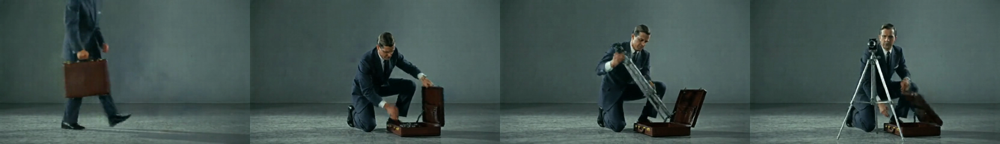
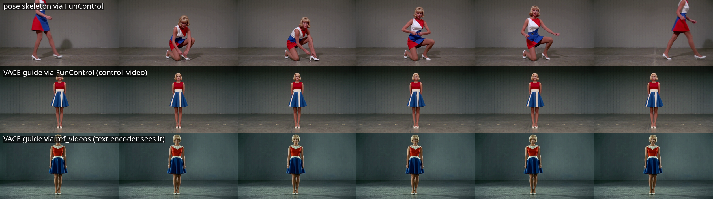
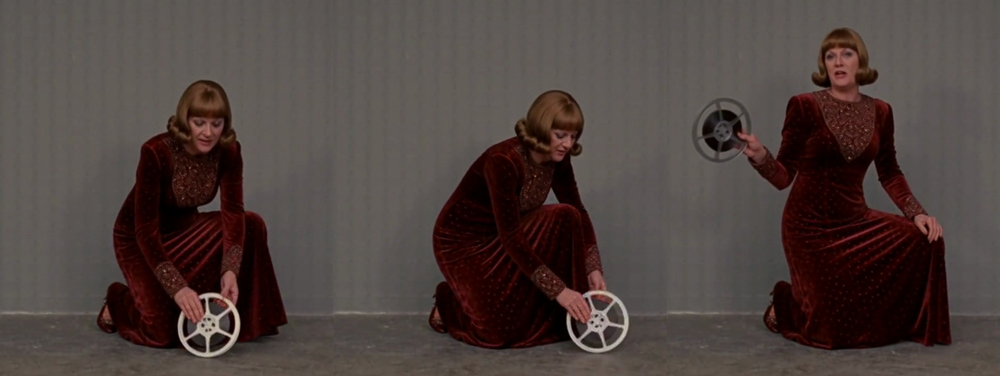
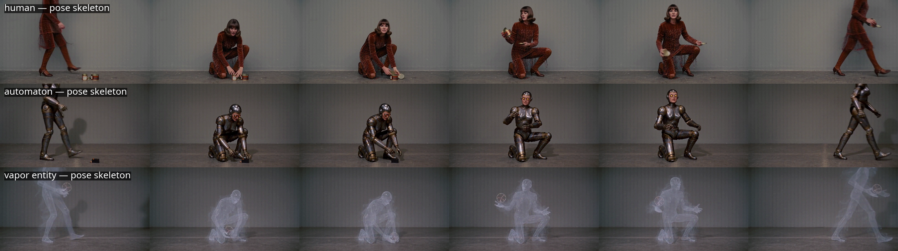
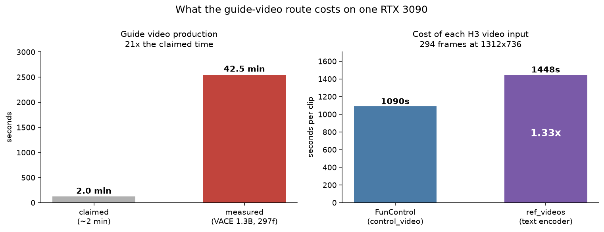

# A guide video does not tell MiniMax H3 what to do

*Status: complete for two of H3's video inputs, N=2 seeds each, plus a
three-body-plan scope check. A VACE-rendered guide containing a briefcase and a
tripod transfers neither the objects nor the action, through either input. A
pose skeleton transfers the action — to a human, a machine, or a cloud of vapor
alike; the prompt supplies the objects.*

## The question

The [pose transfer write-up](2026-09-15-h3-funcontrol-pose-transfer.html)
reported a limitation: H3 FunControl carries body position and nothing else.
Across three seeds the subject crouched and reached exactly as the control
skeleton did, and no briefcase or tripod ever appeared.

A reply disputed the framing:

> wan controlnets (fun, wace, onetoall, all the dancing scail etc) can produce
> qualified reference vid in like a minute or two. [...] It's very easy to make
> minimax do absolutely anything as intended by combining a storyboard grid
> first split onto control video for Vace then reused with minimax, decent
> prompt from LLM, a guide video rendered with Vace. prep steps take like two
> minutes, and you have the video to work with.

The claim is that the limitation belongs to the control signal, not to H3:
render an appearance-carrying guide with VACE first, feed that to H3 instead of
a stick figure, and the props come along. It is a specific, testable claim
against a published result, which makes it worth the GPU time.

## Method

One variable: the control video. Everything else is held — the prompt, 1312x736,
294 frames, strength 0.8, control window 0.0-0.6, the `int8_convrot` transformer
and the `nvfp4_awq` text encoder.

The guide is rendered with Wan2.1 VACE 1.3B as a video-to-video pass over the
original clip the pose skeleton was extracted from, so the briefcase and tripod
are present as pixels rather than as joint positions.

**The guide is verified before it is used.** A null result from a degraded guide
would prove nothing, so its frames are inspected first: a suited figure carries
a brown briefcase into frame, kneels, opens it, lifts out a tripod and extends
the legs. That is the appearance signal a skeleton discards.

H3 has **two** inputs that accept a video, and they are different mechanisms.
Both are tested:

- **`H3FunControlApply.control_video`** — structural. The clip is VAE-encoded,
  packed into control tokens, and injected at one transformer layer across a
  sigma window.
- **`MiniMaxH3ReferenceToVideo.ref_videos`** — semantic. The clip is
  VAE-encoded *and* subsampled to 2 fps with timestamps, then handed to the text
  encoder as a reference item. Qwen sees the video.

The second exists because the disputant's words are "qualified reference vid",
and H3's own reference-video input is `ref_videos`.

### The null

H3 is deterministic here. The same graph at a fixed seed and control, rendered
in three separate builds on different days, produces byte-identical decoded
output (`ffmpeg -f md5` = `92203a0899aa1db59eb8726ff579b91a` each time). There
is no run-to-run noise to account for, so any difference between arms is
attributable to the control video.

The floor is therefore the **seed floor**: how much the output moves when only
the seed changes. It is measured fresh in each experiment rather than borrowed.

### The decision rule, registered before rendering

*Supported* — props or the kneel appear in both guided arms and neither skeleton
arm. *Refuted* — neither pathway transfers them. *Indeterminate* — an effect at
one seed only, or the guide's own subject replacing the prompt's, which is
leakage rather than transfer.

## Results

Same prompt, same seed, three control conditions:

The skeleton row crouches to one knee and reaches toward the floor. Both guided
rows stand essentially motionless for all 294 frames. No briefcase, no tripod,
no kneel — through either input.

Mean absolute pixel difference, stride 8:

| | seed floor (skeleton) | seed floor (guided) | between control types | ratio |
|---|---|---|---|---|
| simple subject | 11.38 | 17.30 | 21.69–25.59 | 2.25x |
| complex subject | 10.82 | 17.09 | 21.84–29.00 | 2.68x |
| `ref_videos` | 11.38 | 7.16 | 25.39–25.54 | 3.57x |

The guide is not inert. In every case it moves the output further than changing
the seed does — two to three and a half times further. It moves it toward
*stillness*.

One number inverts an assumption. Under `ref_videos` the seed floor is **7.16**,
*lower* than the skeleton arms' 11.38 in the same build. A reference video makes
the output more stable across seeds, not less. It behaves like a strong prior
toward a neutral standing portrait rather than like an instruction to reproduce
an action.

### The subject is not the reason

A sparse prompt might plausibly leave H3 with too little to hold onto. The
complex-subject row above uses a prompt specifying skin, hair, face, physique,
wardrobe and a named held object, drawn from a seeded palette grammar rather
than written to taste. It changes nothing: the guided arms still stand still.

### What the prompt does carry

The complex subject's prompt names an object — *a mysterious reel of magnetic
tape clutched in one hand*. Under pose control, it appears:

She is doing the **skeleton's** action and holding the **prompt's** object. The
reel is carried while walking, set down during the crouch, and lifted again
afterwards.

This is the first direct test of advice the earlier write-up gave. That advice —
props must come from the prompt — was inferred from props being *absent* under
pose control; nobody had put one in a prompt and checked. It holds.

### The subject does not have to be human

A pose skeleton describes human joints. Whether that is *why* it works is a
separate question, and one the earlier write-up never asked: every subject
tested until now has been a person.

Three body plans, drawn from a seeded palette grammar, under the same skeleton:

The automaton walks in, kneels, works at floor level and stands, in the same
choreography as the woman. The vapor entity does the same while remaining
translucent mist throughout. Neither has human joints in the sense the skeleton
describes. Both follow it.

Each subject also stays what the prompt asked for. The machine is brass and
steel from first frame to last; the mist never solidifies. The control supplies
the choreography and takes nothing from the identity.

Temporal motion within each clip — mean absolute difference between frames one
second apart — confirms the pattern holds per body plan:

| subject | pose skeleton | VACE guide | ratio |
|---|---|---|---|
| woman | 8.83 | 3.91 | 2.26x |
| automaton | 6.93 | 4.30 | 1.61x |
| vapor entity | 4.26 | 1.20 | 3.55x |

Absolute values are not comparable across subjects — mist displaces fewer
pixels than a velvet dress whatever it does — but the within-subject ratio is.

### A pose is not an action

The automaton's guided arm is the exception worth naming. It is static, like
every other guided arm, but it is static **half-kneeling** rather than standing.
That posture is why its motion score is the highest of the three guided arms
and its ratio the lowest.

So the guide does not simply suppress movement. It transfers a *pose* and fails
to transfer the *action*: the kneel arrives as a frozen attitude instead of a
movement through time. The human arms alone supported only the weaker statement
that the subject stands still.

This is one observation at one seed and was not predicted. It deserves its own
design before anything is built on it.

## Who was right

The dispute resolves cleanly, and not entirely in either direction.

He is right that a VACE guide is cheap to produce relative to an H3 render, and
right that the guide is a real signal — it changes the output decisively. He is
wrong that it makes H3 "do absolutely anything as intended". Through both of
H3's video inputs, a guide full of visible props produced neither the props nor
the action.

The published limitation survives, and the mechanism is now better described
than it was: **the control video contributes structure, the prompt contributes
content.** A pose skeleton is a good structural signal — good enough to move a
machine and a cloud of vapor through a human choreography. A photoreal guide is
a worse one, because its structure is buried in appearance the model does not
use.

An explanation offered mid-experiment — that FunControl reads structure
regardless of appearance, and so the text-encoder path might succeed where the
structural one failed — is wrong. The text-encoder path failed the same way.
That prediction was the one favourable to the disputant's claim.

## Cost

**The guide takes 42.5 minutes, not two.** 2547.9 s by ComfyUI's own execution
timestamps, excluding queue and model load, for 297 frames at 832x480, 20 steps,
VACE 1.3B fp16 on an RTX 3090. That is 21x the claimed figure. The gap is large
enough that it probably reflects a different configuration — a much lower step
count, a shorter clip, or the `rcm 1.3b` speed path also mentioned — rather than
a disagreement about the same work.

**Per clip, `ref_videos` costs 1.33x what FunControl costs** — 1447.7 s against
~1090 s. Consistent with the node's own tooltip: reference tokens ride through
every sampling step, where control tokens are injected at one layer inside a
window.

**Reference length is capped by memory, not by taste.** `adapt_canvas()` resizes
a reference *up* to a 768-short-edge canvas, so a 294-frame reference at
1312x736 adds ~87,700 tokens against the shot's own 82,000 and the sequence more
than doubles. That OOMs on a 24 GB card at 20.17 GiB allocated. A 90-frame
reference — 4 s, inside the node's stated 2-15 s range — adds ~18,100 and fits.

**Nine builds, roughly 7h15m of GPU under lock.** Three of those builds failed
and their causes are worth stating: a missing module in a task script; a guide
generated at the source clip's resolution rather than the shot's, which the node
correctly rejected on a token-count mismatch; and the reference-length OOM
above. A further ~50 minutes of GPU sat idle between two builds through a
scheduling mistake.

**Calendar: the reply landed 2026-09-18T04:42Z and the work ran the same day.**
The measurement itself is a day's work. It rests on a rig — lock, egress,
fixtures, validators — built across the preceding weeks, which is the part that
makes a same-day answer possible and the part nobody counts.

## What this does not settle

- **Two of the recipe's components, not the recipe.** The storyboard grid split
  into a control video, the "128rbg spacing", the ExVideo/RifleX long-context
  path and an LLM-written prompt are all untested. This refutes *a VACE guide
  carries props into H3*, not his whole workflow.
- **Both inputs at once.** "Combining" is a fair reading of the comment and
  remains unrun. It is the obvious next experiment.
- **The guide depicts a different figure from the prompt's subject.** If the
  intended workflow is that the guide already resembles the target shot, that is
  a different procedure and would deserve its own test.
- **VACE 1.3B, upscaled from 832x480.** The 14B model and a natively
  full-resolution guide are both untested.
- **Three body plans at one seed each.** The non-human arms are a scope check,
  not a survey. A marginal reading would need the seed replicate the human arms
  have.
- **The frozen-mid-kneel result is a single observation** and was not
  predicted. It is reported because it sharpens the description of the failure,
  not because one arm settles it.

## Files

- [Pixel scores, simple subject](files/2026-09-18-h3-guide-video-control/h3-exp-010-pixel-scores.json)
- [Pixel scores, complex subject](files/2026-09-18-h3-guide-video-control/h3-exp-011-pixel-scores.json)
- [Pixel scores, ref_videos](files/2026-09-18-h3-guide-video-control/h3-exp-012-pixel-scores.json)
- [The scoring script](files/2026-09-18-h3-guide-video-control/score_prop_transfer.py)
- [Motion scores by body plan](files/2026-09-18-h3-guide-video-control/h3-exp-013-motion.json)
- [The guide-render script](files/2026-09-18-h3-guide-video-control/render_vace_guide.py)

Workflows are API-format and name local checkpoints; they are a starting point,
not a drag-and-drop.
