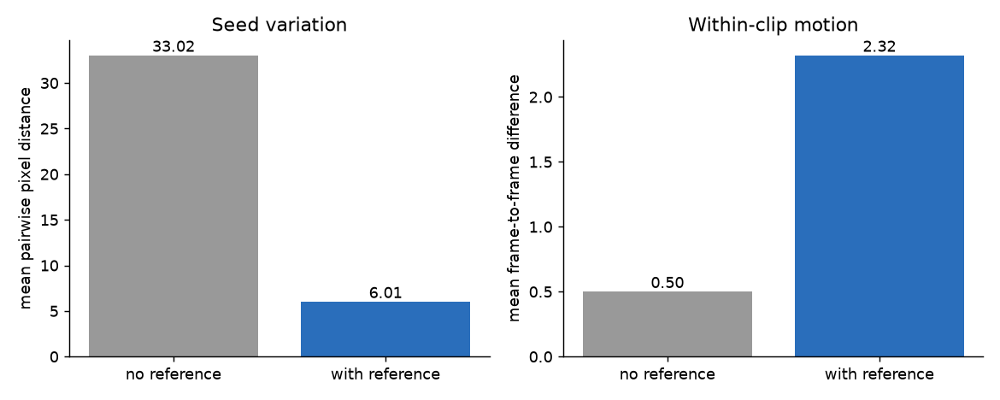
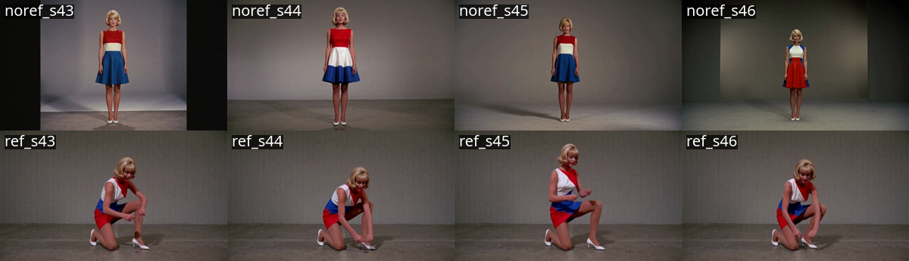
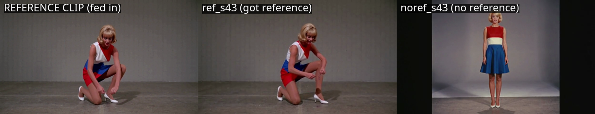
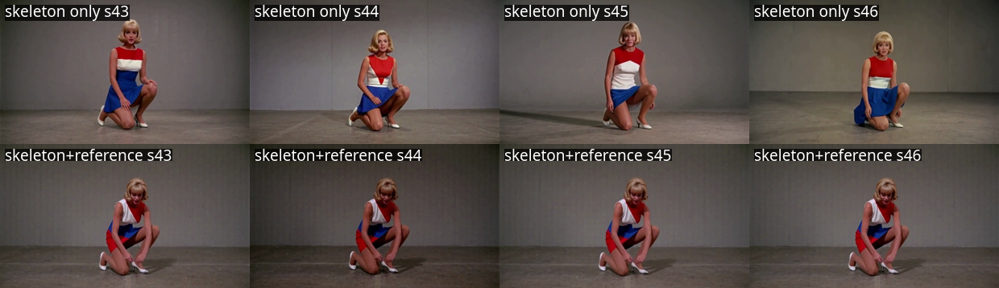

# A reference video keeps a character across seeds

*Status: complete. Sixteen arms, four seeds, one prompt: supplying a prior
render as a reference video cuts seed-to-seed variation, the character it holds
is the one in the reference, and a subject driven by a pose skeleton keeps
moving.*

## The question

MiniMax H3 gives you a different person every time you change the seed. Same
prompt, same everything else — a new face, a new dress. For a single clip that
does not matter. For a sequence of shots meant to show the same character, it
is the whole problem.

H3's `MiniMaxH3ReferenceToVideo` node takes an optional `ref_videos` input,
described as reference frames at 24 fps. Whether it can pin a character across
seeds is the question here.

A prior experiment on this node supplies the motive. Feeding it a *foreign*
guide video — a Wan2.1 VACE render of a different subject — left seed-to-seed
distance at 7.16 where a pose skeleton gave 11.38. The reference halved the
output's sensitivity to the seed while transferring none of the guide's
content. A number like that is either a consistency lever or an artefact of a
subject that had gone inert, and the two look identical from one measurement.

## Method

Sixteen arms in two blocks of eight. One prompt, held identical and asserted in
the builder. Four seeds — 43, 44, 45, 46 — crossed with reference present or
absent, run once without a pose skeleton and once with one.

**The reference is a prior H3 render of this prompt's own subject**: an earlier
seed-43 clip, first 90 frames, scaled to the shot. That is the production
workflow — render a character once, then keep her across later shots — so the
reference is what someone would really feed it, rather than footage of a
stranger.

**The first block has no control video at all**, enforced by assertion rather
than inspection. H3 has two video inputs, and leaving a control video attached
would make any effect unattributable between them. **The second block puts a
pose skeleton in both its arms**, so the reference remains the only variable
while the subject has an action to perform. The skeleton feeds
`H3FunControlApply` and the reference feeds `ref_videos`, from separate loader
chains — sharing one would hand the skeleton to both inputs and silently
answer a different question.

Shot is 832×480, 124 frames, which satisfies H3's `17n + 5` frame constraint.
The reference is 90 frames, inside the node's stated 2–15 s window and also
`17n + 5`. A control video must match the shot in length, width and height,
because `H3FunControlApply` packs both into one token stream. The smaller shot
buys four seeds per arm rather than two, so seed variation comes from six
pairwise distances per arm instead of one.

**Two measures, because one cannot answer the question.**

*Seed variation* is the mean pairwise pixel distance across the four seeds
within an arm. *Within-clip motion* is the mean absolute frame-to-frame
difference. A reference can lower seed variation two ways: by pinning identity
while the subject still acts, or by collapsing every seed toward the same inert
portrait. Both produce a low number; the first is a capability and the second
is a defect wearing its clothes. Motion separates them.

**The null** is the no-reference arm, measured in the same units, at the same
resolution, on the same four seeds. Its seed variation is what the metric reads
when nothing is pinning the output — 33.02 without a skeleton, 17.81 with one,
each established in its own block rather than borrowed across them.

**The decision rule, fixed before rendering.** Reference cuts seed variation by
at least 25% *and* holds motion within 25% of the null: stabilising. Cuts both
by more than 25%: flattening, and worthless. Seed variation within 25% of the
null: no effect. Anything else, including a reference that increases variation:
indeterminate, reported as such. The second block reuses the rule with motion
as the decisive term: within 25% of the null, the reference preserves the
action; more than 25% below it, the reference and the pose control compete.

One failure mode is registered in advance because it is the one most easily
rationalised away: if the reference arms simply reproduce the reference clip's
composition, that is flattening by another name, and distance from each arm to
the reference clip itself tests it.

## Results

| | no reference | with reference | change |
|---|---|---|---|
| seed variation | 33.02 | 6.01 | −81.8% |
| within-clip motion | 0.50 | 2.32 | +364% |
| distance to the reference clip | 26.53 | 8.91 | −66% |

Seed variation falls by 81.8%. Motion does not fall with it — it rises. By the
registered rule this is stabilising, and the direction of the motion change
rules out flattening outright rather than on a threshold.

Per-arm figures show the same thing without averaging. Pairwise seed distances
run 21.41–42.68 without a reference and 3.81–7.27 with one: every reference
pair is tighter than every no-reference pair. Motion runs 0.34–0.66 without and
1.45–3.79 with.

The registered failure mode does not hold. Arms given the reference sit at 8.91
from it against the null's 26.53 — closer, but not a copy, and their motion
(2.32) stays well below the reference clip's own (4.91). A replay would match
it and would not vary across seeds the way these do.

## What it means

The reference holds the character, and holds the *right* character.

The garment settles it. The reference clip wears a straight-cut dress with a
red hem. The arm given that reference wears the same straight cut and the same
red hem; the same seed without a reference wears a pleated dress with a blue
hem. Lower-garment red-minus-blue is +23.9 to +30.4 across the reference arms,
tightly clustered, against +14.2 to +19.4 spread wider across the null.

This distinction matters more than the headline number. Four arms agreeing with
each other would be consistency without fidelity — useful for a fresh sequence,
useless for continuing a character who already exists. These agree with the
source.

So the recipe is: render a character once, keep the clip, feed it forward as
`ref_videos` on every later shot. Cost is 1.33× the render time, measured on
the same node.

Pixel distance is the wrong instrument for the last step, and it is worth
saying why the garment reading is done by eye. Mean pixel distance cannot
represent pleating, cut, or hemline; it would score a pleated blue dress and a
straight red one as close if they fill similar pixels at similar brightness.
The metric establishes that the frames are similar in aggregate. Whether it is
the same dress is a reading, and it is taken as one.

## With a subject that is already moving

The result above is measured on a subject that barely moves without a
reference — motion 0.50. A reference that lowers seed variation on a nearly
still baseline might do so by holding it still, which would make the recipe
useless wherever the subject has to act.

Adding a pose skeleton to both arms supplies the motion and isolates the
reference as the only variable. Eight further arms, same prompt, same
reference clip, same four seeds, same resolution.

| | skeleton only | skeleton + reference | change |
|---|---|---|---|
| within-clip motion | 3.85 | 3.99 | +3.6% |
| seed variation | 17.81 | 12.58 | −29.4% |
| seed variation, brightness-normalised | 24.58 | 7.91 | −67.8% |

Motion is unchanged. The reference rides along with the pose control rather
than competing with it, so the recipe holds for a subject performing an
action.

The seed-variation figure needs its distribution rather than its mean. The six
pairwise distances in the reference arm are 1.81, 2.56, 2.61, 22.44, 22.82 and
23.22 — bimodal, and no pair is anywhere near the mean of 12.58. Three seeds
land within 2.61 of each other; the fourth sits apart from all of them. The
skeleton-only arm is unimodal across 14.95–21.67, so the structure belongs to
the reference arm.

The outlying seed is an **exposure** difference, not a content one: clip mean
luma 56.7 against 79.0, 79.0 and 79.3. Its framing, timing, action and garment
all match its siblings — best temporal alignment is offset zero, best spatial
alignment is zero, the motion centroid agrees to within 0.2 px, and the
garment's red-minus-blue is +23.9 against +23.5 to +23.7. It is the same shot
rendered about 28% darker.

That matters for the instrument as much as the result. Mean absolute pixel
difference charges a brightness offset as though it were a difference in
content, so it understates consistency whenever one arm's exposure wanders.
Normalising each clip by its own mean brightness puts the reference arm's
seed variation at 7.91 against 24.58 — a 67.8% reduction where the raw figure
reports 29.4%.

Normalisation does not remove the outlier. Its pairwise distances fall from
about 23 to about 12, while the other three sit at 3 to 4. Exposure accounts
for roughly half of its divergence; the remainder is unexplained.

Three of the four seeds land 4.15 to 4.80 from the reference clip itself,
against 14.10 to 18.20 for the skeleton-only arms.

## What this does not settle

- **One seed in eight renders with a different exposure.** Brightness accounts
  for about half its divergence from its siblings and nothing identified
  accounts for the rest. A reference makes most seeds agree closely; it does
  not make all of them agree.
- **Identity is read from a garment, not a face.** No perceptual or
  face-identity metric is applied. The dress matches; whether the face would
  survive a face-recognition comparison is a separate instrument and a separate
  claim.
- **Two variables differ from the prior foreign-reference run** — same-subject
  versus different-subject, and an H3 render versus a Wan render. This design
  cannot say which of the two explains the difference in behaviour.
- **One prompt, one subject, one resolution.** Four seeds is a better variation
  estimate than two, and it is still one character in one shot.
- **The reference is 90 frames of a 124-frame shot.** Whether a shorter or
  longer reference holds as well is untested.

## Cost

- **Render:** sixteen arms in about 80 minutes under GPU lock. No-reference
  arms run ~2m20s each; reference arms are slower, as the node's own
  documentation implies — reference tokens ride every sampling step. A
  5.2-second shot is a two-to-five-minute wait, roughly 30–60× real time.
- **Memory:** the 832×480 shot with a 90-frame reference is comfortable on a
  24 GB card. The same design at 1312×736 with a 294-frame reference is not —
  that configuration needs ~87,700 reference tokens against the shot's 82,041
  and exhausts the card. Shortening the reference rather than the shot is what
  makes it fit.
- **Failed builds:** one, costing about two minutes. A control video must match
  its shot in all three dimensions, and the published skeleton is 1312×736×294
  against this shot's 832×480×124 — `H3FunControlApply` rejects the mismatch at
  sampling time, after the GPU lock is taken. A rescaled control fixes it, and
  the builder now asserts the match before writing a graph.
- **Calendar:** the underlying question — can a video input drive H3 — was
  opened by a forum comment on 2026-09-18 and answered across six experiments
  over two days. This experiment is the sixth and took about three hours from
  design to result.

## Files

Graphs are ComfyUI API format and name local checkpoints; they will not
drag-and-drop into a stock install.

- [Scores without a pose skeleton](files/2026-09-19-h3-reference-video-consistency/h3-exp-014-scores.json)
- [Scores with a pose skeleton, including the brightness normalisation](files/2026-09-19-h3-reference-video-consistency/h3-exp-015-scores.json)
- [Arm builder, first block](files/2026-09-19-h3-reference-video-consistency/build_exp014.py)
- [Arm builder, second block, with the control-matches-shot assertion](files/2026-09-19-h3-reference-video-consistency/build_exp015.py)

Arms, pre-registration and decision rules live in `genops-pipelines` under
`workflows/h3-exp-014-arms/`, `workflows/h3-exp-015-arms/`,
`EXPERIMENT-014.yml` and `EXPERIMENT-015.yml`.
