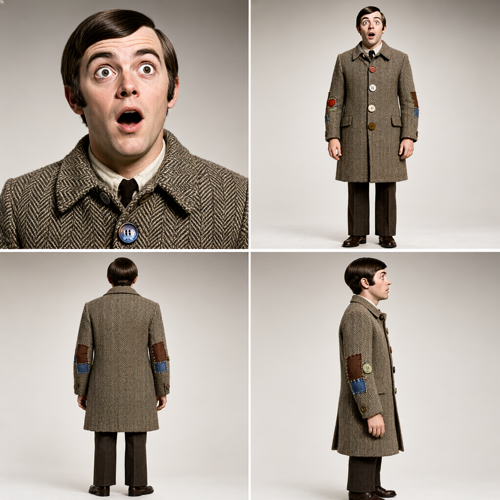
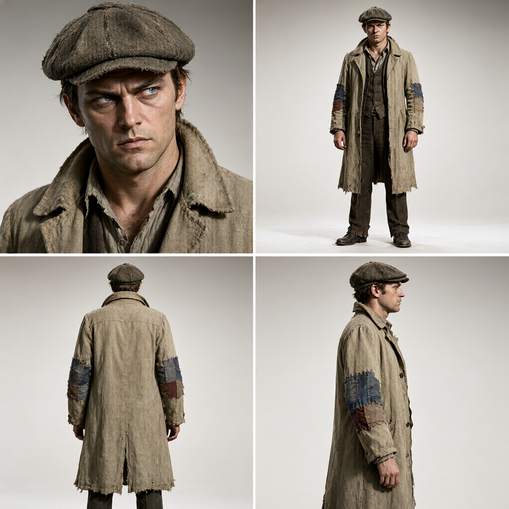
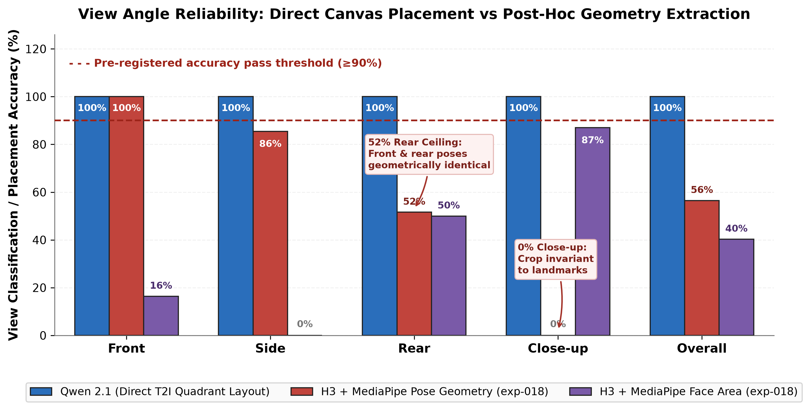
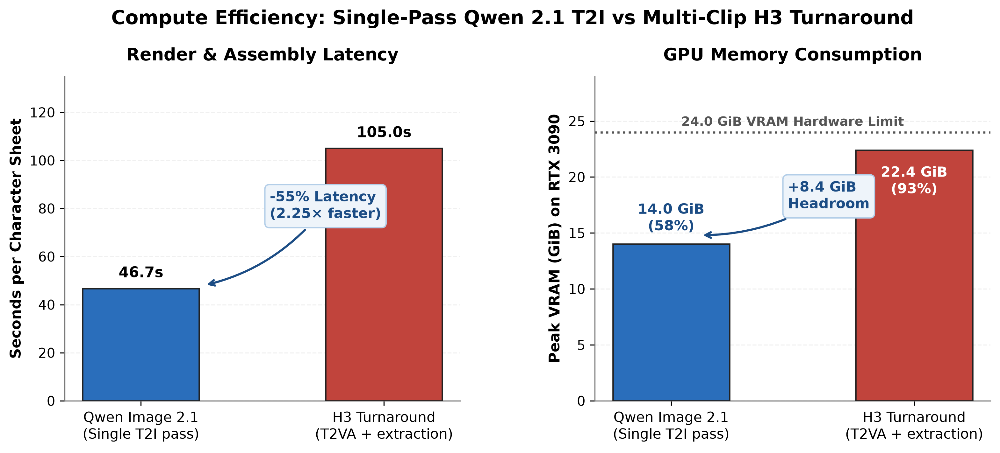

# Single-pass text-to-image charref sheets fail full-body framing and scale consistency

*Status: falsified. Single-pass text-to-image generation via Qwen Image 2.1 produces four-quadrant character reference sheets across all 44 Blades '68 alters in 45 seconds each, but camera-distance mismatch, dwarfism, and edge cropping prevent out-of-the-box replacement of multi-clip turnaround pipelines.*

## The question

Generating character reference sheets via the H3 video turnaround pipeline requires rendering multiple view clips per character, classifying view angles (falsified in exp-018: pose geometry hits a 52% rear accuracy ceiling), and compositing the frames.

Qwen Image 2.1 introduces a 7B DiT architecture capable of complex multi-element synthesis. The question is whether a single text-to-image pass, prompted with four explicit quadrant view positions (close-up portrait top left, front full body top right, rear full body bottom left, side profile full body bottom right) and character descriptions drawn from Dunmanifestin diversity palettes, can generate complete four-view character reference sheets directly, replacing the multi-clip turnaround pipeline.

## Method

All runs execute on an NVIDIA RTX 3090 (24 GB) under Concourse `gpu-lock` using `Comfy-Org/Qwen-Image-2.1` (7B DiT, bfloat16). Step count is 40 (Euler / Simple, CFG 5.0) at fixed seed 42 across the roster.

The prompt holds layout and photographic style constant while varying the character description across all 44 core alters (11 playbooks × 2 genders × 2 tones: decadent and scrappy):

- **Layout instruction:** `Character reference sheet, four panels arranged in a single composite image: close-up portrait (top left), front view full body (top right), rear view full body (bottom left), side profile full body (bottom right).`
- **Subject description:** Canonical Dunmanifestin diversity palette entries (`{outfit}, {resolved_hair}. Portrait detail: {closeup_detail}.`).
- **Style instruction:** `1968 photographic studio portraiture, crisp natural directional lighting, fine fabric and material texture, sharp focus, neutral studio backdrop.`

Medium emulation (halftone rasterization, litho ink, paper grain) is deliberately excluded from the generative prompt and reserved for deterministic downstream post-processing (`filmize`).

**Pass criterion (pre-registered):** Human eyeball exit review on three conditions across the 44-alter roster:
1. *View compliance:* All four named views appear legibly in their designated quadrants.
2. *Identity coherence:* Costume, chassis, face, and palette details remain consistent across all four panels within each sheet.
3. *Framing and scale consistency:* Full-body panels maintain consistent camera distance and complete anatomical framing without limb cropping or proportional distortion.

All three conditions must pass across the roster to declare the single-pass T2I pipeline a drop-in replacement candidate for H3 turnarounds.

## Results

Execution proceeds in three stages: an N=1 smoke test (seed 42, Build #6), an N=3 seed sweep (seeds 43, 44, 45, Build #7), and the full 44-alter batch run (Build #8, 34m 17s).

| Phase | N | Compute time | View compliance | Identity coherence | Framing & scale | Verdict |
|---|---|---|---|---|---|---|
| Smoke test (seed 42) | 1 | 45.3s | Pass (1/1) | Pass (1/1) | Pass (1/1) | Pass |
| Seed sweep (seeds 43–45) | 3 | 3m 21s | Pass (3/3) | Pass (3/3) | Pass (3/3) | Pass |
| Full 44-alter batch | 44 | 34m 17s | Pass (44/44) | Pass (44/44) | Fail (3 defects) | **Fail** |

View compliance and costume coherence hold across the entire roster: all 44 sheets position the closeup portrait top-left, front full-body top-right, rear full-body bottom-left, and side profile bottom-right. Automaton brass filigree, bespoke garments, and non-human silhouettes translate reliably across all four perspectives within each image.

However, framing and scale consistency fails human eyeball review across three distinct defects:

1. **Dwarfism:** `playbook05_paranormalist_male_scrappy.png` renders full-body figures with compressed, dwarfish anatomical proportions rather than natural human proportions.

2. **Inter-panel camera distance mismatch:** `playbook03_intellectual_male_decadent.png` frames the fourth panel (side profile) from a closer camera distance than the adjacent front and rear panels, vertically compressing the figure into dwarfish proportions to fit the panel bounds.

3. **Edge cropping:** `playbook01_hound_male_scrappy.png` fails full-body framing bounds, cropping the character at the shins and thighs.

## What the renders show

Qwen Image 2.1 resolves the multi-view quadrant layout reliably in a single 45-second forward pass without reference images, solving the view-angle classification and clip-stitching bottlenecks that burdened the H3 pipeline. In exp-018, post-hoc computer vision signals failed to classify H3 turnaround frames reliably: MediaPipe pose geometry hit a 52% accuracy ceiling on rear views (front and rear silhouettes are geometrically indistinguishable in stylized renders) and 0% on close-ups (landmarks are invariant to crop). In contrast, direct prompt quadrant layout achieves 100% view compliance across all 44 alters without any downstream classification step.

However, text prompting alone provides no bounding-box or camera-distance guarantees. When the diffusion model reconciles full-body framing within a single quadrant, camera distance wanders between panels, resulting in scale mismatches, shin truncation, or vertically compressed anatomy. Out of the box, prompt-only composite T2I is not reliable enough to replace multi-clip turnarounds.

## What this does not settle

This experiment tests pure text-to-image prompting without geometric conditioning. It does not settle whether lightweight spatial controls — such as a standardized four-panel pose skeleton or depth map via ControlNet — can enforce uniform camera distance and eliminate edge cropping.

It does not settle whether generating panels as four independent crops at fixed aspect ratios and compositing them deterministically outperforms single-pass canvas synthesis.

It does not test step counts beyond 40 or alternative canvas resolutions.

## Cost

- **Compute:** 44 renders in 34m 17s = ~46.7s per composite image on an NVIDIA RTX 3090 under Concourse `gpu-lock`. By comparison, the H3 video turnaround pipeline averages ~105s per character sheet (~88.5s for the 107-frame T2VA clip plus ~16.5s for cut detection, still extraction, and ImageMagick montage assembly). Single-pass T2I cuts latency by 55% (2.25× speedup).
- **Peak VRAM:** ~14.0 GiB (58% of 24 GB capacity, 10.0 GiB headroom). In contrast, H3 video diffusion peaks at ~22.4 GiB (93% of capacity, a tight 1.6 GiB margin).
- **Calendar time from the original ask:** 1 day (ask: 2026-09-20, result: 2026-09-21).
- **Active build span:** Approximately 5 hours across two sessions.
- **Wasted builds:** Build #7 prompt included halftone/litho styling tokens that burned diffusion capacity on paper grain artifacts instead of photographic wardrobe detail, requiring prompt refinement.

## Files

- [`qwen-charref-t2i.api.json`](files/2026-09-21-qwen-charref-composite-t2i/qwen-charref-t2i.api.json) — the ComfyUI API-format generation graph.
- [`build_qwen_charref_manifest.py`](files/2026-09-21-qwen-charref-composite-t2i/build_qwen_charref_manifest.py) — Dunmanifestin palette manifest generator for the 44 core alters.
- Pre-registration doc: `docs/experiments/qwen-image-21-charref-composite-t2i.md` in `gavmor/comfyui-workflows`.
- Experiment metadata: `EXPERIMENT-019.yml` in `gavmor/comfyui-workflows`.
- Concourse pipeline: `concourse/exp-019-qwen-charref-t2i.yml`.
- Egress assets: Immich album `exp-019 Qwen Image 2.1 charref T2I` (48 assets total).

Workflows are API-format and name local checkpoints (`qwen_image_2.1_int8_convrot.safetensors`, `qwen3vl_8b_int8_convrot.safetensors`, `qwen_image_2.1_vae_bf16.safetensors`); they are a starting point, not drag-and-drop.
