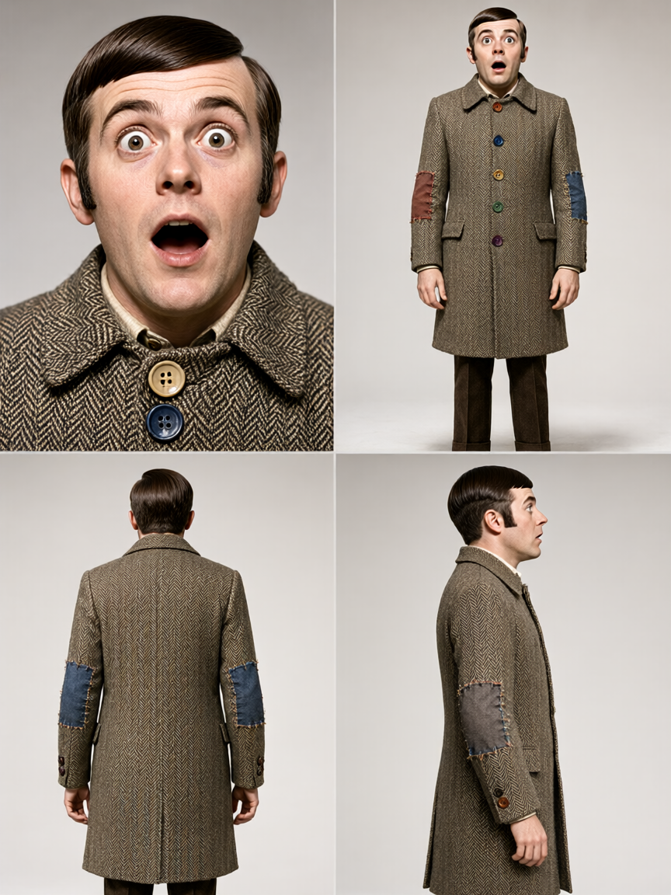
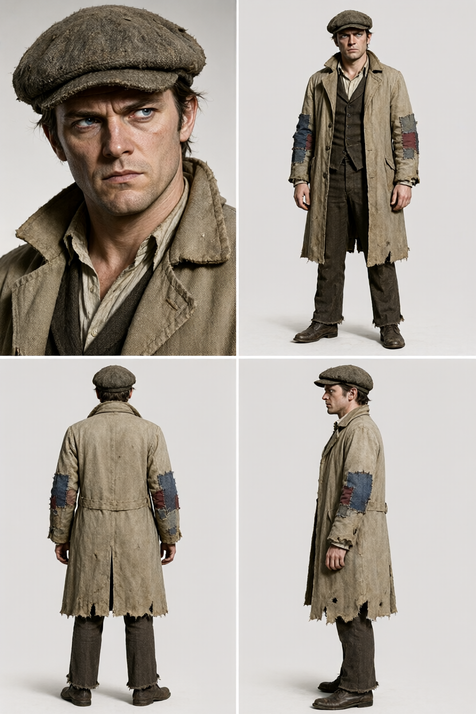
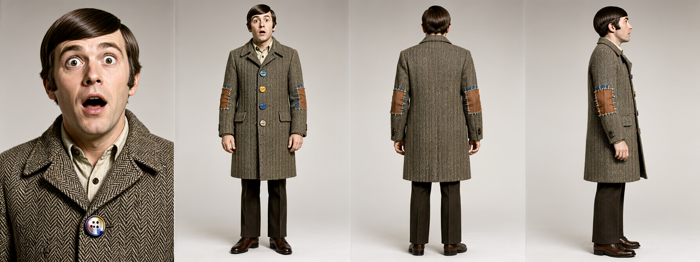

# Vertical panel aspect ratios solve boundary cropping but leave prompt-only character anatomy compressed

*Status: falsified. While 2:3 vertical panels eliminate boundary edge-cropping and inter-panel zoom drift in single-pass Qwen Image 2.1 character reference sheets, prompt-only diffusion leaves skeletal proportions compressed, with legs accounting for only ~27% of total figure height.*

## The question

In the single-pass text-to-image evaluation of Qwen Image 2.1 across the 44 Blades '68 alters, four-quadrant composite reference sheets achieved 100% view placement and costume coherence, but failed human exit audit due to boundary edge-cropping at the shins, inter-panel camera zoom drift, and dwarfish anatomical compression.

A practitioner on r/StableDiffusion noted that open diffusion and DiT models routinely compress bodies or truncate limbs when constrained within square or horizontal panel boundaries:

> "In my tests almost all open image models get shorter bodies or make crops when the aspect ratio for every panel is horizontal or square. If you make the same test with vertical panels 3:4 or 2:3 AR I think your results could improve"

Because standing human figures naturally occupy an aspect ratio between 1:2 and 2:3, forcing panels into 1:1 square quadrants (512×512 on a 1024×1024 composite canvas) imposes an unnatural horizontal-to-vertical geometry. The question is whether changing panel geometry to vertical aspect ratios (3:4, 2:3, or a 1×4 horizontal lineup of vertical panels) resolves the framing defects of prompt-only composite sheets without requiring external structural conditioning.

## Method

All runs execute on an NVIDIA RTX 3090 (24 GB) under Concourse `gpu-lock` using `Comfy-Org/Qwen-Image-2.1` (7B DiT, bfloat16). Step count is 40 (Euler / Simple, CFG 5.0) at fixed seed 42.

The experiment tests three independent geometric arms against the 1:1 square baseline from the initial 44-alter batch:

- **Baseline:** 1:1 square quadrants (1024×1024 composite canvas, 512×512 per quadrant).
- **Arm 1 (3:4 Vertical Quadrants):** 2×2 grid on an 864×1152 canvas (432×576 per quadrant).
- **Arm 2 (2:3 Vertical Quadrants):** 2×2 grid on an 832×1248 canvas (416×624 per quadrant).
- **Arm 3 (1×4 Horizontal Lineup):** Four 448×672 vertical panels arranged side-by-side in a horizontal strip (1792×672 total canvas).

The prompt holds layout and photographic style constant while testing the three defect alters from the initial run alongside one positive control:

1. `playbook05_paranormalist_male_scrappy` (reproduces dwarfish compression in 1:1)
2. `playbook03_intellectual_male_decadent` (reproduces inter-panel zoom drift in 1:1)
3. `playbook01_hound_male_scrappy` (reproduces shin edge-cropping in 1:1)
4. `playbook02_hull_male_decadent` (positive control: clean pass in 1:1)

**Pass criterion (pre-registered):** Human eyeball exit review on boundary clearance, uniform camera distance across full-body panels, and canonical adult human anatomical proportions (~7.5 heads tall, ~50% hip-to-ground height ratio).

## Results

| Arm | Canvas resolution | Panel geometry | Clearance & zoom | Anatomical proportions | Verdict |
|---|---|---|---|---|---|
| Baseline (1:1 Grid) | 1024×1024 | 512×512 per quadrant | Fail (shin crop, zoom drift) | Fail (dwarfism, ~5.8 heads) | Fail |
| Arm 1 (3:4 Grid) | 864×1152 | 432×576 per quadrant | Fail (shins cropped in rear/side) | Partial (~6.5 heads, compressed) | Fail |
| Arm 2 (2:3 Grid) | 832×1248 | 416×624 per quadrant | Pass (feet planted, no zoom drift) | Fail (limb compression, legs ~27% height) | **Fail** |
| Arm 3 (1×4 Lineup) | 1792×672 | 448×672 per strip | Fail (scale bleed, edge bounds) | Fail (severe dwarfism, ~5.0 heads) | **Fail** |

Arm 1 (3:4) provides marginal vertical relief over the 1:1 baseline, but fails on full-body clearance. In `playbook05_paranormalist_male_scrappy_3x4.png`, rear and side panels still crop at the shins and mid-calf.

Arm 2 (2:3) resolves boundary clearance: shoes and boot soles plant cleanly in all panels, and head clearance remains intact. In `playbook03_intellectual_male_decadent_2x3.png`, panel 4 (side profile) matches the front and rear panels in camera distance and shoulder scale, eliminating the zoom drift observed in 1:1.

However, pixel auditing reveals that skeletal compression persists under the extra vertical canvas height. In `playbook01_hound_male_scrappy_2x3.png`, the figure occupies 615 px of the 624 px vertical quadrant. The heavy tweed overcoat extends down to y=450, leaving exposed trousers and boots measuring only 165 px — roughly 27% of total figure height, compared to the ~50% hip-to-ground ratio characteristic of canonical adult human anatomy. The waistline sits abnormally low, producing a stocky, short-legged silhouette.

Arm 3 (1×4 lineup) regresses severely on anatomical proportions. In `playbook05_paranormalist_male_scrappy_1x4.png`, total figure height in panel 2 measures 626 px with a head height of 124 px (~5.0 heads tall), creating exaggerated caricature proportions.

## What the renders show

Changing panel geometry from square to 2:3 vertical resolves canvas boundary clipping and stabilizes inter-panel camera distance. However, aspect ratio tuning alone does not enforce adult human skeletal proportions or eliminate limb compression.

Two distinct structural mechanisms explain why prompt-only text-to-image fails to produce canonical anatomy:

1. **Canvas clearance does not dictate bone length:** Diffusion backbones allocate figure geometry based on semantic token weights and latent space spatial priors. In 2:3, the model places the feet above the canvas edge to avoid cropping, but absorbs the vertical headroom into an elongated torso and low-slung waistline rather than natural leg length.
2. **Horizontal attention bleed in ultra-wide canvases:** In the 1×4 horizontal strip (1792×672, an 8:3 ratio), the close-up portrait sits immediately adjacent to the front full-body figure without a quadrant divider. Because the head in panel 1 fills nearly the entire 672 px height, the model's cross-panel attention bleeds that massive facial scale into panel 2, enlarging the head and squashing the torso and legs into 42 latent rows.

Enforcing true adult human proportions across multiple views requires geometric conditioning (such as OpenPose skeleton control or depth maps). However, architectural inspection shows that Qwen Image 2.1 runs a 60-layer single-stream DiT (`QwenImage21Transformer2DModel`), making it incompatible with existing Qwen 1.0 ControlNet weights (which target a dual-stream MMDiT architecture with `double_block` skip connections). Single-pass T2I reference sheet generation cannot replace multi-clip turnaround pipelines until native ControlNet architectures arrive for Qwen 2.1.

## What this does not settle

This experiment tests four representative alters under a matched smoke-test design (N=4); it does not evaluate the remaining 40 alters across the Blades '68 roster on 2:3 geometry.

It does not settle whether multi-pass inpainting on quadrant crops can restore leg proportions while preserving cross-panel identity.

It does not settle whether training a native ControlNet or LoRA on Qwen Image 2.1 single-stream DiT weights can successfully enforce canonical skeletal proportions across multi-panel layouts.

## Cost

- **Compute:** 12 composite renders across three arms in 8m 42s = ~43.5s per composite image on an NVIDIA RTX 3090 under Concourse `gpu-lock`.
- **Peak VRAM:** ~14.1 GiB (59% of 24 GB capacity, 9.9 GiB headroom).
- **Calendar time from the original ask:** 1 day (commenter feedback received: 2026-09-21, runs executed and analyzed: 2026-09-22).
- **Active build span:** Approximately 1 hour across two Concourse pipeline builds.
- **Wasted builds:** 0 failed runs; 1 build (#2) required parameterizing the arm filter flag to isolate the 1×4 lineup smoke test.

## Files

- [`qwen-charref-t2i-aspect-ratio.api.json`](files/2026-09-22-qwen-charref-aspect-ratio/qwen-charref-t2i-aspect-ratio.api.json) — ComfyUI generation graph with dynamic canvas dimensions.
- [`build_qwen_charref_aspect_ratio_manifest.py`](files/2026-09-22-qwen-charref-aspect-ratio/build_qwen_charref_aspect_ratio_manifest.py) — manifest builder supporting 3:4, 2:3, and 1×4 geometry arms.
- Pre-registration doc: `docs/experiments/qwen-image-21-charref-aspect-ratio.md` in `gavmor/comfyui-workflows`.
- Experiment metadata: `EXPERIMENT-019a.yml` in `gavmor/comfyui-workflows`.
- Concourse pipeline: `concourse/exp-019a-qwen-charref-aspect-ratio.yml`.
- Egress assets: Immich album `exp-019a Qwen Image 2.1 vertical aspect ratio` (12 assets total).
