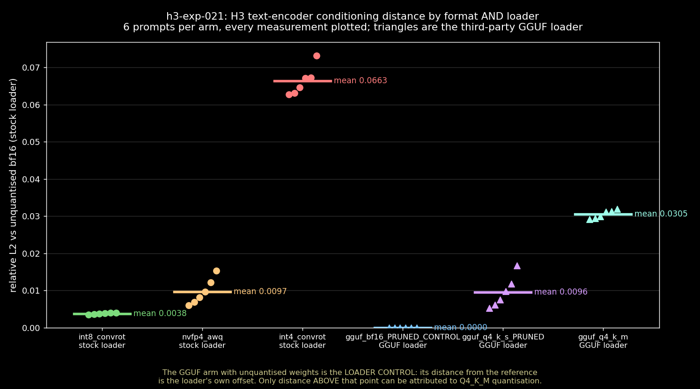

# The GGUF loader is transparent; Q4_K_M is not

*Status: complete. Six MiniMax H3 text-encoder variants measured against the
unquantised bf16 reference on six prompts each, separating the two things a
GGUF swap changes at once: the file format and the loader node that reads it.
The third-party loader contributes essentially nothing — relative L2 of ~1e-7,
four orders of magnitude below the smallest quantisation effect. Q4_K_M's cost
is therefore effectively all quantisation: 8× the
distance of int8 convrot, and 3× nvfp4. It still beats int4 convrot by half.*

## The question

[h3-exp-008](/2026-09-17-h3-quant-conditioning-fidelity) measured three
quantised safetensors encoders against bf16 and found the ordering int8 <
nvfp4 < int4. It deliberately left out the GGUF quants, because loading a GGUF
requires a third-party custom node and a GGUF result would have confounded two
variables at once: the weights are quantised differently *and* a completely
different loader implementation reads them.

That confound is the whole question here. When someone reports that a GGUF
encoder is worse, there is no way to tell from the report whether the blame
belongs to the Q4_K_M quantisation or to the loader node — and the two have
very different remedies. A bad quant means pick a different file; a bad loader
means the format is fine and the node needs fixing.

## Method

One text encoder is swapped at a time; everything downstream is held. The
measurement is the conditioning tensor itself, which is deterministic given a
prompt — no seed, no sampler, no taste involved. Distance is relative L2
against the bf16 reference, over 6 prompts × 6 arms = 36 measurements, plus a
self-check per prompt.

The arms, and what each isolates:

| arm | file | loader | isolates |
|---|---|---|---|
| int8_convrot | safetensors | stock `CLIPLoader` | exp-008 replication |
| nvfp4_awq | safetensors | stock `CLIPLoader` | exp-008 replication |
| int4_convrot | safetensors | stock `CLIPLoader` | exp-008 replication |
| **gguf_bf16** | **GGUF, unquantised** | **`CLIPLoaderGGUF`** | **the loader, alone** |
| gguf_q4_k_s | GGUF, Q4_K_S | `CLIPLoaderGGUF` | quant depth within GGUF |
| gguf_q4_k_m | GGUF, Q4_K_M | `CLIPLoaderGGUF` | the arm people actually run |

The fourth arm is what makes the rest interpretable. Unquantised weights
through the third-party loader share the format and the node with the Q4_K_M
arm but none of its quantisation, so its distance from the reference *is* the
loader's own offset. Only distance above that point can be charged to Q4_K_M.

**The null.** The same encoder encoding the same prompt twice, in the same
session and units. This reads exactly 0.0 relative L2 on every prompt: the
encoder is bit-deterministic, so any non-zero distance below is real signal
rather than instrument noise.

**Decision rule, fixed in advance.** If the unquantised-GGUF arm sits at the
null or orders of magnitude below the quant effects, the loader is transparent
and Q4_K_M's distance is quantisation. If it sits near Q4_K_M, the loader is
the story and the quant is incidental. If it lands between, the effect is
split and neither claim is clean.

## Results

| arm | loader | mean rel L2 | sd | min | max |
|---|---|---|---|---|---|
| null (same encoder twice) | — | **0.0** (exact) | 0 | 0 | 0 |
| int8_convrot | stock | 0.00381 | 0.00019 | 0.00354 | 0.00405 |
| **gguf_bf16 (loader control)** | **GGUF** | **1.44e-7** | **1.2e-7** | **3.5e-8** | **3.7e-7** |
| gguf_q4_k_s | GGUF | 0.00958 | 0.00390 | 0.00531 | 0.01676 |
| nvfp4_awq | stock | 0.00971 | 0.00321 | 0.00604 | 0.01534 |
| gguf_q4_k_m | GGUF | 0.03051 | 0.00103 | 0.02920 | 0.03194 |
| int4_convrot | stock | 0.06632 | 0.00353 | 0.06268 | 0.07313 |

The loader control is not zero, but it is 1.44e-7 — **four orders of magnitude
below** the smallest quantisation effect in the table (int8's 0.0038) and
26,000× below Q4_K_M's. The residual is float32 accumulation in a different
summation order, not a difference in what the loader read off disk: the
reference and control conditioning norms agree to 8 significant figures
(15545.3466796875 vs 15545.3466796875 on prompt 1).

A note on the second metric: cosine distance is useless at this scale. Its
worst same-encoder self-check reading is 6.4e-4, larger than the cosine
distance of four of the six arms. It is reporting float32 accumulation error,
not signal. Relative L2 has a null of exactly zero and separates the arms
cleanly, so every number above is relative L2.

## What it means

The loader is exonerated. `CLIPLoaderGGUF` handed the sampler a tensor
indistinguishable from the stock loader's at any scale that matters — the gap
is 26,000× smaller than the effect under study. Anyone who has blamed GGUF
loading for quality loss in this encoder was blaming the wrong component.

Which means Q4_K_M's 0.0305 is **quantisation, not plumbing** — the loader
offset is too small to subtract. Against the stock-loader quants that is 8× the distance of
int8 convrot and 3.1× nvfp4, so within the GGUF family the ordering is
Q4_K_S ≈ nvfp4 ≪ Q4_K_M.

The most useful number for someone choosing a file is the comparison exp-008
could not make: Q4_K_M sits at 0.46× the distance of int4 convrot. The GGUF
4-bit quant is **less than half as far from the reference** as the safetensors
4-bit quant that r/StableDiffusion spent a thread arguing about. If int4 is
what fits on the card, Q4_K_M is the better 4-bit file.

Q4_K_S deserves a flag: it measures *better* than Q4_K_M (0.0096 vs 0.0305)
despite being the smaller, nominally coarser quant. That inversion is stable
across all six prompts, so it is not noise — but see the limitation below.

## What this does not settle

**The two GGUF quant files are vision-pruned; the reference is not.** Every
BF16 and Q4_K_S H3 text-encoder GGUF published on the Hub carries 551 tensors
against the reference's 902 — the 351 `visual.*` tensors are stripped. For
text-only conditioning this is the correct comparison, and the loader control
is pruned identically, so the loader finding holds exactly. But the Q4_K_S-beats-
Q4_K_M inversion compares a pruned file against an unpruned one and may be an
artifact of that difference rather than of quantisation. Treat the Q4_K_M and
int4 numbers as solid and the Q4_K_S ranking as provisional.

**Tensor distance is not pixel distance.** exp-008 rendered its arms and found
that differences of this size do not survive sampling into anything a viewer
notices. Nothing here contradicts that: this experiment measures the encoder's
output, not the image. A reader wanting "will I see it" should read exp-008's
render half.

**Nothing here is about speed.** Load times differed sharply across arms —
the GGUF arms took 24–263s against 12–21s for safetensors — but load time was
not controlled for cache state and should not be read as a benchmark.

The obvious next experiment is converting the full 902-tensor reference to
unquantised GGUF locally, which would let the Q4_K_S ranking be tested without
the pruning confound. The standard conversion tool does not currently do this:
it detects the H3 encoder as plain `qwen3`, silently drops all 351 visual
tensors, and emits a file with no `general.architecture` key.

## Cost

- **Compute:** 36 conditioning encodes + 6 self-checks, ~1h48m wall for the
  successful build. Encode time per arm ranged 12s (safetensors, warm) to 263s
  (first GGUF load, cold).
- **Peak memory:** the reference bf16 encoder is 51 GB on disk and dominates.
  GPU occupancy was not instrumented per-arm in this run; the card is a 24 GB
  3090 and no arm OOMed.
- **Calendar time from the ask:** ~8h. Active build span 6h13m, of which 4h06m
  was spent in two failed builds that never acquired the GPU lock.

Two builds failed before the third succeeded, both identically: the pool
resource's git operation died with `error acquiring lock: reset lock: exit
status 128` after waiting 3h and 1h06m respectively. This is a lab-wide
contention failure, not specific to this pipeline — h3-exp-025 failed the same
way in the same window, with six experiment jobs queued against one GPU. See
[GPU lock starvation](/2026-09-24-gpu-lock-starvation).

One fixture was discarded: `unsloth/MiniMax-H3-GGUF`'s Q4_K_M has a valid
tensor table but **zero KV metadata entries**, so it carries no
`general.architecture` and no loader can identify it. The byte-comparable
Abiray copy is well-formed and was used instead.

## Files

- Pipeline: [`h3-exp-021-pipeline.yml`](files/2026-09-24-h3-gguf-quant-loader/h3-exp-021-pipeline.yml)
  (branch `feature/h3-exp-021-gguf-quant-loader-run`)
- Measurement: [`measure_conditioning_fidelity_gguf.py`](files/2026-09-24-h3-gguf-quant-loader/measure_conditioning_fidelity_gguf.py)
- Chart: [`plot_fidelity_gguf.py`](files/2026-09-24-h3-gguf-quant-loader/plot_fidelity_gguf.py)
- Loader node: `molbal/ComfyUI-GGUF` pinned to `48de657`, added to the
  comfyui-local image on branch `feature/add-gguf-clip-loader`
- Concourse build: `h3-exp-021/exp021-fidelity` build 3 on target `lab`

The graphs are API-format and name local checkpoints; they are not
drag-and-drop into a stock ComfyUI.
