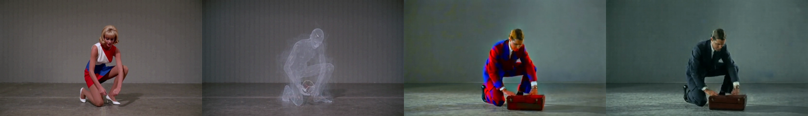
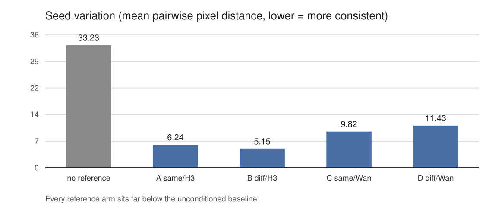
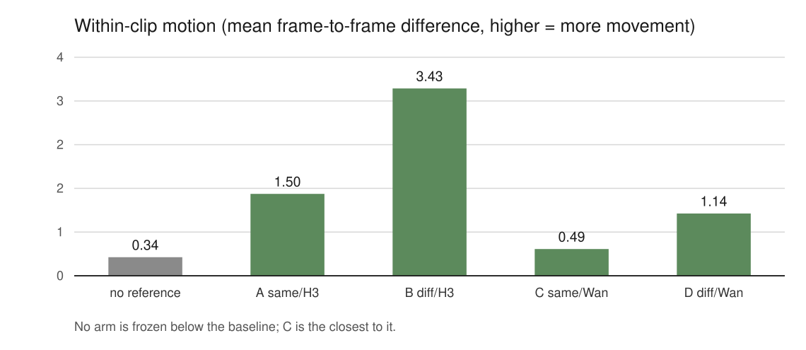
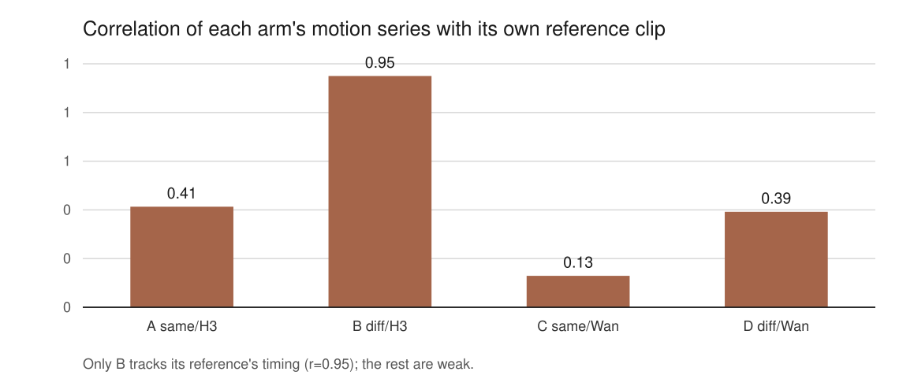
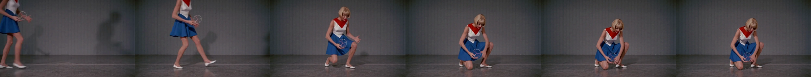
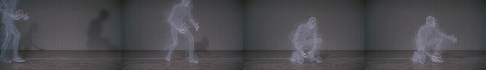
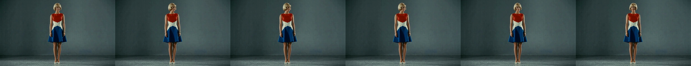

# A reference video moves the subject; it does not replace them

*Status: complete, with one cell of the 2×2 void. Twenty arms, four seeds. The
engine that rendered a reference clip changes how much it damps seed variation;
the subject in that clip does not get copied into the output. One fixture turned
out to depict the wrong character, which costs the same-subject/Wan cell and is
reported here rather than papered over.*

## The question

Two earlier runs disagreed, and neither could say why.

In `h3-exp-014`, feeding `MiniMaxH3ReferenceToVideo.ref_videos` a prior H3 render
of the prompt's own character cut seed-to-seed variation by 81.8% and held the
character across seeds. In `h3-exp-012`, feeding it a Wan2.1 VACE render of a
*different* character — a suited man with a briefcase — also cut variation, to a
similar figure, while transferring none of that man's content.

Those two runs differ in two ways at once: the reference's **subject** (the
prompt's own character vs. a stranger) and the **engine** that rendered it
(native H3 vs. Wan2.1 VACE). Either factor could explain either result. This
experiment crosses them.

## Method

Five conditions, four seeds each (43–46), twenty renders. One prompt, held
identical across every arm. Shot is 832×480×124 frames, satisfying H3's `17n+5`
constraint; references are 90 frames at the same resolution.

| Arm | Subject | Engine | Reference fixture |
|---|---|---|---|
| A | same | H3 | `char_ref_90.mp4` |
| B | different | H3 | `h3_diff_subject_90.mp4` (vapor entity) |
| C | *intended* same | Wan | `wan_same_subject_90.mp4` |
| D | different | Wan | `vace_guide_90.mp4` (briefcase man) |
| null | — | — | `ref_videos` disconnected |

`H3FunControlApply` is absent from every arm, so the reference pathway is the
only conditioning mechanism. H3 has two video inputs and leaving a pose track
attached would make any effect unattributable between them.

**Three measures.** *Seed variation* is the mean pairwise pixel distance across
an arm's four seeds — how much the output moves when only the seed changes.
*Within-clip motion* is the mean absolute frame-to-frame difference, which
guards the failure where consistency is bought by freezing the subject into a
still. *Distance to the reference* tests whether an arm is simply replaying the
clip it was handed.

A fourth measure was added after the first pass, because the first three cannot
support the claim the data suggested. Mean motion says how *much* an arm moves,
never *when*. **Motion correlation** is the Pearson r between an arm's
frame-to-frame motion series and its reference's, over their common length: two
clips with identical mean motion score near zero if they move at different
moments, and near one if they move together. Any claim about transferred
choreography is made in that number or not at all.

**The null is measured here**, at these settings, on these seeds — not borrowed
from exp-012 or exp-014. Prior figures are context in the prose, never terms in
the arithmetic.

## One cell is void

The fixture built for Arm C does not show the character it was supposed to show.

Panels three and four are both the briefcase man. Arm C's fixture was produced
from a Wan template whose prompt reads *"A person in a dark suit carries a brown
leather briefcase into frame, kneels down on one knee"* — the same subject as
Arm D's, in different colours. Arm C was meant to be the prompt's woman rendered
by Wan, and it is not.

So the design has three filled cells, not four:

- **A** same subject, H3
- **B** different subject, H3
- **C and D** different subject, Wan — two independent replicates

The same-subject/Wan cell is empty. Every contrast below is stated in terms of
what the fixtures actually contain.

## Results

| arm | seed variation | motion | distance to its reference | motion correlation |
|---|---|---|---|---|
| null | 33.23 | 0.34 | — | — |
| A same/H3 | 6.24 | 1.50 | 9.42 | 0.41 |
| B diff/H3 | 5.15 | 3.43 | 10.17 | **0.95** |
| C diff/Wan | 9.82 | 0.49 | 24.30 | 0.13 |
| D diff/Wan | 11.43 | 1.14 | 19.67 | 0.39 |

Every reference arm damps seed variation heavily — between 65.6% and 84.5%
below the null. A reference video of *any* kind, depicting *anyone*, makes H3
far less sensitive to its seed. That much replicates both prior runs and needs
no 2×2 to establish.

**The engine matters, and this contrast is clean.** Arms B, C and D all show a
stranger, so comparing them holds subject fixed and varies only the renderer.
The H3-rendered reference lands at 5.15; the two Wan-rendered references land at
9.82 and 11.43. Under a matched subject, a native H3 reference damps seed
variation roughly twice as hard as a foreign one, and the two Wan replicates
agree with each other more closely than either agrees with B.

**The subject barely matters, where it can be measured.** Under H3, moving from
the prompt's own character (A, 6.24) to a vapor entity (B, 5.15) changes seed
variation by −1.09 — smaller than the gap between the two Wan replicates that
are nominally the same cell. With the same-subject/Wan cell void, this is the
only place the subject factor can be read at all.

## Nothing is frozen, and one arm is dancing

The flattening failure mode does not occur. Every reference arm moves *more*
than the unconditioned null, not less, so none of them bought consistency by
collapsing the subject into a still portrait. C is closest to the floor at 0.49
against the null's 0.34.

The interesting number is the correlation.

Arm B's motion series tracks its reference's at r = 0.95. Its reference is the
vapor entity: a translucent, limbless mist that walks in and sinks to the floor.
Arm B's output is the prompt's woman — solid, blonde, in the red-white-blue
dress — walking in and crouching to the floor on the same beats.

The reference supplied the choreography. It did not supply the character.

## What it means

**`ref_videos` transfers motion, not identity.** Across all four reference arms,
no output adopts its reference's subject. Arm B was shown a vapor entity and
rendered the prompt's woman. Arm D was shown a suited man with a briefcase and
rendered the prompt's woman. Arm C the same.

This reframes exp-014's headline. That run fed H3 a reference showing the
prompt's own character, saw the character held across seeds, and read it as
identity transfer. The same observation is equally consistent with the reference
transferring nothing about identity at all — the character was already specified
in the prompt, and what the reference contributed was the damping and the
motion. This experiment cannot separate those two readings for arm A, but it can
show that when the reference's subject and the prompt's subject *disagree*, the
prompt wins every time.

The operational consequence is the opposite of exp-014's recipe. If you want a
character held across shots, the prompt is doing that work and the reference is
not the lever. If you want a *performance* carried from one shot to another —
the timing of a walk, a crouch, a reach — that is what a reference clip moves,
and it moves it out of a subject that need not resemble yours at all.

**Native H3 references damp harder.** Between the two engines, at matched
subject, H3 roughly halves what a Wan reference achieves. Whatever the pathway
keys on is partly distributional, not purely semantic.

## What this does not settle

- **The same-subject/Wan cell was never run.** Its fixture depicted the wrong
  character. The engine contrast rests on the different-subject row, where it is
  clean; a full 2×2 would need that cell rebuilt from a Wan render of the
  prompt's own woman.
- **The choreography result is one arm.** B's r = 0.95 is a single condition at
  four seeds. A is 0.41, D is 0.39, C is 0.13 — so strong temporal transfer is
  not a general property of the pathway, and what makes B different (its
  reference is native H3 *and* has a clear, large motion arc) is not isolated
  here.
- **Identity is read by eye.** No face-recognition or perceptual identity metric
  is applied. "The output is the prompt's woman, not the reference's man" is a
  reading of frames, stated as one. It is an easy reading — the subjects differ
  in gender, solidity and clothing — but it is not a measurement.
- **One prompt, one resolution, one reference length.** Four seeds per arm is a
  better variance estimate than two and is still one character in one shot.
- **Motion correlation is a coarse instrument.** It compares whole-frame motion
  magnitude over time. It cannot distinguish a subject performing the
  reference's action from a camera or a background moving on the same schedule.

## Cost

- **Render:** twenty arms in about 53 minutes under GPU lock, ~170 s per arm,
  plus one Wan fixture render of about 15 minutes.
- **Failed builds:** three. Build #17 died because a sibling pipeline's
  container recreate wiped `comfyui-local`'s `input/` directory mid-run —
  `input/` lives in the container's writable layer, not a volume, so nothing
  staged there survives a recreate. Build #18 submitted a prompt and then polled
  a queue that had forgotten it, because ComfyUI restarted underneath it. Build
  #19 rendered all four fixtures correctly and then failed preflight, because
  the install loop uploaded three of them and assumed the fourth was already
  resident. The fixture builder now derives everything from durable `output/`
  artifacts, uploads all four unconditionally, and fails fast when a submitted
  prompt vanishes from the queue.
- **Scoring:** a separate Concourse job that takes no GPU lock. It decodes
  finished clips and does pixel arithmetic, so it can be corrected and re-run
  without re-rendering twenty arms or queueing behind the 3090.

## Files

- [Scores, all five conditions](files/2026-09-24-h3-reference-video-2x2/h3-exp-020-scores.json)
- [Scorer, including the motion-correlation measure](files/2026-09-24-h3-reference-video-2x2/score_exp020.py)
- [Fixture builder](files/2026-09-24-h3-reference-video-2x2/build_exp020_fixtures.py)

Renders are in Immich under *H3-EXP-020 unconfounded reference 2×2*. Arms and
pipeline live in `comfyui-workflows` on
`feature/h3-exp-020-unconfounded-reference-video`, under
`workflows/h3-exp-020-arms/` and `concourse/exp020-pipeline.yml`.
