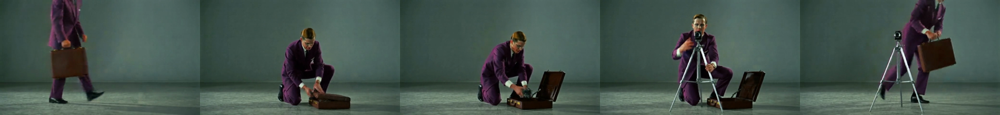
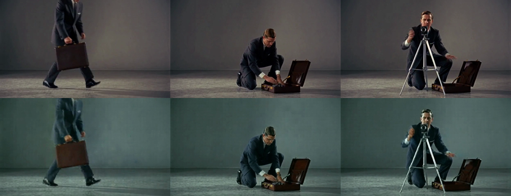

# A VACE guide will not change its subject, so the same-subject question stays open

*Status: falsified instrument, no arms rendered. A Wan2.1 VACE video-to-video pass at strength 1.0 reproduces the source clip's subject and ignores a prompt that asks for a different one, so the same-subject guide and the different-subject guide are the same man in the same suit. Factor 1 never varies, the comparison cannot be built, and no conditioned arm was rendered.*

## The question

An [earlier result](2026-09-18-h3-guide-video-control.html) found that a VACE-rendered guide video carries neither props nor action into MiniMax H3, through either of H3's two video inputs. Its limitations section names the objection this experiment exists to answer:

> **The guide depicts a different figure from the prompt's subject.** If the intended workflow is that the guide already resembles the target shot, that is a different procedure and would deserve its own test.

That is a fair objection. A guide showing a suited man, handed to a shot whose prompt describes a blonde woman in a 1960s mini dress, asks the model to transfer an action while contradicting it about who is performing it. If H3 resolves that conflict by discarding the guide, the published null measures the contradiction rather than the mechanism.

So: render a second guide that depicts the *prompt's own subject* performing the same choreography, and compare.

## Method

Six conditions, four seeds each, twenty-four arms. Everything is held except the conditioning: the same prompt, 832x480, 124 frames, the `int8_convrot` transformer, the `nvfp4_awq` text encoder, strength 0.8 and a 0.0-0.6 control window on every FunControl arm.

Two factors cross:

- **Subject alignment** — does the guide depict the prompt's subject, or a foreign one?
- **Pathway** — `H3FunControlApply.control_video` (structural) or `MiniMaxH3ReferenceToVideo.ref_videos` (semantic).

| Arm | Guide subject | Pathway |
|---|---|---|
| arm0_null | none | none |
| arm1_fc_diff | different | control_video |
| arm2_fc_same | same | control_video |
| arm3_ref_diff | different | ref_videos |
| arm4_ref_same | same | ref_videos |
| armS_pose | pose skeleton | control_video |

`arm0_null` is the null: what the prompt alone produces, measured in this configuration rather than borrowed from another run. `armS_pose` is the positive control — the pose track is already known to transfer action, so an arm that fails to move while the skeleton arm moves separates "this guide does nothing" from "nothing works today".

All six conditioning fixtures are derived from 294-frame sources by one uniform resample, so a difference between arms cannot come from how the fixtures were cut.

**The design's own guard is what failed.** Before any arm renders, the fixtures are decoded and hashed, and the build aborts if the same-subject and different-subject guides are not distinct. That check exists because two guides that are secretly identical would produce a clean-looking null with no information in it.

## Results

The guard did not fire, because the two guides are not bit-identical — they are separately encoded. They are nonetheless the same person.

The same-subject guide is rendered from a prompt naming "a young woman with a blonde bob, wearing a sleeveless late-1960s colour-blocked A-line mini dress in red, white and blue, and low white heels". What came back is a man in a dark suit.

Set beside the different-subject guide, the two are the same subject wearing the same suit, performing the same choreography:

The mechanism is not mysterious. `WanVaceToVideo` runs at `strength: 1.0` over a control video of the source clip, which pins the output to the source's pixels. The text prompt is present but has nothing left to decide. The subject swap the experiment depends on never happens.

**No conditioned arm rendered.** Only `arm0_null` completed, at all four seeds — the arm with no guide at all, which cannot answer the question. Zero of the twenty conditioned arms produced a frame, so there is no measurement to report and nothing landed in Immich.

## What it means

The objection from the earlier write-up is not answered, and the design as registered cannot answer it. A video-to-video pass at full strength is a *copier*, not a re-caster: it is the wrong instrument for producing "the same action, performed by a different person".

This also tightens the earlier result rather than weakening it. That experiment's guide was honestly described as depicting a different figure; this one shows that the obvious fix does not produce what it appears to promise. Anyone repeating the recipe with "just render the guide with your own character in it" will get the source clip's character back unless they change how the guide is made.

Three routes remain, none of them tested here:

- Lower `WanVaceToVideo` strength so the prompt can influence appearance, accepting that the choreography loosens as it drops.
- Drive VACE with a *pose skeleton* plus a subject prompt, so structure comes from the track and appearance from the text.
- Source a clip that already depicts the target subject performing the action, and skip the re-cast entirely.

## What this does not settle

- **The same-subject hypothesis itself is untouched.** This is a finding about how to build the instrument, not about whether H3 transfers action from an aligned guide. That question is exactly as open as it was.
- **Only strength 1.0 was tried.** The failure is specific to a full-strength video-to-video pass; a strength sweep is the obvious next step and was not run.
- **The pipeline's own distinctness guard is insufficient.** It compares decoded streams, which catches identical fixtures but not fixtures that differ in encoding while depicting the same subject. A guard that could have caught this would have to read the *content* — the cheapest version is a human or a vision model looking at one frame of each guide before the GPU commits to twenty arms.
- **Nothing here evaluates H3.** No conditioned arm ran.

## Cost

- **Render:** the same-subject guide took 2651.9s by ComfyUI's clock — 44 minutes for a 12.4-second clip, roughly 214x real time. Null arms run ~91s each for 5.2 seconds of video, about 17x real time.
- **Memory:** the 832x480x124 shot is comfortable on the 24 GB card; the guide pass peaks well under it.
- **Failed builds:** five, of which four cost real GPU time. Build #1 (52m) and #4 (1h11m) died when comfyui-local was recreated underneath them by concurrent work. Build #2 failed in seconds because a shared fixture had been removed from the container's input directory between graph-build and submit — fixed by namespacing every fixture and pinning the guide source before rendering. Builds #3 and #5 died at the first FunControl arm on a reproducible native segmentation fault inside `comfy_aimdo`'s allocator during H3 sampling, twelve occurrences in one day. The guide is now cached and reused across retries, so the 44 minutes was paid once rather than five times.
- **Queue:** gpu-lock contention dominated wall-clock. Build #5 waited 2h49m for the lock before rendering anything; eight experiment pipelines were competing for one 3090.
- **Calendar:** the underlying objection was raised on 2026-09-18 in response to that day's write-up. Six days to a negative result about the instrument.

## Files

- [The same-subject guide graph](files/2026-09-24-h3-same-subject-guide/vace_guide_same.api.json)
- [The fixture builder](files/2026-09-24-h3-same-subject-guide/build_exp023_fixtures.py)
- [The arm builder](files/2026-09-24-h3-same-subject-guide/build_exp023_arms.py)
- [The pipeline](files/2026-09-24-h3-same-subject-guide/h3-exp-023-pipeline.yml)
- [ComfyUI segfault traceback](files/2026-09-24-h3-same-subject-guide/comfyui-segfault-traceback.txt)

Workflows are API-format and name local checkpoints; they are a starting point, not a drag-and-drop.
