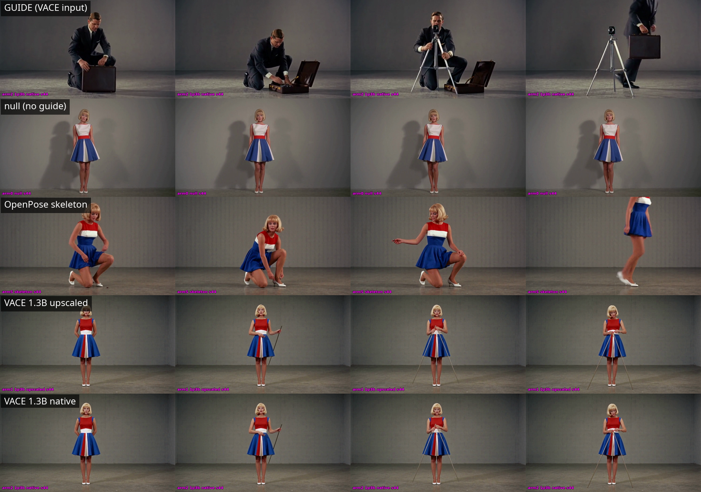

# Rendering the guide at full resolution changes nothing, because H3 is not reading the guide's detail

*Status: complete for the 1.3B half; the 14B half is scoped out. A VACE guide
rendered natively at 1312×736 costs 5.2× the GPU time of one rendered at
832×480 and upscaled, and produces output 0.11 apart on a scale where changing
the seed moves 15.85. The props that do appear are not the guide's props and do
not arrive when the guide's props arrive.*

## The question

An [earlier result](2026-09-18-h3-guide-video-control.html) found that a VACE
guide video carries neither props nor action into MiniMax H3. Its limitations
section named the escape hatch:

> VACE 1.3B, upscaled from 832×480. The 14B model and a natively
> full-resolution guide are both untested.

That is a real objection. If the guide is generated at 832×480 and then
lanczos'd up to H3's 1312×736, every fine structure in it — the clasp of a
briefcase, the strut of a tripod — is interpolated rather than drawn. A model
that ignores such a guide might be ignoring the blur, not the content. The
cheap fix would be to render the guide at H3's own resolution and hand it over
sharp.

So: hold everything, vary only the resolution at which the guide is rendered,
and see whether a sharp guide transfers what a blurred one does not.

## Method

Two guide conditions plus two controls, two seeds each, eight renders.

| Arm | Guide | Pathway |
|---|---|---|
| `arm0_null` | none | `H3FunControlApply` deleted entirely |
| `armS_skeleton` | OpenPose skeleton | `control_video` |
| `arm1_1p3b_upscaled` | VACE 1.3B at 832×480 → lanczos → 1312×736 | `control_video` |
| `arm2_1p3b_native` | VACE 1.3B at 1312×736 | `control_video` |

Everything else is held at the earlier experiment's exact values, so the
numbers here are comparable to its published ones: the same prompt string, the
same 8-step turbo stack (`minimax_h3_turbo_v4_step600_ema`), the same
1312×736 / 294-frame / 24fps geometry, `H3FunControlApply` at strength 0.8
over a 0.0–0.6 control window, seeds 43 and 44. The two arms' graphs differ in
exactly one field: the filename `LoadVideo` names.

The guide depicts a man in a suit who kneels at a briefcase, opens it, and
sets up a camera tripod. The prompt describes a blonde woman in a
red/white/blue A-line mini dress against a plain grey wall. That mismatch is
deliberate and inherited: it is what makes prop transfer legible: any
briefcase or tripod in the output can only have come from the guide, because
nothing in the prompt mentions one.

**The null** is `arm0_null`, which has no control path at all. It establishes
what the prompt alone produces, and it is what "no transfer" looks like in the
same units and configuration.

**The instrument** is mean absolute grayscale pixel distance at temporal
stride 8, the same measure used across this line of work. Its scale is set by
the null arm's seed-to-seed distance, 60.99 — that is what "two unrelated
renders of this prompt" reads.

**The decision rule, stated before the results.** Native-resolution guide
rendering is worth its cost if the native arm transfers props or choreography
the upscaled arm does not. If the two arms differ by less than the
seed-to-seed variation within an arm, the resolution of the guide is not a
factor and the remaining factor — model scale — is not worth testing at the
same price. If they differ by more, the 14B arms are worth running.

## Results

Distances between arms, matched seed 44, with the null's own seed-to-seed
distance as the scale:

| comparison | distance |
|---|---|
| null s43 vs null s44 (*scale: two unrelated renders*) | 60.99 |
| upscaled s43 vs upscaled s44 (*seed effect, within arm*) | 15.85 |
| null vs skeleton | 18.70 |
| null vs upscaled | 21.86 |
| null vs native | 21.88 |
| **upscaled vs native** | **0.11** |

The two guide arms are 0.11 apart. Changing the seed inside either arm moves
15.85 — 144× further. Both arms sit essentially the same distance from the
null (21.86 vs 21.88, a gap of 0.02).

This is not an instrument that cannot see the guides apart. The guide files
are byte-distinct (verified by checksum in Immich; no two assets in the run
share one), and measured directly against each other at full 1312×736
resolution they differ by 0.36, with the native guide carrying slightly *less*
high-frequency energy than the upscaled one (25.8 vs 26.7 gradient variance) —
the lanczos upsample adds ringing, it does not merely blur. That 0.36 of guide
difference produced 0.23 of output difference at full resolution. The guide
channel moved, and the output followed it at roughly unity — into noise.

Temporal motion within each clip, which guards the failure mode where an arm
looks consistent because the subject froze:

| arm | seed 43 | seed 44 |
|---|---|---|
| null | 0.64 | 0.84 |
| OpenPose skeleton | — | 4.33 |
| VACE upscaled | 0.51 | 0.89 |
| VACE native | 0.51 | 0.89 |

Both VACE arms move less than the null. The skeleton arm moves 4.33, about
five times either.

Rows: the guide, then null, OpenPose skeleton, VACE upscaled, VACE native.
Columns are t = 2s, 5s, 8s, 11s, all seed 44.

## What the props actually do

The one thing that does cross over is worth reading carefully, because it is
not transfer.

A thin vertical rod appears in both VACE arms at seed 44. In the grid it is
visible from **t=2s**, held near the woman's side, and it persists to the end
of the clip. In the guide, at t=2s, the man is kneeling at a **briefcase**;
the **tripod does not appear until t=8s**, and only stands free of him at
t=11s.

So the object arrives six seconds before its supposed source, is one rod
rather than three legs and a head, is held rather than stood on the floor, and
sits beside a woman who is otherwise doing exactly what the null arm's woman
does. It also fails to reproduce: seed 43 of both guide arms shows no rod at
all, no briefcase, and no man. The briefcase — which is on screen in the guide
from t=0 and is the larger, higher-contrast object — never appears in any arm
at either seed.

An object that is not the guide's object, not at the guide's time, not in the
guide's place, and not there on the other seed is an appearance prior leaking
a vaguely rod-shaped thing into a scene, not an instruction being followed.

The skeleton control, by contrast, does what a control is supposed to do. Its
arm crouches, reaches, and rises across the four frames, at 4.33 motion
against the null's 0.84, while the VACE arms stand as still as the null and
merely acquire a stick.

## What it means

The escape hatch is closed on the resolution side. The earlier null was not an
artifact of handing H3 an interpolated guide: given a guide drawn sharp at its
own working resolution, H3 produces output indistinguishable from the blurred
case at 144× below seed noise. Whatever H3 does with a dense RGB guide through
`control_video`, it is not reading the guide's fine structure, because
removing the blur from that structure changed nothing.

The positive reading of the whole line is that H3 treats a dense RGB guide as
a weak appearance prior and a variance damper — it pulls seed-to-seed
variation down from the null's 60.99 to 15.85 and pulls motion *below* the
null — rather than as an instruction about what objects exist or what the
subject does. Choreography is available, and cheaply, through the OpenPose
skeleton pathway, which is the arm in this run that actually moves.

## What this does not settle

**The 14B half is deliberately not run.** The design crossed two factors —
model scale and guide resolution — for four cells. Cells 1 and 2 answer the
resolution factor at 1.3B and answer it with a 144-to-1 margin; cell 3 (14B
upscaled) was in flight at publication and cell 4 (14B native) was never
started. The decision rule stated above forecloses them: the resolution factor
is dead at 1.3B, and cell 4 exists only to cross it with scale. At the guide
costs measured below, cell 4 alone is 6+ GPU-hours to vary a factor that has
just been shown not to matter. This is a scope cut, not an unfinished run.

What remains genuinely open is **model scale on its own** — whether a 14B VACE
guide, at either resolution, contains something a 1.3B guide does not that H3
would read. Nothing here tests that. The cheap version is one cell, not two:
14B upscaled against the 1.3B upscaled arm already in hand.

**N=2 per arm.** The design pre-registers four seeds (43, 44, 45, 46); two
were run. That is enough for the resolution finding, where the effect is 144×
below the noise it would have to clear, and not enough to characterize how
often the rod artifact appears — it shows at seed 44 and not at 43, which is
all that can honestly be said about its frequency.

**The guide's subject differs from the prompt's.** That mismatch is what makes
prop transfer legible, but a
[separate result](2026-09-24-h3-same-subject-guide.html) established that a
VACE pass will not re-subject a guide on request, so the same-subject variant
of this question remains untestable by this route rather than answered.

**No VRAM figure.** This run carries no memory instrumentation, so peak usage
is not reported rather than estimated.

## Cost

The headline operational number is the guide render, and it is the reason the
resolution factor is expensive to ask about at all:

| guide | ComfyUI clock | wall | vs upscaled |
|---|---|---|---|
| 1.3B at 832×480 → upscaled | 2,623s (43.7m) | 43.8m | — |
| 1.3B at 1312×736 native | 13,635s (3.79h) | 5.50h | **5.2× compute, 7.5× wall** |

Native is 2.42× the pixels and 5.2× the compute — superlinear by 2.15×. The
wall-clock ratio is worse still (7.5×) because the long render straddled
contention for the single card.

Arm rendering, by contrast, does not care at all. Each arm is 294 frames of
12.25s video:

| arm | seed 43 | seed 44 | vs real-time |
|---|---|---|---|
| null | 951s | 943s | ~77× |
| skeleton | 1,123s | 1,097s | ~91× |
| VACE upscaled | 1,101s | 1,110s | ~90× |
| VACE native | 1,059s | 1,055s | ~86× |

943–1,123s across every arm: what the guide is costs nothing downstream, so
the entire price of the native guide is paid once, up front, in the guide
render. Eight arms is 8,439 GPU-seconds (2.34h); the two guides together are
4.52h — the fixtures cost about twice the experiment.

At ~90× real-time, a 12-second shot is a 19-minute wait.

**Calendar time: 64.1 hours from the design commit to publication**, of which
the first 40.6h was queue and pipeline work before any build ran, and 23.5h
was the active build span. Twenty-one builds were triggered to produce three
successful cells.

Failed and wasted builds, with causes:

- **Fourteen builds on the controls cell before one succeeded.** Nine errored
  within seconds on pipeline-configuration faults; the rest died mid-render.
- **`fly trigger-job -w` forwards client death to the build as an abort.**
  Build #15 was killed at 2h01m, after it had already rendered an arm, when
  the triggering client went away. The driver now triggers detached and polls.
- **A hardcoded 7,200s guide limit killed the native-guide cell at 2h26m**,
  having held the GPU lock for all of it. The ceiling was measuring the
  harness, not the model — the native guide legitimately needs 3.79h. Raised
  to 21,600s and made env-overridable.
- **Arms could not validate before the lock was acquired**, because the guide
  they validate against does not exist until the cell renders it; the
  validation gate is now split into immediate and deferred targets.
- **The raw guide fetch wrote a fixed filename**, so every cell's guide landed
  as `vace_guide_raw.mp4` and the shared guides album could not attribute a
  guide to its arm. Fixed; the per-arm albums were never affected, and each
  arm's guide is verified byte-distinct.

One artifact of that last bug is worth stating plainly for anyone reading the
albums: each arm album holds four assets per two seeds, and only the
`_00001_`-suffixed files are H3 outputs. The `_294`-suffixed files are the
input guide fixtures, egressed alongside for provenance.

## Files

Guide graphs, arm graphs, and both controls are in
[`files/2026-09-25-h3-guide-resolution-appearance-prior/`](files/2026-09-25-h3-guide-resolution-appearance-prior/):

- `vace_1p3b_upscaled.api.json`, `vace_1p3b_native.api.json` — the two guide
  renders; they differ only in the `ImageScale`/`WanVaceToVideo` dimensions.
- `arm1_1p3b_upscaled_s44.api.json`, `arm2_1p3b_native_s44.api.json` — the two
  guide arms; they differ only in the filename `LoadVideo` names.
- `arm0_null_s43/s44.api.json`, `armS_skeleton_s43/s44.api.json` — controls.

These are API-format graphs naming local checkpoints
(`minimax_h3_turbo_v4_step600_ema.safetensors`,
`minimax_h3_fun_controlnet_union_pruned_bf16.safetensors`, Wan2.1 VACE 1.3B),
so they will not drag-and-drop into a stock ComfyUI without those files
present.

Renders are in Immich: `h3-exp-025 controls (skeleton + null)`,
`h3-exp-025 arm1 VACE 1.3B upscaled`, `h3-exp-025 arm2 VACE 1.3B native`.
