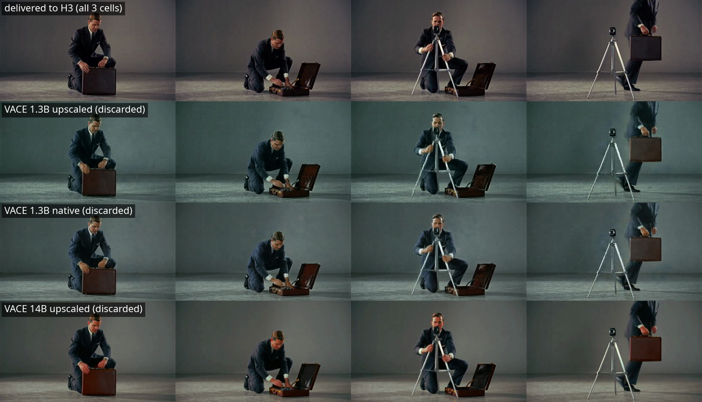

# RETRACTED: the guide resolution comparison was never run — all three cells were handed the same file

*Status: retracted 2026-09-25, the same day it was published. A bug in the
guide-fetch step sent every cell the experiment's own source control video
instead of the VACE render it had just spent between 44 minutes and 3.8 hours
producing. The three "guide" fixtures were byte-identical. The resolution
comparison the report claimed to make — and the decision rule it used to scope
out the 14B half — compared a file against itself.*

## What happened

The original report concluded that rendering a VACE guide at H3's native
1312×736, rather than at 832×480 and upscaling, changes nothing: the two arms
came out 0.11 apart on a scale where changing the seed moves 15.85, a 144-to-1
margin. On that margin it declared the resolution factor dead and cut cell 4
(14B native) from the design.

The 0.11 was not a small effect. It was two renders of the same input.

`render_vace_guide.py` picked the guide out of ComfyUI's history with a
first-match-wins scan:

```python
def find_output(entry):
    for node_out in (entry.get("outputs") or {}).values():
        for key in ("videos", "gifs", "images"):
            for item in node_out.get(key, []) or []:
                if str(item.get("filename", "")).endswith(".mp4"):
                    return item
```

ComfyUI's `history[...]["outputs"]` reports **`LoadVideo` alongside
`SaveVideo`**. Node 6 is the graph's `LoadVideo`, and it reports back the
source file it opened, tagged `type="input"`. Node 6 sorts before node 14. So
the scan returned the graph's input, every time:

```
=== cell1 1.3B upscaled guide (4c906d20-cc0e-42a8-b8e5-a64a042e6b33) ===
  outputs node order: ['6', '14']
    node   6 images  vace_src_props.mp4  type=input
    node  14 images  vace_1p3b_upscaled_00001_.mp4  type=output
  -> find_output() would return: node 6 vace_src_props.mp4 (type=input)
=== cell2 1.3B native guide (b49ad12e-22c8-4479-9afa-10ec9f7d4f8a) ===
  -> find_output() would return: node 6 vace_src_props.mp4 (type=input)
=== cell3 14B upscaled guide (14a51a8a-1739-46a2-b612-f3bfc0bba3d8) ===
  -> find_output() would return: node 6 vace_src_props.mp4 (type=input)
```

All three cells then logged `fetched guide-out/vace_guide_raw.mp4 (1130241
bytes)` — the same byte count, because it was the same file. Its SHA-1, base64
encoded the way Immich stores it, is `sJ2Doe08vmmeuAeqETCTsi+Xasc=`, which
matches the asset sitting in the `h3-exp-025 guide videos` album under the name
`vace_guide_raw.mp4`.

The bug was invisible because the file it substituted is a *valid* guide. A
re-encode of the control video is a real 294-frame mp4 at the right
dimensions, so it passed the frame-count check, passed the trim, passed
`H3FunControlApply`'s token-count gate, and produced eight plausible H3 renders
that no downstream check could distinguish from a correct run.

## The evidence that the original numbers were measuring nothing

The published report defended itself against exactly this possibility, and the
defence was wrong in an instructive way. It argued the instrument could see the
guides apart because *"the guide files are byte-distinct (verified by checksum
in Immich; no two assets in the run share one)"*.

They are byte-distinct. Every cell burns an arm label into its egressed copy
before upload, so `arm1 1p3b upscaled s44` and `arm3 14b upscaled s44` are
different files carrying different text over identical pixels. Checksum
distinctness proved the labeller ran. It could never have proved the renders
differed, and it was read as if it had.

Comparing the delivered guides by pixel content, with the burn-in strip cropped
away:

| comparison | distance |
|---|---|
| 1.3B guide vs 14B guide, whole frame (includes burn-in) | 0.16 |
| 1.3B guide vs 14B guide, burn-in cropped away | **0.04** |
| either delivered guide vs `vace_src_props.mp4` | 0.49 |

0.04 apart is the same video twice. The 0.49 against the source is one lanczos
re-encode.

The arms follow, matched seed:

| comparison | s43 | s44 |
|---|---|---|
| arm1 (1.3B upscaled) vs arm2 (1.3B native) | 0.10 | 0.11 |
| arm1 vs arm3 (14B upscaled) | 0.13 | 0.13 |
| arm2 vs arm3 | 0.13 | 0.12 |

Three arms that span two model scales and two guide resolutions sit inside
0.13 of each other. That is the residual nondeterminism of the H3 sampler on
one fixed input, and it is the correct reading of the original report's
headline 0.11.

## What the cells actually rendered

The VACE renders were real. They ran, they cost what the report said they
cost, and they are still on the box — they were simply never fetched. Pulling
them from `H3/exp025/` by the node-14 filenames ComfyUI recorded:

| real render | vs source control video | frames |
|---|---|---|
| 1.3B upscaled | 6.12 | 297 |
| 1.3B native | 6.91 | 297 |
| 14B upscaled | 5.50 | 297 |

| real render vs real render | distance |
|---|---|
| 1.3B upscaled vs 1.3B native | 2.78 |
| 1.3B upscaled vs 14B upscaled | 3.65 |
| 1.3B native vs 14B upscaled | 3.70 |

The comparison that should have been made separates by 2.78–3.70. The
comparison that was made separates by 0.04. The experiment discarded a signal
roughly 70× larger than the one it measured.



Row 1 is the file all three cells delivered to H3; rows 2–4 are the VACE
renders they produced and dropped. Columns are t = 2s, 5s, 8s, 11s.

Worth stating because it cuts against a tidy retraction: the four rows look
very similar. `WanVaceToVideo` here runs at `strength 1.0` over a dense control
video, which is close to a reconstruction pathway — the man, the briefcase and
the tripod appear in the same places at the same times in all four. The
2.78–3.70 separation is real and 70× the noise floor, but it is a texture-and-
grade difference, not a different scene. Whether a difference that size is one
H3 could read through `control_video` is exactly what this experiment was built
to answer and did not.

## What survives

**The cost figures.** The guide renders genuinely ran at those durations; only
their output was mis-fetched. 1.3B upscaled 2,623s, 1.3B native 13,635s (5.2×
compute for 2.42× the pixels), 14B upscaled 10,014s. The arm render times
(943–1,123s, ~77–91× real-time) and the finding that arm cost is insensitive
to what the guide is are unaffected.

**One observation about dense RGB guides, in weakened form.** What H3 received
was `vace_src_props.mp4` — the real source footage, trimmed and scaled to
1312×736. That is a dense RGB video guide, and a sharper one than any VACE
render. Against it, H3 still produced no briefcase at either seed, no tripod at
the tripod's time, and less motion than the null (0.51/0.89 vs 0.64/0.84) while
the OpenPose skeleton arm moved 4.33. So "H3 does not take props or
choreography from a dense RGB guide through `control_video`, and the skeleton
pathway is what carries choreography" still has one N=2 observation behind it.
It is now an observation about *the source footage as guide*, which was never
the arm anyone designed.

**The earlier result this was testing.** The
[2026-09-18 finding](2026-09-18-h3-guide-video-control.html) is untouched; this
run simply failed to test its escape hatch.

## What is void

- **The resolution comparison.** Cells 1 and 2 received identical inputs. There
  is no evidence here either way about guide resolution.
- **The 144-to-1 margin**, and the decision rule built on it.
- **The scope cut of cell 4.** It was foreclosed by a result that does not
  exist. The 2×2 design is open at three of four cells.
- **The claim that model scale is untested "because the resolution factor is
  dead."** Scale is untested, but for the ordinary reason.
- **The guide-vs-guide analysis** — "0.36 of guide difference produced 0.23 of
  output difference at full resolution", and the gradient-variance reading
  about lanczos ringing. Both were computed on two copies of one file.
- **The rod artifact reading.** The rod appears at seed 44 in arms that were
  all given the source footage. Whatever it is, it is not evidence about VACE
  guides at two resolutions.

## The fix

`find_output()` now refuses anything that is not a render:

```python
                if item.get("type") != "output":
                    continue
```

A render-less graph now returns `None` and fails the task loudly, where before
it silently returned the input. On top of that, the fetched guide is hashed
against the graph's own `LoadVideo` source and the task aborts if they match,
so the specific substitution that happened here cannot recur even if a future
graph reports its nodes in some other order.

Both are covered by `concourse/scripts/test_render_vace_guide.py`, driven by
the exact history payload ComfyUI returned for cell 3. The old implementation
fails those tests — checked, rather than assumed:

```
OLD find_output returns: vace_src_props.mp4 type=input
=> OLD code picks the INPUT. The new test fails against it: the test is not vacuous.
```

## The lesson worth keeping

Every guard this pipeline had was a guard on *shape*. Frame count, dimensions,
token count, arm-graph hash distinctness, per-asset checksum distinctness in
Immich — the run passed all of them while three arms shared one input, because
the wrong file was the right shape. The checksum check in particular read as
provenance and was actually a check on the burn-in labeller.

The guard that would have caught it on day one is the cheap one: assert the
output of a render is not equal to its input. That is now in the script.

Nothing in this line should be read as a resolution or scale result until the
2×2 is re-run on the fixed fetch.

## Files

Graphs are unchanged and still in
[`files/2026-09-25-h3-guide-resolution-appearance-prior/`](files/2026-09-25-h3-guide-resolution-appearance-prior/).
The Immich albums (`h3-exp-025 controls`, `arm1 VACE 1.3B upscaled`, `arm2
VACE 1.3B native`, `arm3 VACE 14B upscaled`) hold the renders as produced;
their `_294`-suffixed guide fixtures are all the same source video under four
names, which is the bug rather than provenance.
