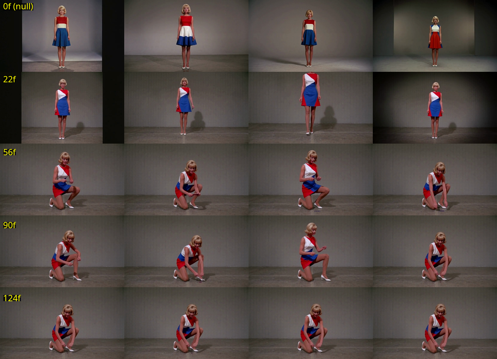
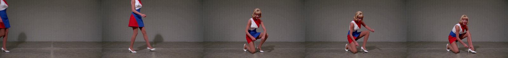

# A longer reference video buys consistency by copying the reference

*Status: complete. Twenty arms, five reference durations, four seeds, one
prompt. Seed-to-seed variation falls from 31.5 with no reference to 1.4 at 124
frames — but the arms that are most consistent are the ones reproducing the
reference clip's choreography, not the ones holding a character while acting
independently.*

## The question

[An earlier report](2026-09-19-h3-reference-video-consistency.md) established
that feeding `MiniMaxH3ReferenceToVideo` a prior render as `ref_videos` pins a
character across seeds. It left one thing open: how long does the reference
have to be? The clip used there was 90 frames. Nobody had tested whether 20
would do, or whether 124 would do better.

The practical stake is cost. Reference tokens are not free, and if a
two-second clip locks identity as well as a four-second one, every downstream
shot gets cheaper.

## Method

Five arms crossed with four seeds — 43, 44, 45, 46 — for twenty renders.

The arms are reference durations: 0 frames (no `ref_videos` input at all), 22,
56, 90, and 124. Every reference is the *same source clip*, an earlier H3
render of this prompt's subject, trimmed to the first N frames and scaled to
832×480. The target shot is 124 frames in every arm, so arm 4's reference is
exactly as long as the shot being generated.

One prompt, asserted byte-for-byte in the builder: a 1960s woman in a
colour-blocked red/white/blue A-line mini dress, full body, static camera,
plain grey wall. No pose track in any arm — `H3FunControlApply` is purged from
all twenty graphs, so the only conditioning is the prompt and the reference.

Three measurements, all mean absolute pixel distance on grayscale frames at
temporal stride 8:

- **Seed variation** — mean over all six seed pairs within an arm. Low means
  the seed stopped mattering.
- **Temporal motion** — mean frame-to-frame difference within a clip. Guards
  the failure mode where consistency is achieved by freezing the subject.
- **Distance to reference** — mean distance from each render to its own
  trimmed reference clip. Guards the failure mode where consistency is
  achieved by copying.

## What came back

| reference | seed variation | temporal motion | distance to reference |
|---|---|---|---|
| 0f (null) | 31.50 | 0.52 | — |
| 22f | 23.55 | 1.65 | 23.97 |
| 56f | 3.90 | 2.08 | 10.24 |
| 90f | 5.38 | 2.77 | 8.60 |
| 124f | 1.37 | 4.40 | 5.09 |

Seed variation collapses between 22 and 56 frames. The null arm is at 31.5,
22 frames barely moves it to 23.6, and then 56 frames drops it to 3.9 — an
87% reduction from baseline, achieved entirely in the step from 22 to 56.
Going further to 90 does not improve it (5.38, slightly worse than 56), and
124 pushes to 1.37.

Temporal motion goes *up* monotonically with reference length, 0.52 → 4.40.
Whatever is happening, it is not the flattening failure — the longer the
reference, the more the subject moves.

## The grid

Rows top to bottom: 0f, 22f, 56f, 90f, 124f. Columns are seeds 43–46, all at
the same frame index.

The top two rows are a standing woman, and the four seeds disagree about her
face, her lighting, and where the dress's colour blocks sit. The bottom three
rows are a woman crouched on the floor reaching toward her shoe — and by 124f
the four seeds are nearly indistinguishable.

That is the result the numbers were describing, and it is not the result the
experiment was looking for.

## Why the consistent arms are the suspicious ones

The reference clip is not a static character turnaround. It is a *performance*:
the woman starts standing and crouches to the floor.

Left to right: frame 0 of the source, then the last frame of the 22f, 56f,
90f, and 124f trims. At 22 frames the clip has barely left standing. By 56 she
is in a crouch, and by 90 and 124 she is down on one knee reaching toward the
floor.

Line that up against the render grid and the arms stop looking like a
consistency curve. The 22f arm — whose reference is still standing — produces
standing women. The 56f, 90f, and 124f arms — whose references have crouched —
produce crouching women. **The reference's ending pose predicts the render's
pose in every arm.**

So the falling seed-variation number has two readings that this design cannot
separate:

1. The reference pins *identity*, and longer references pin it harder.
2. The reference pins *choreography*, and the seeds agree because they are all
   reproducing the same motion.

The distance-to-reference column favours the second. It falls monotonically —
23.97, 10.24, 8.60, 5.09 — meaning each longer reference produces output that
is *pixel-closer to the reference clip itself*. The 124f arm, whose reference
is exactly as long as the shot, sits at 5.09. That is the copying signature,
and it is strongest exactly where the consistency looks best.

The rising temporal-motion column fits the same story. The longer references
end deeper into a crouch, so the renders that follow them have further to
travel, and frame-to-frame difference goes up. Motion rising is not evidence of
autonomy here; it is evidence of a borrowed trajectory.

## What this does and does not establish

Established: reference duration below roughly 56 frames does not pin anything.
The 22f arm is closer to the null arm than to any reference arm on every
measure. Whatever mechanism is working, it needs more than about one second of
reference to engage.

Established: the pose in the output tracks the pose the reference clip has
reached. This was visible in all five arms and is the clearest signal in the
run.

**Not** established: that a longer reference gives better *identity*
consistency. Every arm's reference differs in two ways at once — how much
identity information it carries and what pose it ends in — so the design
cannot attribute the falling seed variation to either. The experiment
confounded duration with choreography.

The earlier 90-frame result is not overturned; a reference does hold a
character across seeds, and that finding rested on a comparison against a
foreign guide rather than on duration. A [same-day 2×2 on this same
node](2026-09-24-h3-reference-video-2x2.md) reached the compatible conclusion
from the other direction — a reference video *moves the subject* without
replacing them. What this run adds is that the movement it supplies is the
reference's own, and that the scaling question was asked with a fixture that
could not separate the two.

## What would answer it

A reference set where duration varies and ending pose does not: trim clips of
22, 56, 90 and 124 frames sampled from a *static* section of a turnaround, so
every arm's reference ends in the same stance. If seed variation still falls
with length, the duration effect is real. If it flattens out, the curve here
was choreography all along.

Cheaper and worth doing first: re-run the 124f arm against a reference trimmed
from a *different* subject's crouch. If the output crouches with a face from
the prompt rather than the reference, that separates pose transfer from
identity transfer in one render.

## Cost

Sampling latency scales linearly with reference length — each additional 34
reference frames costs about 34 seconds:

| reference | seconds/arm | vs null |
|---|---|---|
| 0f (null) | 92 | — |
| 22f | 108 | +17% |
| 56f | 141 | +53% |
| 90f | 176 | +91% |
| 124f | 212 | +130% |

A 124-frame reference more than doubles render time for a 124-frame shot. At
212s for 5.17s of video that is ~41× real-time; the null arm is ~18×.

Peak VRAM held at 13.8–14.3 GiB across all arms — 56–58% of the 24 GB card.
Reference length does not move it meaningfully, so the cost of a longer
reference is time, not memory.

Twenty arms of GPU work is about 50 minutes. Eleven builds across four branch
pipelines were spent getting it, over roughly 16 hours of calendar time from
first trigger to final egress, on a lab with seven experiment pipelines
contending for one 3090.

Failed builds and their causes:

- **Four builds lost to `comfyui-local` segfaults** (SIGSEGV; container restart
  count reached 4). Each killed the in-flight prompt. A task that has submitted
  a prompt and is waiting on it does not notice: it holds `gpu-lock` and polls
  a prompt id that no longer exists until its own timeout. Two *other*
  experiments' builds were stranded the same way for over an hour each and had
  to be aborted by hand before the pool would turn over. Same fault [pinned to a
  VideoVAE-before-H3 load order](2026-09-24-h3-comfyui-segfault.md) a day
  earlier.
- **Two builds died on `error acquiring lock: reset lock: exit status 128`** —
  the pool resource's git push to `concourse-locks` failing on an SSH timeout
  to GitHub while the job sat in the acquire step. One had queued 2h19m before
  failing without ever running.
- **One build rendered nothing in six seconds.** ComfyUI's `input/` directory
  does not survive container restarts. A restart mid-run removed
  `char_ref_22/56/124.mp4` and left `char_ref_90.mp4` truncated by one byte,
  so every ref-arm submission failed validation with `Invalid video file` while
  the null arm — which loads no video — kept succeeding. The fixtures are
  committed under `workflows/refs/` with checksums; reinstalling from there is
  the fix, and a preflight that checksums fixtures against the repo before
  acquiring the lock would have caught it.

Splitting twenty arms across two smaller branches is what gets them through. A
build needing 55 minutes of uninterrupted lock time loses the race against an
hourly segfault; two builds needing ~45 minutes each (42m32s and 45m44s, both
green) do not.

## Files

Workflows are ComfyUI **API-format** graphs naming local checkpoints — they
will not drag-and-drop into a fresh install without those models present.
Seed-43 representative of each arm:

- [noref_s43.api.json](files/2026-09-25-h3-reference-duration-scaling/noref_s43.api.json)
- [ref22_s43.api.json](files/2026-09-25-h3-reference-duration-scaling/ref22_s43.api.json)
- [ref56_s43.api.json](files/2026-09-25-h3-reference-duration-scaling/ref56_s43.api.json)
- [ref90_s43.api.json](files/2026-09-25-h3-reference-duration-scaling/ref90_s43.api.json)
- [ref124_s43.api.json](files/2026-09-25-h3-reference-duration-scaling/ref124_s43.api.json)
- [exp026_metrics.py](files/2026-09-25-h3-reference-duration-scaling/exp026_metrics.py) — computes all three measurements from the rendered mp4s

All twenty graphs are generated by `concourse/scripts/build_exp026.py` in
`gavmor/comfyui-workflows`. Renders are in Immich, one album per arm
(`noref_s43` … `ref124_s46`), 20 albums with distinct asset ids.

