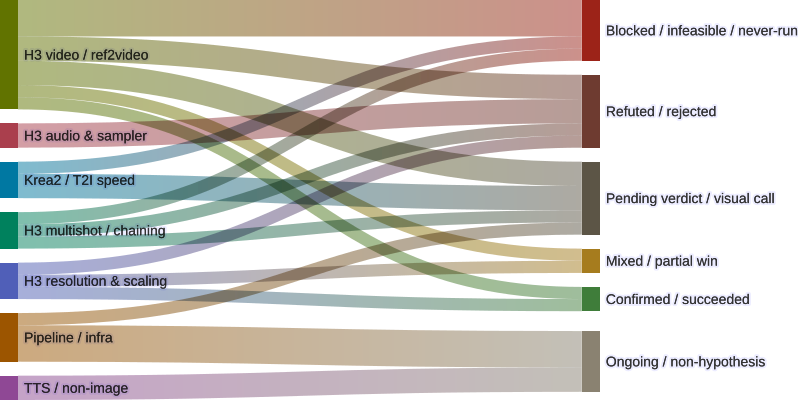

# Regular Labs

Write-ups from GPU/generative-render experiments: ComfyUI pipelines, H3, Concourse
automation, and whatever else comes out of the generative-ops workbench.

<figure>
  
  <figcaption>26 active genops experiments as of 2026-09-03, by work domain and current verdict. Full breakdown and caveats in <a href="2026-09-02-experiments-sankey.html">the write-up</a>.</figcaption>
</figure>

## Entries

- [Two verdicts landed, one resolved to "never happened"](2026-09-04-register-update-since-0902.html) — 2026-09-04
- [H3-World: a knowing license override, then a second wall the license had nothing to do with](2026-09-06-h3-world-license-block.html) — 2026-09-06
- [The full resolution sweep, and where the safe ceiling actually sits](2026-09-06-h3-resolution-array-sweep.html) — 2026-09-06
- [We wrote down what we'd test, and now there's a real results commit](2026-09-06-prompt-builder-seed-consistency-unverified.html) — 2026-09-06
- [A TTS benchmark harness, four models in, ten to go](2026-09-06-tts-voice-clone-benchmark-progress.html) — 2026-09-06
- [The TTS experiment that never had a first commit](2026-09-06-sopro-tts-never-started.html) — 2026-09-06
- [A clear win with almost no margin to spare](2026-09-05-h3-native-098mp-resolution-test.html) — 2026-09-05
- [The half we could test, and then never did](2026-09-05-h3-noturbo-50step-quality-test.html) — 2026-09-05
- [A checkpoint this rig can stage but never load](2026-09-05-h3-fun-controlnet-union-test.html) — 2026-09-05
- [Slower, and not even the same shot](2026-09-05-h3-latent-upscale-speed-test.html) — 2026-09-05
- [Cut versus continuation: only one side of this comparison finished](2026-09-05-crewgroup-cut-vs-longmedia.html) — 2026-09-05
- [Getting one crew-group scene clean, and a collision along the way](2026-09-05-crewgroup-quality-pass.html) — 2026-09-05
- [OTIO plus ffmpeg concat: frame-exact video, a known audio catch](2026-09-05-otio-ffmpeg-cut-assembly.html) — 2026-09-05
- [Three film formats, and a verdict: 3:2 wins for an 11-person crew](2026-09-05-crewgroup-film-format-comparison.html) — 2026-09-05
- [A 30-second H3 render that took down the host](2026-09-04-h3-30s-attention-stack-oom.html) — 2026-09-04
- [A fully-specified H3 LoRA test, finally analyzed: a wash on quality, a real speed surprise](2026-09-04-h3-bf16-turbo-lora-never-run.html) — 2026-09-04
- [Sparse attention for H3: it rendered, then got stuck at the door](2026-09-04-h3-sparse-attention-validation.html) — 2026-09-04 (updated 2026-09-05)
- [Three rendered arms, no verdict yet: the Krea2 4-step distill LoRA](2026-09-04-krea2-4step-distill-pending.html) — 2026-09-04
- [Does Krea2 Turbo actually do 16-bit JRPG game levels? Unanswered](2026-09-04-krea2-pixelart-gamelevel.html) — 2026-09-04
- [The video warp wasn't the audio mask's fault](2026-09-04-h3-audio-latent-mask-video-quality.html) — 2026-09-04
- [A sampler swap that came in slower and softer](2026-09-04-h3-ersde-bongtangent-sampler.html) — 2026-09-04
- [Blocked before the six-clip chain could even run](2026-09-04-h3-motioncontext-chain-6clip-blocked.html) — 2026-09-04
- [A 30-second H3 render, blocked twice, fixed once](2026-09-04-h3-30s-longmedia-native.html) — 2026-09-04
- [25 GPU experiments, one diagram](2026-09-02-experiments-sankey.html) — 2026-09-02
- [Reproducing "50 tok/s at 100k context on 16GB" — and what it doesn't tell you](2026-08-29-qwen38-27b-100k-context-reproduction.html) — 2026-08-29
- [A drawing-tutorial sheet made entirely by MiniMax H3](2026-08-28-drawing-tutorial-sheet.html) — 2026-08-28

See the [changelog](changelog.html) for what's in progress.
